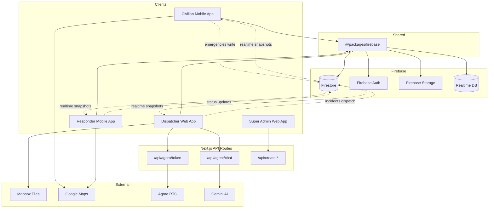
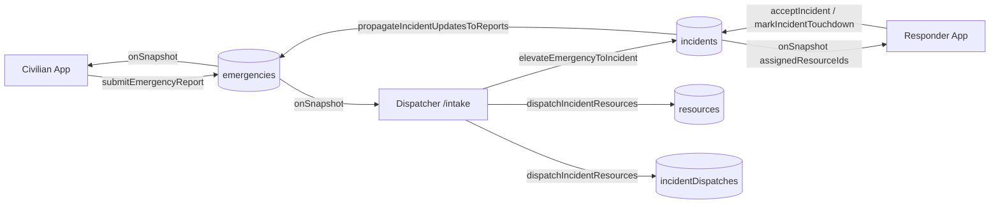
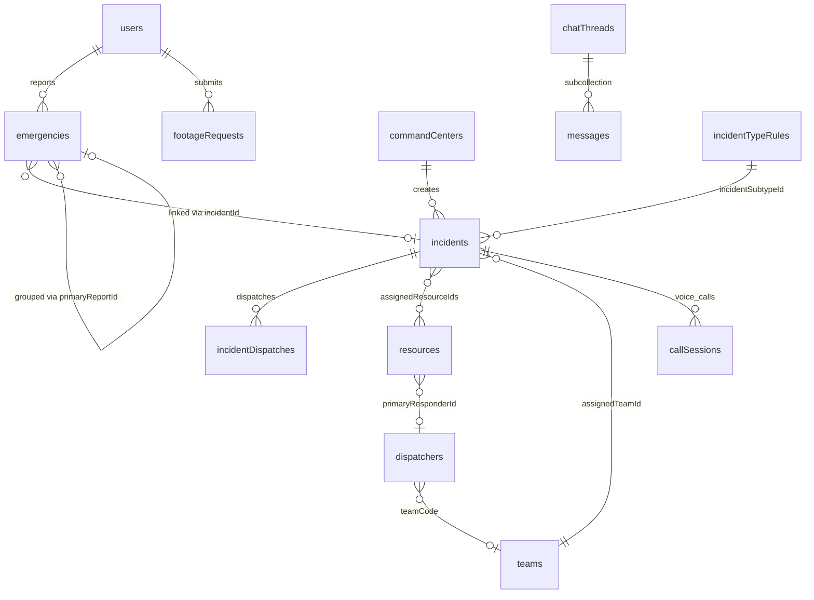
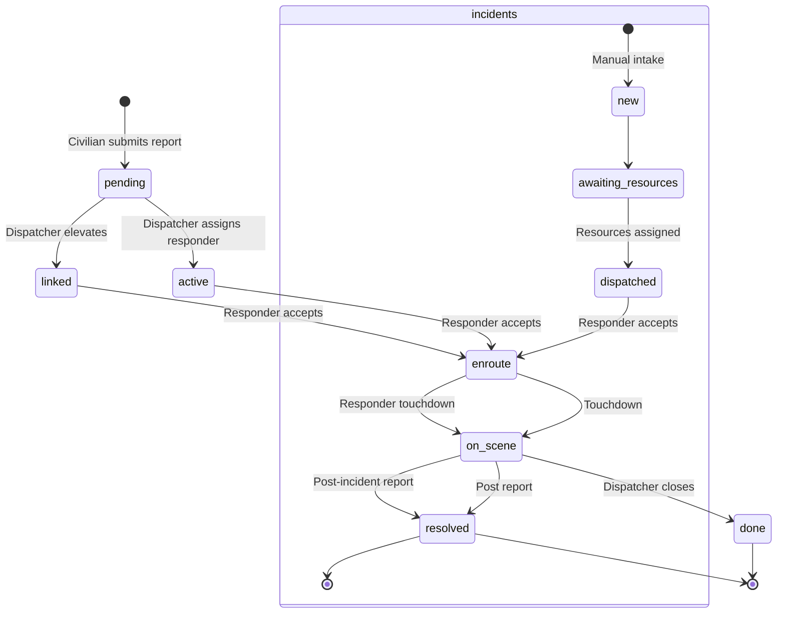

> **Updated 21 August 2026:** Dispatcher and Super Admin web apps were consolidated into `apps/resq-link-web-app`. Historical folder names below (`dispatcher-web-app`, `super-admin-web-app`, port 3001) refer to the pre-consolidation layout.

# RESQ Emergency Response System — Complete Technical Analysis

> **Document version:** 1.0  
> **Generated:** July 5, 2026  
> **Scope:** Civilian Mobile App · Dispatcher Web App · Responder Mobile App · Shared Firebase Package  
> **Purpose:** Master technical documentation for the entire RESQ platform

---

## Table of Contents

1. [Executive Summary](#1-executive-summary)
2. [Project Architecture](#2-project-architecture)
3. [Civilian Mobile App Analysis](#3-civilian-mobile-app-analysis)
4. [Dispatcher Web App Analysis](#4-dispatcher-web-app-analysis)
5. [Responder Mobile App Analysis](#5-responder-mobile-app-analysis)
6. [End-to-End Emergency Workflow](#6-end-to-end-emergency-workflow)
7. [Data Flow Analysis](#7-data-flow-analysis)
8. [Database Analysis](#8-database-analysis)
9. [API Analysis](#9-api-analysis)
10. [Authentication & Authorization](#10-authentication--authorization)
11. [Real-Time Features](#11-real-time-features)
12. [Maps & Location Services](#12-maps--location-services)
13. [Notification System](#13-notification-system)
14. [User Roles & Permissions](#14-user-roles--permissions)
15. [Incident State Machine](#15-incident-state-machine)
16. [UI/UX Review](#16-uiux-review)
17. [Code Quality Review](#17-code-quality-review)
18. [Performance Review](#18-performance-review)
19. [Security Review](#19-security-review)
20. [Cross-Application Integration](#20-cross-application-integration)
21. [Current Strengths](#21-current-strengths)
22. [Current Weaknesses](#22-current-weaknesses)
23. [Recommended Improvements](#23-recommended-improvements)
24. [Missing Features](#24-missing-features)
25. [Final System Assessment](#25-final-system-assessment)

---

## 1. Executive Summary

### Project Overview

**RESQ-Link** (also referred to as *Tuguegarao Rescue System*) is a multi-application emergency response platform designed for the City of Tuguegarao, Philippines. It connects civilians reporting emergencies with a command-center dispatcher and field responders through a shared Firebase backend.

The system is organized as an **npm workspaces monorepo** at `c:\projects\resq-link` with four client applications and one shared TypeScript library:

| Application | Path | Technology | Port |
|-------------|------|------------|------|
| Civilian Mobile App | `apps/civilian-mobile-app` | Expo SDK 54, React Native, Expo Router 6 | Expo dev server |
| Dispatcher Web App | `apps/dispatcher-web-app` | Next.js 15, React 19, Tailwind CSS | 3000 |
| Responder Mobile App | `apps/responder-mobile-app` | Expo SDK 54, React Native, Expo Router 6 | Expo dev server |
| Super Admin Web App | `apps/super-admin-web-app` | Next.js 15 | 3001 |
| Shared Firebase Package | `packages/firebase` | TypeScript → `dist/` | N/A |

**There is no standalone REST/Express backend.** All business logic lives in `@packages/firebase`. Server-side endpoints are limited to seven Next.js API routes across the dispatcher and super-admin apps.

### Purpose of the System

RESQ enables:

1. **Civilians** to report emergencies (fire, medical, vehicular, police, utility hazards) with GPS location, photos, and structured field assessment.
2. **Dispatchers** at the command center to receive, triage, assign agencies/resources, monitor live incidents, and close cases.
3. **Field responders** to accept assignments, navigate to scenes, update status, and submit post-incident reports.
4. **Super administrators** to provision accounts for all roles.

### Main Objectives

- Reduce emergency response time through real-time coordination
- Provide a single operational picture for the command center
- Enable civilian self-service emergency reporting with location and media
- Track responder location, status, and response metrics
- Support multi-agency coordination (BFP, PNP, MDRRMO, Ambulance, PCG)
- Maintain incident history, analytics, and audit trails

### Target Users

| Role | Application | Primary Tasks |
|------|-------------|---------------|
| Civilian | Civilian Mobile App | Report emergencies, track status, call command center |
| Command Center Operator | Dispatcher Web App | Intake, dispatch, monitor, close incidents |
| Field Responder | Responder Mobile App | Accept, navigate, touchdown, post-report |
| Super Administrator | Super Admin Web App | Create accounts, manage system users |
| Agency Administrator | Dispatcher Web App (Teams) | Manage team members and resources |

### High-Level Architecture

```
┌─────────────────────────────────────────────────────────────────────────┐
│                         RESQ-Link Platform                              │
├─────────────────────────────────────────────────────────────────────────┤
│                                                                         │
│  ┌──────────────┐   ┌──────────────┐   ┌──────────────┐                │
│  │  Civilian    │   │  Dispatcher  │   │  Responder   │                │
│  │  Mobile App  │   │  Web App     │   │  Mobile App  │                │
│  │  (Expo/RN)   │   │  (Next.js)   │   │  (Expo/RN)   │                │
│  └──────┬───────┘   └──────┬───────┘   └──────┬───────┘                │
│         │                  │                  │                         │
│         └──────────────────┼──────────────────┘                         │
│                            ▼                                            │
│              ┌─────────────────────────────┐                            │
│              │   @packages/firebase        │                            │
│              │   (Shared TypeScript SDK)   │                            │
│              └──────────────┬──────────────┘                            │
│                             ▼                                           │
│  ┌──────────────────────────────────────────────────────────┐          │
│  │              Firebase Platform                            │          │
│  │  ┌──────────┐ ┌──────────┐ ┌──────────┐ ┌──────────┐    │          │
│  │  │ Firestore│ │   Auth   │ │ Storage  │ │   RTDB   │    │          │
│  │  └──────────┘ └──────────┘ └──────────┘ └──────────┘    │          │
│  └──────────────────────────────────────────────────────────┘          │
│                             ▲                                           │
│              ┌──────────────┴──────────────┐                            │
│              │  Next.js API Routes (×7)    │                            │
│              │  Agora · Gemini · Admin SDK │                            │
│              └─────────────────────────────┘                            │
│                                                                         │
│  External: Mapbox · Google Maps · Agora RTC · Gemini AI                │
└─────────────────────────────────────────────────────────────────────────┘
```

### Overall Emergency Response Workflow

```
Civilian reports emergency
        ↓
Firestore `emergencies` collection (status: pending)
        ↓
Dispatcher receives real-time alert (PriorityAlertContext)
        ↓
Dispatcher acknowledges → assigns team/agency/responder
        ↓
Report elevated to master `incidents` record (optional)
        ↓
Responder receives assignment via Firestore subscription
        ↓
Responder accepts → en route → on scene → post report
        ↓
Incident resolved → moved to history
        ↓
Civilian sees status update in real time
```

### Strengths of the Current Implementation

- **Unified data layer** — Single `@packages/firebase` package eliminates API duplication across three apps
- **Real-time by design** — Firestore `onSnapshot` subscriptions power live queues, maps, and status
- **Feature-rich dispatcher** — Intake, dispatch, maps, analytics, teams, resources, voice calls, chat, AI assistant
- **Structured emergency intake** — Type-specific field assessment, priority resolution, agency routing rules
- **Operational team model** — Team on duty, quadrant mapping, barangay data for Tuguegarao
- **Voice call integration** — Agora RTC with Firestore session state machine
- **Shared status presentation** — `incidentStatusVisual.ts` provides consistent labels/colors across apps

### Weaknesses

- **No push notifications (FCM)** — Notification toggles are UI-only; no FCM token registration
- **Legacy REST config** — Civilian app references `:4000` endpoints that do not exist
- **Agora URL mismatch** — Mobile apps default to port 4000; actual route is on dispatcher Next.js (port 3000)
- **Auth gaps** — Dispatcher web login does not verify `commandCenters/{uid}` at sign-in; civilian logout does not call Firebase `signOut`
- **Dual auth storage** — Civilian app has both `userStore` (AsyncStorage) and `authStore` (SecureStore JWT) — only one is wired
- **Documentation lag** — Dispatcher README still claims mock data; code is Firebase-integrated
- **Missing Firestore rules** — `teamAssignmentHistory` subcollection has no explicit rule (falls through to deny-all)
- **Status model fragmentation** — Emergency reports and incidents use different status vocabularies

### Overall Assessment

RESQ-Link is a **substantially implemented, Firebase-centric emergency response platform** with strong real-time coordination capabilities. The dispatcher web app is production-oriented with comprehensive intake, dispatch, and monitoring features. Both mobile apps follow a clean feature-module architecture. The system is **not yet production-ready** due to missing push notifications, auth hardening gaps, and configuration mismatches, but the core end-to-end workflow is functional and well-architected for a municipal emergency response system.

---

## 2. Project Architecture

### Overall Architecture

RESQ follows a **Firebase-first, client-direct architecture**:

- All three client apps communicate directly with Firebase (Auth, Firestore, Storage, RTDB)
- Business logic is centralized in `packages/firebase/src/` (~20 domain modules)
- Server-side logic is limited to Next.js API routes requiring Admin SDK (account creation, Agora tokens, Gemini AI)
- No middleware, no API gateway, no message queue

### Monorepo Folder Structure

```
resq-link/
├── apps/
│   ├── civilian-mobile-app/     # Expo — citizens
│   ├── dispatcher-web-app/      # Next.js — command center
│   ├── responder-mobile-app/    # Expo — field responders
│   └── super-admin-web-app/     # Next.js — account provisioning
├── packages/
│   └── firebase/                # @packages/firebase shared SDK
│       ├── src/                 # TypeScript source modules
│       ├── dist/                # Compiled output (required before app use)
│       ├── scripts/             # Bootstrap, seed, migrate scripts
│       ├── firestore.rules
│       ├── firestore.indexes.json
│       ├── storage.rules
│       └── database.rules.json
├── docs/
├── .github/workflows/
├── vercel.json
└── README.md
```

### Application Boundaries

| Boundary | Responsibility | Data Access |
|----------|---------------|-------------|
| Civilian App | Report emergencies, track status, voice calls | `emergencies`, `users`, `callSessions`, Storage |
| Dispatcher App | Intake, dispatch, monitor, analytics, admin | All collections (command center role) |
| Responder App | Accept, navigate, touchdown, post-report | `incidents`, `dispatchers`, `resources`, `callSessions`, `chatThreads` |
| Super Admin App | Account provisioning | Admin SDK via API routes |
| `@packages/firebase` | All CRUD, subscriptions, lifecycle | Direct Firestore/Auth/Storage/RTDB |

### Shared Services (`packages/firebase/src/`)

| Module | File | Responsibility |
|--------|------|----------------|
| `config.ts` | Firebase lazy init | Auth, Firestore, Storage, RTDB; env resolution |
| `auth.ts` | Account creation, sign-in | All roles: civilian, dispatcher, command center |
| `admin.ts` | Server-only Admin SDK | API route account provisioning |
| `emergencies.ts` | Civilian reports CRUD | Largest domain module (~1500 lines) |
| `incidents.ts` | Master incidents, dispatch | Lifecycle, elevation, propagation |
| `resources.ts` | Fleet management | Ambulances, BFP units, stations |
| `teams.ts` / `operationalTeams.ts` | Team definitions | Assignment snapshots, history |
| `dispatchers.ts` | Location + online status | GPS tracking in Firestore |
| `responderPresence.ts` | RTDB presence | Online count, heartbeat |
| `messaging.ts` | Operational chat | Direct + group threads |
| `callSessions.ts` | Voice call state machine | Agora channel coordination |
| `footageRequests.ts` | CCTV/evidence requests | Civilian → dispatcher workflow |
| `priority.ts` | Priority levels, escalation | Visual + alert coding |
| `alertAcknowledgment.ts` | Alert ack + escalation | Dispatcher acknowledgment |
| `incidentStatusVisual.ts` | Status colors/labels | Shared UI tokens |
| `incidentLifecycle.ts` | Live vs resolved helpers | Filtering logic |
| `civilianFieldAssessment.ts` | Civilian intake fields | Type-specific forms |
| `responderAssessment.ts` | On-scene assessment | Responder submissions |
| `quadrants.ts` | Operational quadrants | Tuguegarao map filtering |
| `commandCenterShift.ts` | Current team on duty | Stored on `commandCenters` doc |
| `storage.ts` | Image upload | Firebase Storage |

### State Management

| App | Mechanism | Details |
|-----|-----------|---------|
| Civilian | Zustand (`userStore`, `authStore`) + React Context (`AppThemeProvider`) + React Query | Primary session in AsyncStorage |
| Dispatcher | React Context (`AuthContext`, `OperationalTeamContext`, `PriorityAlertContext`) + page-level `useState` | Firestore subscriptions as server state |
| Responder | Zustand (`userStore`) + React Query + Context (`ResqThemeProvider`) | Realtime writes into query cache |
| All | Firestore `onSnapshot` | Primary real-time data mechanism |

### Navigation

**Civilian App (Expo Router):**
```
Root Stack
├── / (SplashGateScreen)
├── (auth): login, register
├── (main): dashboard, emergency-form, emergency-confirmation, calling, responder-map
│   └── (tabs): history, profile [tab bar hidden]
└── (settings): appearance, notifications, privacy-security, help-support, faq, report-issue
Overlay: CustomBottomNav (Home, Map, Call, SOS, History, Settings)
```

**Dispatcher App (Next.js App Router):**
```
/ → redirect to /intake
/login, /overview, /map, /intake, /incidents, /footage-requests
/report, /report/incidents, /history, /incident-management
/resources, /teams
```

**Responder App (Expo Router):**
```
/ (AuthIndexGate)
/login
(tabs): dashboard, map, settings [notifications hidden from tab bar]
/incident/:id
/support: about, help-support, location
```

### API Layer

- **Client → Firebase:** Direct SDK calls via `@packages/firebase` (primary path)
- **Client → Next.js API:** Agora token (`POST /api/agora/token`), Gemini chat (dispatcher only)
- **Legacy REST (unused):** Civilian `apiConfig.endpoints` pointing to `:4000` — not implemented

### Authentication

| Role | Method | Profile Collection | Sign-in Function |
|------|--------|-------------------|------------------|
| Civilian | Email/password or Phone OTP | `users/{uid}` | `signInCivilian`, `signInUserWithPhone` |
| Command Center | Email/password | `commandCenters/{uid}` | `signInCommandCenter` |
| Responder | Email/password | `dispatchers/{uid}` | `signInDispatcher` |
| Super Admin | Email/password | `admins/{uid}` | Standard Firebase Auth |

### Configuration & Environment Variables

**Firebase (all apps):**
- `EXPO_PUBLIC_FIREBASE_*` (mobile) / `NEXT_PUBLIC_FIREBASE_*` (web)
- `FIREBASE_*` (scripts), `FIREBASE_SERVICE_ACCOUNT_JSON` (Admin SDK)

**Dispatcher-specific:**
- `NEXT_PUBLIC_MAPBOX_ACCESS_TOKEN`, `NEXT_PUBLIC_MAPBOX_STYLE`
- `GEMINI_API_KEY`, `GEMINI_MODEL`
- `AGORA_APP_ID`, `AGORA_APP_CERTIFICATE`, `AGORA_TOKEN_TTL_SECONDS`

**Mobile-specific:**
- `EXPO_PUBLIC_AGORA_APP_ID`, `EXPO_PUBLIC_API_URL` (Agora backend URL)
- `EXPO_PUBLIC_PROJECT_GROUP_ID` (JWT SecureStore key)

**Runtime flags:**
- `app.json` `extra.uiMode` — enables mock data without Firebase (civilian app)
- `app.json` `extra.apiUrl` — default `http://localhost:4000`

### Architecture Diagram



---

## 3. Civilian Mobile App Analysis

**Path:** `apps/civilian-mobile-app`  
**Stack:** Expo SDK 54, React Native 0.81, React 19, Expo Router 6, Zustand, TanStack React Query

### Screen-by-Screen Analysis

| Screen | Route | Component | Purpose |
|--------|-------|-----------|---------|
| Splash Gate | `/` | `SplashGateScreen` | Auth routing gate; welcome hero |
| Login | `/login` | `LoginScreen` | Email/password via `signInCivilian` |
| Register | `/register` | `RegisterScreen` | Phone OTP via `signInUserWithPhone` |
| Dashboard | `/dashboard` | `DashboardScreen` | Home: active incident, quick actions, nearby/recent |
| Emergency Form | `/emergency-form` | `EmergencyFormScreen` | 5-step reporting wizard |
| Confirmation | `/emergency-confirmation` | `EmergencyConfirmationScreen` | Post-submit real-time status + voice call |
| Map | `/responder-map` | `ResponderMapScreen` | Live incident map with bottom sheets |
| History | `/(tabs)/history` | `HistoryScreen` | Searchable/filterable incident history |
| Profile | `/(tabs)/profile` | `ProfileScreen` | Settings hub |
| Calling | `/calling` | `CallingScreen` | Agora voice call to command center |
| Appearance | `/appearance` | `AppearanceScreen` | Light/dark/system theme |
| Notifications | `/notifications` | `NotificationsScreen` | Toggle prefs (AsyncStorage only) |
| Privacy | `/privacy-security` | `PrivacySecurityScreen` | Placeholder |
| Help | `/help-support` | `HelpSupportScreen` | Email support |
| FAQ | `/faq` | `FaqScreen` | Static Q&A |
| Report Issue | `/report-issue` | `ReportIssueScreen` | Mailto issue report |

### Emergency Reporting Workflow

```
Entry: Dashboard / SOS button / History CTA
  → 5-Step Form (type → location → details → attachments → review)
  → submitEmergencyReport() → Firestore emergencies (status: pending)
  → /emergency-confirmation?reportId=...
  → Real-time subscription + optional voice call
  → Resolved → history
```

**SOS Flow:** `useSOS` → GPS + reverse geocode → `submitEmergencyReport(type=other_emergency)` → confirmation.

**Key hook:** `useReportEmergency` — form state, GPS (10s fallback), reverse geocoding, image upload (max 6), submit.

**Bottom nav:** Home, Map, Call (dispatcher), SOS, History, Settings — hidden on auth/form/calling/settings screens.

---

## 4. Dispatcher Web App Analysis

**Path:** `apps/dispatcher-web-app` | **Stack:** Next.js 15, React 19, TypeScript, Tailwind, Leaflet/Mapbox

### Routes

| Route | Purpose |
|-------|---------|
| `/` | Redirects to `/intake` |
| `/login` | Command center authentication |
| `/overview` | Dashboard: KPIs, map preview, timeline chart |
| `/intake` | **Primary ops** — triage queue, manual intake, dispatch |
| `/incidents` | Active incidents list + detail |
| `/map` | Full-screen incident + dispatcher location map |
| `/history` | Resolved archive |
| `/report` | Analytics dashboard |
| `/report/incidents` | Filterable export (PDF/Excel/print) |
| `/resources` | Fleet/resource CRUD + map |
| `/teams` | Operational teams + account management |
| `/incident-management` | Incident type routing rules |
| `/footage-requests` | CCTV/evidence request queue |

### Key Features

**Intake (`/intake`):** Merges live `emergencies` (app reports) + live `incidents` (manual). Source filters (all/app/sms/manual), team grouping, barangay/quadrant logic, `IntakeDetailView` detail panel, priority audio alarms.

**Dispatch actions:** `acknowledgeEmergencyAlert`, `elevateEmergencyToIncident`, `assignResponderToEmergency`, `dispatchIncidentResources`, `createIncident`, `associateReportsWithIncident`, `reassignIncidentTeam`, `moveEmergencyReportToHistory`.

**Global overlays:** `IncidentCallNotification` (Agora), `OperationalChatWidget`, `AgentAssistant` (Gemini), `CriticalAlertModal`.

**State:** React Context (`AuthContext`, `OperationalTeamContext`, `PriorityAlertContext`) + Firestore `onSnapshot` subscriptions.

---

## 5. Responder Mobile App Analysis

**Path:** `apps/responder-mobile-app` | **Stack:** Expo SDK 54, React 19, Expo Router 6, Zustand, React Query

### Routes

| Route | View | Purpose |
|-------|------|---------|
| `/` | `AuthIndexGate` | Redirect to dashboard or login |
| `/login` | `LoginView` | `signInDispatcherWithVerification` |
| `/dashboard` | `DashboardView` | Assigned cases, stats, location tracking |
| `/map` | `ResponderMapExplorer` | Map with bottom sheet case list |
| `/settings` | `SettingsView` | Profile, logout, sub-screen links |
| `/notifications` | `NotificationsView` | Local toggle prefs (hidden from tab bar) |
| `/incident/:id` | `CaseDetailView` | Full case detail with actions |
| `/support/*` | About, Help, Location | Support screens |

### Responder Workflow

```
Assignment (assignedResourceIds updated in Firestore)
  → subscribeToResponderAssignedIncidents fires
  → PriorityAlertProvider haptics (critical/high/medium)
  → Dashboard + Map show case

Accept → acceptIncident() → status: enroute, acceptedAt set
  → GPS tracked via useDashboardLocationTracking (5s/50m)

En Route → navigate via Google Maps directions URL

Touchdown → markIncidentTouchdown() → status: on_scene, responseTimeSeconds

Post Report → submitPostIncidentReportForIncident() → status: resolved
  → Optional photo via uploadImageToStorage

Parallel: Voice calls via subscribeToResponderIncomingCallSessions + Agora
```

**Status actions in `CaseInfoCard`:** Accept/Decline (pending/dispatched), Touchdown (enroute), Post Report modal (on_scene), Completed badge (resolved).

**Tab bar:** 3 visible tabs — Dashboard, Map, Settings.

---

## 6. End-to-End Emergency Workflow

### Complete Lifecycle

```
┌─────────────────────────────────────────────────────────────────┐
│ PHASE 1: CIVILIAN REPORTING                                     │
├─────────────────────────────────────────────────────────────────┤
│ Civilian opens app → SplashGate → Dashboard                     │
│   → Reports emergency (form or SOS)                             │
│   → GPS captured + reverse geocoded                             │
│   → Photos uploaded to Storage (optional)                       │
│   → submitEmergencyReport() → emergencies/{id} status: pending  │
│   → Confirmation screen with real-time subscription             │
└──────────────────────────┬──────────────────────────────────────┘
                           ▼
┌─────────────────────────────────────────────────────────────────┐
│ PHASE 2: DISPATCHER INTAKE                                      │
├─────────────────────────────────────────────────────────────────┤
│ Firestore onSnapshot → /intake queue                            │
│   → PriorityAlertContext plays alarm                            │
│   → Dispatcher acknowledges (acknowledgeEmergencyAlert)         │
│   → Reviews report details, map, civilian field assessment      │
│   → Selects incident subtype, priority, operational team        │
│   → elevateEmergencyToIncident() creates incidents/{id}         │
│     OR createIncident() for manual intake                       │
│   → assignResponderToEmergency() / dispatchIncidentResources()  │
│   → Linked emergencies status → linked/dispatched               │
└──────────────────────────┬──────────────────────────────────────┘
                           ▼
┌─────────────────────────────────────────────────────────────────┐
│ PHASE 3: RESPONDER RESPONSE                                     │
├─────────────────────────────────────────────────────────────────┤
│ subscribeToResponderAssignedIncidents fires                     │
│   → PriorityAlertProvider haptic alert                          │
│   → Responder views case on Dashboard/Map                       │
│   → acceptIncident() → status: enroute                          │
│   → GPS location pushed to dispatchers collection (5s/50m)      │
│   → RTDB presence: online status                                │
│   → markIncidentTouchdown() → status: on_scene                  │
│   → Field assessment + post-incident report                     │
│   → submitPostIncidentReportForIncident() → status: resolved    │
└──────────────────────────┬──────────────────────────────────────┘
                           ▼
┌─────────────────────────────────────────────────────────────────┐
│ PHASE 4: CLOSURE & NOTIFICATION                                 │
├─────────────────────────────────────────────────────────────────┤
│ propagateIncidentUpdatesToReports() syncs linked emergencies      │
│   → Civilian confirmation screen shows resolved status          │
│   → moveEmergencyReportToHistory() archives report              │
│   → Incident appears in /history and /report analytics          │
│   → Resource status reset to available                          │
└─────────────────────────────────────────────────────────────────┘
```

### Status Transitions by Actor

| Transition | Actor | Function | Collections Updated |
|------------|-------|----------|-------------------|
| Report created | Civilian | `submitEmergencyReport` | `emergencies` |
| Alert acknowledged | Dispatcher | `acknowledgeEmergencyAlert` | `emergencies` |
| Elevated to incident | Dispatcher | `elevateEmergencyToIncident` | `emergencies` + `incidents` |
| Resources dispatched | Dispatcher | `dispatchIncidentResources` | `incidents` + `resources` + `incidentDispatches` |
| Accepted | Responder | `acceptIncident` | `incidents` + linked `emergencies` + `resources` |
| Touchdown | Responder | `markIncidentTouchdown` | `incidents` + linked `emergencies` + `resources` |
| Post report | Responder | `submitPostIncidentReportForIncident` | `incidents` + linked `emergencies` |
| Archived | Dispatcher | `moveEmergencyReportToHistory` | `emergencies` |

---

## 7. Data Flow Analysis

### Incident Data Flow



### User Data Flow

| Data | Source | Consumers | Mechanism |
|------|--------|-----------|-----------|
| Civilian profile | `users/{uid}` | Dispatcher detail views, Responder `CaseDetailView` | Firestore read |
| Dispatcher location | `dispatchers/{uid}` | Dispatcher map, civilian map | Firestore write (GPS) + `onSnapshot` |
| Responder presence | `presence/responders/{uid}` (RTDB) | Responder dashboard online count | RTDB write + subscribe |
| Command center shift | `commandCenters/{uid}.currentTeamOnDuty` | Intake team filtering | Firestore doc watch |

### Notification Data Flow

| Type | Trigger | Delivery | Status |
|------|---------|----------|--------|
| Priority alerts | New unacknowledged emergency | Web Audio (dispatcher), Haptics (responder) | **Implemented** |
| Status updates | Incident status change | Firestore subscription → UI update | **Implemented** |
| Push notifications | — | — | **Not implemented** |
| Voice call ringing | `callSessions` status: ringing | Firestore subscription → Agora | **Implemented** |
| Chat messages | `chatThreads/{id}/messages` | Firestore subscription | **Implemented** |

### Location Updates Flow

```
Responder GPS (expo-location watchPosition)
  → updateDispatcherLocation(uid, lat, lng) every 5s/50m
  → dispatchers/{uid} Firestore doc updated
  → subscribeToDispatcherLocations() on dispatcher map
  → Civilian map shows responder positions (if assigned)
```

### Attachment Flow

```
Civilian: camera/gallery → uploadImageToStorage → emergencies/photos/{id}
  → imageUrls[] on emergency report doc

Responder: post-report photo → uploadImageToStorage → post-reports/{incidentId}/{id}
  → photoUrl on postIncidentReport object
```

---

## 8. Database Analysis

### Firestore Collections

#### `users` — Civilian Profiles

| Field | Type | Purpose |
|-------|------|---------|
| `uid` (doc ID) | string | Firebase Auth UID |
| `fullName` | string | Display name |
| `phone` | string | Phone number |
| `address` | string | Home address |
| `email` | string | Email (if email auth) |
| `createdAt` | Timestamp | Registration date |

**Relationships:** One user → many `emergencies` (via `userId`)

#### `dispatchers` — Responder/Field Operator Accounts

| Field | Type | Purpose |
|-------|------|---------|
| `uid` (doc ID) | string | Firebase Auth UID |
| `email` | string | Login email |
| `fullName` | string | Display name |
| `role` | string | BFP, PNP, MDRRMO, AMBULANCE, PCG |
| `designation` | string | dispatcher / responder |
| `active` | boolean | Account enabled |
| `teamCode` | string | Operational team |
| `latitude` / `longitude` | number | Live GPS position |
| `isOnline` | boolean | Online status |
| `lastUpdated` | Timestamp | Last location update |

**Relationships:** One dispatcher → many `incidents` (via `assignedResourceIds`)

#### `commandCenters` — Command Center Operators

| Field | Type | Purpose |
|-------|------|---------|
| `uid` (doc ID) | string | Firebase Auth UID |
| `name` | string | Center name |
| `location` | string | Physical location |
| `currentTeamOnDuty` | object | Active operational team snapshot |

#### `emergencies` — Civilian Emergency Reports

| Field | Type | Purpose |
|-------|------|---------|
| `userId` | string | Reporting civilian UID |
| `incidentType` | enum | fire, medical, vehicular_accident, police_emergency, electrical_powerline_hazard, other_emergency |
| `typeProfile` | string | Sub-type within incidentType |
| `locationText` | string | Human-readable location |
| `latitude` / `longitude` | number | GPS coordinates |
| `description` | string | Free-text description |
| `fieldAssessment` | map | Structured questionnaire answers |
| `imageUrls` | array | Scene photos |
| `status` | enum | pending, linked, enroute, on_scene, done, active, resolved |
| `priority` | enum | low, medium, high, critical |
| `incidentId` | string | Linked master incident |
| `primaryReportId` | string | Primary report for grouping |
| `assignedResponderId` | string | Assigned responder UID |
| `assignedTeamId/Code/Name` | string | Operational team |
| `alertAcknowledged` | boolean | Dispatcher acknowledged |
| `acceptedAt` / `touchdownAt` | Timestamp | Responder milestones |
| `responseTimeSeconds` | number | Accept-to-touchdown duration |
| `postIncidentReport` | object | Responder post-report data |
| `createdAt` / `updatedAt` | Timestamp | Timestamps |

**Indexes:** `userId + createdAt DESC`, `status + createdAt DESC`

#### `incidents` — Master Incident Records

| Field | Type | Purpose |
|-------|------|---------|
| `referenceNumber` | string | INC-{timestamp} |
| `source` | enum | civilian_app, call, sms, walk_in, radio, manual |
| `commandCenterAdminId` | string | Creating operator UID |
| `incidentCategory` | enum | fire, peace_and_order, medical, vehicular, utility, community, other |
| `incidentSubtypeId/Label` | string | Routing rule reference |
| `priority` | enum | low, medium, high, critical |
| `locationText` / `latitude` / `longitude` | — | Location data |
| `quadrant` | string | Operational quadrant |
| `status` | enum | new, awaiting_resources, liaison_pending, dispatched, enroute, on_scene, resolved, unresolved |
| `resolutionStatus` | enum | open, resolved, unresolved |
| `assignedResourceIds` | array | Responder UIDs |
| `assignedAgencies` | array | Agency codes |
| `assignedTeamId/Name/Code` | string | Operational team |
| `associatedReportIds` | array | Linked civilian report IDs |
| `acceptedAt` / `touchdownAt` / `resolvedAt` | Timestamp | Lifecycle milestones |
| `responseTimeSeconds` | number | Response metric |
| `postIncidentReport` | object | Field report with photo |

**Subcollection:** `teamAssignmentHistory` — audit trail (no explicit Firestore rule)

#### `resources` — Fleet/Equipment

| Field | Type | Purpose |
|-------|------|---------|
| `name` | string | Resource name |
| `type` | enum | AMBULANCE, BFP, PNP, MDRRMO, PCG, OTHER |
| `status` | enum | available, assigned, en_route, on_scene, maintenance, offline |
| `primaryResponderId` | string | Assigned responder |
| `assignedIncidentId` | string | Current incident |
| `currentLatitude/Longitude` | number | Live position |
| `stationLatitude/Longitude` | number | Home station |

#### `incidentDispatches` — Dispatch Ledger

| Field | Type | Purpose |
|-------|------|---------|
| `incidentId` | string | Parent incident |
| `resourceId` | string | Dispatched resource |
| `agency` | string | Agency code |
| `status` | string | assigned |
| `primaryResponderId` | string | Lead responder |

#### `callSessions` — Voice Call State

| Field | Type | Purpose |
|-------|------|---------|
| `incidentId` | string | Related incident |
| `channelName` | string | `incident_{incidentId}` |
| `callerUserId` | string | Civilian UID |
| `callerRole` | enum | civilian |
| `responderUserId` | string | Answering responder |
| `status` | enum | ringing, accepted, connected, ended, missed, failed |

#### `chatThreads` / `messages` — Operational Messaging

| Field | Type | Purpose |
|-------|------|---------|
| `participantIds` | array | Thread participants |
| `participantRoles` | map | Role per participant |
| `type` | enum | direct, group |
| `text` | string | Message content (subcollection) |

#### Other Collections

| Collection | Purpose |
|------------|---------|
| `teams` | Operational team definitions |
| `incidentTypeRules` | Routing/priority configuration per incident subtype |
| `footageRequests` | CCTV/evidence requests from civilians |
| `admins` | Super administrator accounts |

### Entity Relationship Diagram



### Realtime Database

| Path | Purpose | Rules |
|------|---------|-------|
| `presence/responders/{uid}` | Responder online heartbeat | Auth read all; write own UID |

### Storage Paths

| Path | Purpose | Rules |
|------|---------|-------|
| `emergencies/photos/{photoId}` | Scene photos | Auth read/write, 10MB, image/* |
| `post-reports/{incidentId}/{photoId}` | Post-report photos | Auth write; **public read** |

---

## 9. API Analysis

### Implemented API Routes (7 total)

#### Super Admin Web (`apps/super-admin-web-app/app/api/`)

| Method | Endpoint | Auth | Request Body | Response | Purpose |
|--------|----------|------|-------------|----------|---------|
| POST | `/api/create-dispatcher` | Bearer + `admins/{uid}` | `{ email, password, role }` | `{ uid, email }` | Create dispatcher account |
| POST | `/api/create-responder` | Bearer + `admins/{uid}` | `{ email, password, role }` | `{ uid, email }` | Create responder account |
| POST | `/api/create-civilian` | Bearer + `admins/{uid}` | `{ email, password, fullName, phone?, address? }` | `{ uid, email }` | Create civilian account |
| POST | `/api/create-command-center` | Bearer + `admins/{uid}` | `{ email, password, name, location }` | `{ uid, email }` | Create command center account |

#### Dispatcher Web (`apps/dispatcher-web-app/app/api/`)

| Method | Endpoint | Auth | Request Body | Response | Purpose |
|--------|----------|------|-------------|----------|---------|
| POST | `/api/agora/token` | Bearer + command center OR authenticated | `{ incidentId, channelName }` | `{ token, appId, channelName, uid }` | Agora RTC token generation |
| POST | `/api/create-team-member` | Bearer + `commandCenters/{uid}` | `{ email, password, fullName?, role, designation?, teamCode?, teamLabel? }` | `{ uid, email }` | Command center creates team accounts |
| POST | `/api/agent/chat` | Bearer + command center | `{ messages: [{role, content}], context? }` | `{ reply: string }` | Gemini AI operational assistant |

**Server auth pattern:** Extract `Authorization: Bearer {idToken}` → `verifyIdToken()` → role check via `isAdmin()` or `isCommandCenterAccount()`.

### Legacy REST Endpoints (Defined but NOT Implemented)

From `apps/civilian-mobile-app/src/services/api/index.js`:

| Method | Endpoint | Status | Replacement |
|--------|----------|--------|-------------|
| POST | `/api/auth/login` | **Not implemented** | Firebase `signInCivilian` |
| POST | `/api/auth/register` | **Not implemented** | Firebase phone OTP |
| GET/POST | `/api/emergency/list` | **Not implemented** | Firestore `emergencies` queries |
| POST | `/api/emergency/submit` | **Not implemented** | `submitEmergencyReport()` |
| GET | `/api/responders/locations` | **Not implemented** | Firestore `dispatchers` / `resources` |

### API Assessment

| Category | Finding |
|----------|---------|
| **Duplicate APIs** | Legacy REST config duplicates Firebase SDK functions — dead code |
| **Missing APIs** | No dedicated REST API for third-party integrations, webhooks, or external agency systems |
| **Unused APIs** | All 5 legacy `:4000` endpoints are unused |
| **URL mismatch** | Mobile Agora clients default to `:4000`; actual route is dispatcher `:3000` |

---

## 10. Authentication & Authorization

### Login Flows

**Civilian:**
```
SplashGate → check userStore
  → UI_MODE: mock user → dashboard
  → Production: onAuthStateChanged
    → firebaseUser exists → dashboard
    → no user → login
Login: signInCivilian(email, password) → users/{uid} → setUser → dashboard
Register: signInUserWithPhone → verifyPhoneCodeAndCreateProfile → users/{uid}
Session: AsyncStorage key "user" (userStore)
Logout: AsyncStorage clear only (does NOT call Firebase signOut)
```

**Dispatcher:**
```
/login → signInCommandCenter(email, password)
  → AuthContext onAuthStateChanged
  → ProtectedRoute checks user != null
  → No commandCenters/{uid} verification at login
```

**Responder:**
```
/login → signInDispatcherWithVerification
  → signInDispatcher → verify dispatchers/{uid} exists + active
  → setUser → AsyncStorage "dispatcher_user"
Logout: setDispatcherOnlineStatus(false) + clearResponderRealtimePresence + signOut
```

**Super Admin:**
```
/login → Firebase Auth → verify admins/{uid} exists
  → AdminAuthContext rejects non-admin users
```

### Role-Based Permissions (Firestore Rules)

| Collection | Civilian | Dispatcher | Command Center | Super Admin |
|------------|----------|------------|----------------|-------------|
| `users` | Own R/W | Read | Read | Full |
| `emergencies` | Create own, read all, limited update | Read/Update | Read/Update/Delete | — |
| `incidents` | Read | Read/Update | Create/Read/Update/Delete | Full |
| `resources` | Read | Read/Write | Read/Write | — |
| `dispatchers` | — | Own R/W + peer read | Read/Update all | Full |
| `commandCenters` | — | — | Own R/W | Full |
| `callSessions` | Create ringing, read/update | Read/Update | Read/Update/Delete | Delete |
| `chatThreads` | — | Participant R/W | Participant R/W | — |
| `footageRequests` | Create/read own | Read/Update | Read/Update/Delete | — |
| `teams` | Read | Read | Read/Write | Full |
| `incidentTypeRules` | — | Read/Write | Read/Write | Full |

### Protected Routes

| App | Mechanism | Gap |
|-----|-----------|-----|
| Civilian | `SplashGateScreen` + dashboard redirect | Logout doesn't invalidate Firebase session |
| Dispatcher | `ProtectedRoute` client component | No server middleware; no role doc check |
| Responder | Per-screen auth check + `AuthIndexGate` | — |
| Super Admin | `ProtectedRoute` + `admins/{uid}` check | — |

### Token Handling

- **Firebase ID tokens:** Used for API route auth (`Authorization: Bearer`)
- **Legacy JWT store:** `authStore.js` (SecureStore) — bootstrapped in root layout but **not integrated** into login/logout flows
- **Session persistence:** AsyncStorage (primary), SecureStore (unused JWT path)

---

## 11. Real-Time Features

| Feature | Technology | Key Functions | Apps |
|---------|------------|---------------|------|
| Emergency report feed | Firestore `onSnapshot` | `subscribeToEmergencyReports`, `subscribeToEmergencyReport` | Dispatcher, Civilian |
| Incident feed | Firestore `onSnapshot` | `subscribeToIncidents`, `subscribeToResponderAssignedIncidents` | Dispatcher, Responder |
| Resource fleet | Firestore `onSnapshot` | `subscribeToResources` | Dispatcher |
| Dispatcher GPS | Firestore `dispatchers` | `subscribeToDispatcherLocations`, `updateDispatcherLocation` | Dispatcher, Civilian map |
| Responder presence | RTDB `presence/responders` | `beginResponderRealtimePresence`, `subscribeToOnlineResponderCount` | Responder |
| Operational chat | Firestore `chatThreads` | `subscribeToChatThreads`, `subscribeToChatMessages` | Dispatcher, Responder |
| Voice calls | Firestore `callSessions` + Agora RTC | `subscribeToActiveIncidentCallSessions`, `subscribeToResponderIncomingCallSessions` | All three |
| Footage requests | Firestore `onSnapshot` | `subscribeToFootageRequests` | Dispatcher |
| Teams | Firestore `onSnapshot` | `subscribeToTeams` | Dispatcher |
| Priority escalation | Firestore field updates | `acknowledgeEmergencyAlert`, `applyEmergencyEscalationStep` | Dispatcher |
| Command center shift | Firestore doc watch | `subscribeToCommandCenterCurrentTeamOnDuty` | Dispatcher |

### Synchronization

- **Incident → Emergency propagation:** `propagateIncidentUpdatesToReports()` in `incidents.ts` syncs status changes from master incidents to linked emergency reports
- **Resource status sync:** `updateResourcesForIncidentStatus()` updates fleet resource status when incident status changes
- **Optimistic cache:** Responder dashboard patches React Query cache on accept from card

### Offline Handling

| App | Offline Support |
|-----|----------------|
| Civilian | Map cache (`mapCache.js`); Firestore offline persistence (default SDK) |
| Dispatcher | None explicit — relies on Firestore SDK cache |
| Responder | None explicit — relies on Firestore SDK cache |

**No dedicated offline queue** for emergency submissions or status updates.

---

## 12. Maps & Location Services

| Feature | Civilian App | Dispatcher App | Responder App |
|---------|-------------|----------------|---------------|
| **Map library** | `react-native-maps` (Google) | Leaflet + Mapbox tiles | `react-native-maps` (Google) |
| **User location** | `expo-location` GPS watch | N/A (dispatcher locations from Firestore) | `expo-location` GPS watch (5s/50m) |
| **Incident markers** | Active report marker | All live incidents | Assigned incident markers |
| **Responder tracking** | Via Firestore subscription | `subscribeToDispatcherLocations` | Own position pushed to Firestore |
| **Reverse geocoding** | `expo-location` reverseGeocodeAsync | N/A | N/A |
| **External navigation** | N/A | N/A | Google Maps directions URL |
| **Routing** | N/A | N/A | External (Google Maps) |
| **ETA** | N/A | N/A | Distance shown (no ETA calculation) |
| **Quadrant filtering** | N/A | `OPERATIONAL_QUADRANTS`, barangay mapping | N/A |
| **Map themes** | `mapTheme` (light/dark) | Mapbox style config | `MAP_DARK_STYLE` / `MAP_LIGHT_STYLE` |
| **Offline cache** | `mapCache.js` | None | None |
| **Touchdown proximity** | N/A | N/A | `TOUCHDOWN_RADIUS_METERS = 10` |

### Location Privacy

- Responder location shared only when signed in and location not paused (`LOCATION_PAUSED_KEY`)
- Civilian GPS used only during emergency reporting
- Dispatcher locations stored in `dispatchers` collection (readable by all authenticated users)

---

## 13. Notification System

### Current Implementation

| Type | Trigger | Delivery | Status |
|------|---------|----------|--------|
| **Priority alerts (dispatcher)** | New unacknowledged emergency report | Web Audio API (`priorityAlertSound.ts`, `alarmSound.ts`) | ✅ Implemented |
| **Priority alerts (responder)** | New assigned incident (critical/high/medium) | Expo Haptics (`priorityAlertService.js`) | ✅ Implemented |
| **Critical alert modal** | Escalated unacknowledged reports | Modal overlay + audio loop | ✅ Implemented |
| **Voice call ringing** | `callSessions` status: ringing | Firestore subscription → UI notification | ✅ Implemented |
| **Navigation badges** | Live counts (footage requests, active reports) | Computed from subscriptions | ✅ Implemented |
| **Push notifications (FCM)** | — | — | ❌ Not implemented |
| **Local notification prefs** | User toggles | AsyncStorage only | ⚠️ UI only |

### Notification Preference Storage

| App | Key | Toggles |
|-----|-----|---------|
| Civilian | `notification_settings` | pushAlerts, statusUpdates, nearbyIncidents |
| Responder | `responder_notification_settings` | Assignment, status, completion toggles |

**Critical gap:** No FCM token registration, no Expo Notifications integration, no server-side push dispatch. Notification toggles have no backend effect.

### Recommended Notification Flow (Not Yet Built)

```
Status change in Firestore
  → Cloud Function trigger
  → FCM push to civilian/responder device
  → Local notification displayed
  → Tap → deep link to relevant screen
```

---

## 14. User Roles & Permissions

### Civilian

| Aspect | Detail |
|--------|--------|
| **Responsibilities** | Report emergencies, provide location/photos/details, track incident status, call command center |
| **Permissions** | Create own emergency reports, read all emergencies, update own `additionalDetails`, create footage requests, initiate voice calls |
| **Restrictions** | Cannot modify incident status, cannot assign responders, cannot access dispatcher/responder features |
| **Accessible Features** | Dashboard, emergency form, confirmation, map, history, profile, settings, voice calling |

### Command Center Operator (Dispatcher)

| Aspect | Detail |
|--------|--------|
| **Responsibilities** | Monitor intake queue, triage reports, create/dispatch incidents, assign teams/resources/responders, monitor progress, close incidents, manage resources and teams |
| **Permissions** | Full CRUD on incidents, update emergencies, manage resources/teams, acknowledge alerts, escalate priority, create team member accounts, access analytics/reports |
| **Restrictions** | Cannot accept incidents as responder (unless also in dispatchers collection), cannot modify super admin settings |
| **Accessible Features** | All dispatcher routes, operational chat, AI assistant, voice call answering, map, analytics, export |

### Field Responder

| Aspect | Detail |
|--------|--------|
| **Responsibilities** | Accept/decline assignments, navigate to scene, mark touchdown, submit post-incident report, share live location, participate in voice calls and chat |
| **Permissions** | Read/update assigned incidents, update own dispatcher profile/location, create chat messages, accept/decline/end call sessions, upload post-report photos |
| **Restrictions** | Cannot create incidents, cannot assign other responders, cannot access analytics or team management |
| **Accessible Features** | Dashboard, map, case detail, settings, messaging widget, call panel, notifications prefs |

### Super Administrator

| Aspect | Detail |
|--------|--------|
| **Responsibilities** | Provision all account types, manage system-level configuration |
| **Permissions** | Create civilians, dispatchers, responders, command centers via Admin SDK API routes; full access to `admins` collection |
| **Restrictions** | Does not participate in operational dispatch workflows |
| **Accessible Features** | Super admin dashboard, account management pages |

### Agency Administrator

| Aspect | Detail |
|--------|--------|
| **Responsibilities** | Manage team members and resources for their agency (via dispatcher Teams page) |
| **Permissions** | Create team members via `/api/create-team-member`, manage resources |
| **Restrictions** | Scoped to their operational team; cannot access super admin functions |
| **Accessible Features** | Teams page, resources page within dispatcher app |

**Note:** In the codebase, "dispatcher" and "responder" share the `dispatchers` Firestore collection. The `designation` field distinguishes roles.

---

## 15. Incident State Machine

### Emergency Report Statuses (`emergencies` collection)

| Status | Purpose | Who Updates | Transitions To | Notifications |
|--------|---------|-------------|----------------|---------------|
| `pending` | Newly submitted, awaiting dispatcher | Civilian (create) | `linked`, `enroute`, `active` | Dispatcher priority alert |
| `linked` | Associated with master incident | Dispatcher (elevate) | `enroute`, `on_scene`, `resolved` | — |
| `active` | Legacy active status | Dispatcher/Responder | `enroute`, `on_scene`, `resolved` | Civilian real-time update |
| `enroute` | Responder accepted, traveling | Responder (accept) | `on_scene` | Civilian real-time update |
| `on_scene` | Responder arrived | Responder (touchdown) | `resolved`, `done` | Civilian real-time update |
| `resolved` | Incident completed | Responder (post report) / Dispatcher | Terminal | Civilian real-time update |
| `done` | Legacy resolved status | Dispatcher | Terminal | — |

### Master Incident Statuses (`incidents` collection)

| Status | Purpose | Who Updates | Transitions To | System Actions |
|--------|---------|-------------|----------------|----------------|
| `new` | Just created (manual intake) | Command center (create) | `awaiting_resources`, `dispatched` | Appears in intake queue |
| `awaiting_resources` | Needs resource assignment | Command center | `dispatched`, `liaison_pending` | — |
| `liaison_pending` | Awaiting external agency liaison | Command center | `dispatched` | — |
| `dispatched` | Resources assigned, awaiting accept | Command center (dispatch) | `enroute` | Responder assignment alert |
| `enroute` | Responder accepted, traveling | Responder (accept) | `on_scene` | Resource status → `en_route`; propagate to linked emergencies |
| `on_scene` | Responder at scene | Responder (touchdown) | `resolved`, `unresolved` | Resource status → `on_scene`; compute `responseTimeSeconds` |
| `resolved` | Successfully closed | Responder (post report) | Terminal | Resource status → `available`; `movedToHistoryAt` set |
| `unresolved` | Closed without resolution | Command center | Terminal | — |

### Call Session Statuses

| Status | Purpose | Transitions To |
|--------|---------|----------------|
| `ringing` | Civilian initiated call | `accepted`, `missed`, `failed` |
| `accepted` | Responder/dispatcher answered | `connected`, `ended` |
| `connected` | Active voice call | `ended` |
| `ended` | Call completed normally | Terminal |
| `missed` | No answer within timeout | Terminal |
| `failed` | Technical failure | Terminal |

### Resource Statuses

| Status | Purpose | Transitions To |
|--------|---------|----------------|
| `available` | Ready for dispatch | `assigned` |
| `assigned` | Assigned to incident | `en_route` |
| `en_route` | Traveling to scene | `on_scene` |
| `on_scene` | At incident location | `available` (after resolution) |
| `maintenance` | Under maintenance | `available` |
| `offline` | Not operational | `available` |

### State Machine Diagram



---

## 16. UI/UX Review

### Cross-Application Consistency

| Aspect | Civilian | Dispatcher | Responder | Consistency |
|--------|----------|------------|-----------|-------------|
| **Status colors** | `incidentStatusVisual.ts` shared | Same shared tokens | Same shared tokens | ✅ Consistent |
| **Status labels** | `normalizeOperationalStatus` | Same | Same | ✅ Consistent |
| **Priority badges** | Feature-specific | `PriorityBadge` | `PriorityBadge` | ⚠️ Similar but separate components |
| **Theme system** | `AppThemeProvider` (light/dark/system) | Tailwind + dark mode | `ResqThemeProvider` (light/dark/system) | ⚠️ Different implementations |
| **Navigation pattern** | Custom bottom nav overlay | Sidebar navigation | Tab bar (3 tabs) | ❌ Inconsistent patterns |
| **Button components** | `CustomButton` | Tailwind buttons | `CustomButton` (re-export) | ⚠️ Partially shared |
| **Form inputs** | `FormInput` | Tailwind inputs | `FormInput` (re-export) | ⚠️ Partially shared |
| **Loading states** | `LoadingScreen` | Tailwind spinners | `LoadingScreen` (re-export) | ⚠️ Partially shared |
| **Map provider** | Google Maps (RN) | Leaflet/Mapbox (web) | Google Maps (RN) | ❌ Different providers |
| **Typography** | System fonts via Expo | Tailwind defaults | System fonts via Expo | ⚠️ Different font stacks |

### Per-Application Assessment

**Civilian App:**
- ✅ Clean 5-step emergency wizard with progress indicator
- ✅ SOS one-tap emergency from bottom nav
- ✅ Themed screens with consistent color factories
- ⚠️ Bottom nav hides on many screens — can be disorienting
- ⚠️ Profile labeled "Settings" in nav but shows profile content
- ❌ Privacy & Security screen is placeholder only

**Dispatcher App:**
- ✅ Comprehensive intake queue with source filtering and team grouping
- ✅ Priority alert audio system with acknowledgment
- ✅ Rich analytics and export capabilities
- ✅ AI assistant integration for operational support
- ⚠️ `/intake` page is ~2000 lines — complex single-page experience
- ⚠️ README outdated — misleading for new developers
- ❌ No server-side route protection (client-only auth)

**Responder App:**
- ✅ Clear case workflow with timeline visualization
- ✅ Map explorer with bottom sheet case list
- ✅ Priority haptic alerts for new assignments
- ⚠️ Notifications tab hidden from tab bar (reachable only via Settings)
- ⚠️ `StickyActionBar.jsx` exists but is unused (dead code)
- ❌ No push notifications for assignments when app is backgrounded

### Dark Mode

| App | Support | Implementation |
|-----|---------|---------------|
| Civilian | ✅ | `AppThemeProvider` — light/dark/system, per-screen theme factories |
| Dispatcher | ✅ | Tailwind dark mode classes |
| Responder | ✅ | `ResqThemeProvider` — light/dark/system |

### Accessibility

- No explicit accessibility labels (`accessibilityLabel`) found in mobile components
- No screen reader testing infrastructure
- Color-coded status relies on color alone (dot + text, but no icon alternatives)
- Touch targets appear adequate on mobile but not formally audited

### Responsive Layouts

- Dispatcher web app uses Tailwind responsive classes
- Mobile apps use flex layouts with safe area insets
- No tablet-specific layouts

---

## 17. Code Quality Review

### Architecture

| Aspect | Rating | Notes |
|--------|--------|-------|
| Feature module organization | ✅ Good | Civilian and responder follow feature-based modules with thin routes |
| Shared package design | ✅ Good | `@packages/firebase` centralizes all backend logic |
| Separation of concerns | ⚠️ Mixed | Dispatcher `/intake` page mixes UI, business logic, and data fetching (~2000 lines) |
| Type safety | ⚠️ Mixed | Firebase package is TypeScript; mobile apps are mostly JavaScript |

### Folder Organization

| App | Structure | Assessment |
|-----|-----------|------------|
| Civilian | `src/features/`, `src/components/`, `src/app/` | ✅ Clean feature-module refactor |
| Dispatcher | `app/`, `components/`, `contexts/`, `lib/` | ✅ Standard Next.js App Router |
| Responder | `src/modules/`, `src/components/`, `src/app/` | ✅ Consistent with civilian pattern |
| Firebase | `src/` by domain | ✅ Well-organized domain modules |

### Naming Conventions

| Issue | Location | Impact |
|-------|----------|--------|
| "Dispatcher" used for responders | `dispatchers` collection, `signInDispatcher` | Confusing for new developers |
| `authStore` vs `userStore` | Civilian app | Dual auth storage, only one wired |
| `done` vs `resolved` | Emergency/incident statuses | Legacy status aliases |

### Technical Debt

| Item | Severity | Location |
|------|----------|----------|
| Legacy REST API config | Medium | `civilian-mobile-app/src/services/api/index.js` |
| Unused `authStore` (JWT) | Medium | `civilian-mobile-app/src/stores/authStore.js` |
| Unused `StickyActionBar` | Low | `responder-mobile-app/src/modules/incidents/components/` |
| Outdated dispatcher README | Low | `dispatcher-web-app/README.md` |
| `teamAssignmentHistory` no Firestore rule | High | `firestore.rules` |
| Intake page size (~2000 lines) | Medium | `dispatcher-web-app/app/intake/page.tsx` |
| `IntakeDetailView` size (~1555 lines) | Medium | `dispatcher-web-app/components/IntakeDetailView.tsx` |
| Civilian logout doesn't signOut Firebase | Medium | `ProfileScreen` logout handler |
| Agora URL port mismatch | High | Mobile `extra.apiUrl` defaults to `:4000` |

### SOLID Principles

- **Single Responsibility:** Violated in large dispatcher components (intake page, detail view)
- **Open/Closed:** Firebase package modules are extensible via new functions
- **Liskov Substitution:** N/A (no class hierarchies)
- **Interface Segregation:** TypeScript interfaces in firebase package are well-segmented
- **Dependency Inversion:** Apps depend on `@packages/firebase` abstraction — good

### Design Patterns Used

| Pattern | Usage |
|---------|-------|
| Feature modules | Civilian, Responder apps |
| Thin route files | All Expo Router apps |
| Context providers | Dispatcher (3 contexts), Civilian (theme), Responder (theme, alerts) |
| Zustand stores | Civilian, Responder session management |
| React Query | Civilian, Responder server state cache |
| Firestore subscriptions | All apps (primary real-time pattern) |
| Shared visual tokens | `incidentStatusVisual.ts` across all apps |

---

## 18. Performance Review

### Database Queries

| Concern | Detail | Recommendation |
|---------|--------|----------------|
| Unfiltered subscriptions | `subscribeToEmergencyReports` returns all reports | Add status/priority filters for large datasets |
| Missing composite indexes | Fallback to client-side sort when index missing | Deploy all indexes from `firestore.indexes.json`; add more as needed |
| `getAllEmergencyReports` on dashboard | Fetches all reports for nearby calculation | Add geohash-based proximity query |
| Large intake queue | No pagination on `/intake` | Implement virtual scrolling or pagination |

### Rendering Performance

| Concern | Location | Impact |
|---------|----------|--------|
| Large intake page re-renders | `/intake` with full queue | Medium — mitigated by React state granularity |
| Map marker updates | All map views | Low — markers update via subscription diffs |
| Bottom sheet animations | Civilian map, Responder map | Low — uses Reanimated |

### API Efficiency

- **No REST API overhead** — direct Firebase SDK calls are efficient
- **Agora token fetch** — single POST per call session; token cached for TTL duration
- **Gemini AI** — per-request; no caching of responses

### Bundle Size

| App | Concern |
|-----|---------|
| Civilian | `react-native-maps`, `@gorhom/bottom-sheet`, Agora SDK add significant native weight |
| Dispatcher | Leaflet + Mapbox + jspdf + xlsx; server-side Gemini/Admin SDK not in client bundle |
| Responder | Similar to civilian — maps + Agora |

### Realtime Listeners

| Concern | Detail |
|---------|--------|
| Multiple concurrent listeners | Root layout + page-level subscriptions can stack |
| Listener cleanup | Generally handled via `useEffect` return/unsubscribe |
| Recommendation | Audit listener lifecycle; use shared subscription providers where possible |

### Caching

| Layer | Implementation | Gap |
|-------|---------------|-----|
| React Query | 5min stale, 30min gc (civilian, responder) | Minimal usage — stores fetch directly |
| Map cache | Civilian `mapCache.js` | Responder has no equivalent |
| Firestore SDK | Default offline persistence | Not explicitly configured |

### Recommendations

1. Add geohash proximity queries for nearby incidents
2. Implement pagination/virtual scrolling on dispatcher intake queue
3. Deploy all Firestore composite indexes
4. Consolidate Firestore listeners into shared providers
5. Enable explicit Firestore offline persistence configuration
6. Add React Query for all data fetching (reduce duplicate subscriptions)

---

## 19. Security Review

### Authentication

| Issue | Severity | Detail |
|-------|----------|--------|
| Dispatcher login no role check | **High** | Any Firebase user can reach dispatcher UI; Firestore rules block writes but UI is accessible |
| Civilian logout incomplete | **Medium** | `userStore.logout()` clears AsyncStorage but not Firebase Auth session |
| Dual auth storage | **Low** | `authStore` JWT path unused — potential confusion |
| No server middleware | **Medium** | Dispatcher has no `middleware.ts` for route protection |

### Firestore Rules

| Issue | Severity | Detail |
|-------|----------|--------|
| `teamAssignmentHistory` no rule | **High** | Subcollection writes may fail (deny-all default) |
| `emergencies` read: all authenticated | **Medium** | Any authenticated user can read all emergency reports |
| `callSessions` update: all authenticated | **Medium** | Any authenticated user can update any call session |
| `incidents` read: all authenticated | **Medium** | All incidents visible to all authenticated users |

### Storage Rules

| Issue | Severity | Detail |
|-------|----------|--------|
| Post-report photos public read | **Medium** | `post-reports/{incidentId}/{photoId}` allows unauthenticated read — intentional for dispatcher `` tags but exposes incident photos |
| 10MB upload limit | ✅ Good | Prevents abuse |
| Image content type check | ✅ Good | `image/*` only |

### API Security

| Aspect | Status |
|--------|--------|
| Bearer token verification | ✅ All 7 API routes verify Firebase ID token |
| Role checks on API routes | ✅ Super admin and command center checks |
| Agora channel name validation | ✅ Must match `incident_{incidentId}` pattern |
| Gemini API key | ✅ Server-only env var |
| Service account JSON | ✅ Server-only, not in client bundle |

### Sensitive Data

| Data | Exposure | Risk |
|------|----------|------|
| Civilian phone/address | Readable by dispatchers/responders | Expected for emergency response |
| Responder GPS location | Readable by all authenticated users | Necessary for dispatch |
| Post-report photos | Public read via Storage URL | Medium — anyone with URL can view |
| Firebase config keys | Client-side (expected for Firebase) | Low — protected by Firestore rules |

### Environment Variables

| Concern | Status |
|---------|--------|
| `.env` files gitignored | ✅ |
| Service account in env var | ✅ Server-only |
| API keys in `app.config.js` extra | ⚠️ Visible in compiled app — standard for Firebase |

### Recommendations

1. **Critical:** Add `commandCenters/{uid}` verification at dispatcher login
2. **Critical:** Add Firestore rule for `teamAssignmentHistory` subcollection
3. **High:** Restrict `callSessions` update to participants only
4. **High:** Call Firebase `signOut()` on civilian logout
5. **Medium:** Add Next.js middleware for server-side route protection
6. **Medium:** Use signed URLs for post-report photos instead of public read
7. **Medium:** Scope `emergencies` read to owner + command center + assigned dispatcher

---

## 20. Cross-Application Integration

### Communication Matrix

| From → To | Data Exchanged | Mechanism | Realtime |
|-----------|---------------|-----------|----------|
| **Civilian → Dispatcher** | Emergency report (type, location, photos, field assessment) | Firestore `emergencies` write | ✅ `subscribeToEmergencyReports` |
| **Civilian → Dispatcher** | Voice call request | Firestore `callSessions` create | ✅ `subscribeToActiveIncidentCallSessions` |
| **Civilian → Dispatcher** | Footage request | Firestore `footageRequests` create | ✅ `subscribeToFootageRequests` |
| **Dispatcher → Civilian** | Status updates (assigned, en route, on scene, resolved) | Firestore `emergencies` update (via propagation) | ✅ `subscribeToEmergencyReport` |
| **Dispatcher → Civilian** | Additional details request | Firestore `emergencies.additionalDetailsRequestedAt` | ✅ Real-time field update |
| **Dispatcher → Responder** | Incident assignment | Firestore `incidents.assignedResourceIds` update | ✅ `subscribeToResponderAssignedIncidents` |
| **Dispatcher → Responder** | Resource dispatch | Firestore `incidentDispatches` + `resources` update | ✅ `subscribeToResources` |
| **Dispatcher → Responder** | Voice call routing | Firestore `callSessions` update | ✅ `subscribeToResponderIncomingCallSessions` |
| **Dispatcher → Responder** | Chat messages | Firestore `chatThreads/messages` | ✅ `subscribeToChatMessages` |
| **Responder → Dispatcher** | Status updates (accept, touchdown, resolved) | Firestore `incidents` update | ✅ `subscribeToIncidents` |
| **Responder → Dispatcher** | GPS location | Firestore `dispatchers` location fields | ✅ `subscribeToDispatcherLocations` |
| **Responder → Dispatcher** | Online presence | RTDB `presence/responders` | ✅ `subscribeToOnlineResponderCount` |
| **Responder → Dispatcher** | Post-incident report | Firestore `incidents.postIncidentReport` | ✅ Incident subscription |
| **Responder → Civilian** | Status updates (indirect) | Via `propagateIncidentUpdatesToReports` | ✅ Civilian report subscription |
| **Civilian → Responder** | Voice call (indirect) | Via `callSessions` + Agora RTC | ✅ Real-time audio |

### Synchronization Dependencies

```
incidents.ts: propagateIncidentUpdatesToReports()
  → When incident status changes, linked emergencies are updated
  → Ensures civilian app sees responder actions

incidents.ts: updateResourcesForIncidentStatus()
  → When incident status changes, assigned resources are updated
  → Ensures dispatcher fleet view reflects reality

alertAcknowledgment.ts: acknowledgeEmergencyAlert()
  → Stops priority alert audio on dispatcher
  → Sets alertAcknowledged on emergency report
```

### Failure Handling

| Failure Scenario | Current Behavior | Gap |
|-----------------|-------------|-----|
| Firestore write fails | Error thrown to UI | ✅ User sees error message |
| Network disconnect during submit | Firestore SDK may queue (default) | ⚠️ No explicit offline queue UI |
| Agora token fetch fails | Call cannot connect | ⚠️ Error shown but no retry |
| Responder declines incident | `declineIncident` removes from `assignedResourceIds` | ✅ Dispatcher sees awaiting_resources |
| Multiple responders assigned | All in `assignedResourceIds` | ✅ Each can accept independently |
| Civilian submits while offline | Depends on Firestore offline cache | ❌ No explicit offline submit UI |

---

## 21. Current Strengths

1. **Unified Firebase data layer** — `@packages/firebase` eliminates duplication and ensures consistent business logic across all apps
2. **Real-time by design** — Firestore subscriptions power live queues, maps, status tracking, and voice call coordination
3. **Comprehensive dispatcher intake** — Multi-source intake (app, call, SMS, radio, walk-in) with team grouping, quadrant mapping, and priority alerts
4. **Structured emergency intake** — Type-specific field assessment, priority resolution, and agency routing rules
5. **Clean mobile architecture** — Feature-module pattern with thin route files in both mobile apps
6. **Shared status presentation** — `incidentStatusVisual.ts` provides consistent labels, colors, and pulse behavior
7. **Operational team model** — Team on duty, assignment history, barangay/quadrant data for Tuguegarao
8. **Voice call integration** — End-to-end Agora RTC with Firestore session state machine across all three apps
9. **Incident lifecycle propagation** — Status changes on master incidents automatically sync to linked civilian reports
10. **Analytics and reporting** — Dispatcher export center with PDF, Excel, and print capabilities
11. **AI assistant** — Gemini-powered operational advisor for dispatchers
12. **Operational messaging** — Real-time chat between dispatchers and responders

---

## 22. Current Weaknesses

1. **No push notifications** — Notification toggles are UI-only; no FCM integration
2. **Auth hardening gaps** — Dispatcher login doesn't verify role; civilian logout doesn't sign out Firebase
3. **Legacy REST config** — Dead `:4000` API references in civilian app
4. **Agora URL mismatch** — Mobile defaults to port 4000; actual route on port 3000
5. **Status model fragmentation** — Different status vocabularies for emergencies vs incidents
6. **Large monolithic components** — Intake page (~2000 lines), IntakeDetailView (~1555 lines)
7. **Missing Firestore rules** — `teamAssignmentHistory` subcollection unprotected
8. **Documentation lag** — Dispatcher README claims mock data; actual code is Firebase-integrated
9. **Naming confusion** — "Dispatcher" collection used for field responders
10. **No offline submit UI** — No explicit offline queue for emergency reports
11. **Public post-report photo URLs** — Storage rules allow unauthenticated read
12. **No server-side route protection** — Dispatcher relies on client-only auth checks
13. **Dead code** — Unused `StickyActionBar`, `authStore` JWT path, legacy REST endpoints
14. **No accessibility audit** — Missing accessibility labels and screen reader support

---

## 23. Recommended Improvements

### Critical

| # | Problem | Reason | Impact | Solution | Complexity |
|---|---------|--------|--------|----------|------------|
| C1 | No push notifications | Responders/civilians miss assignments and status updates when app is backgrounded | Emergency response delays | Integrate FCM + Expo Notifications; Cloud Function triggers on status changes | High |
| C2 | Dispatcher auth gap | Any Firebase user can access dispatcher UI | Unauthorized access to operational interface | Verify `commandCenters/{uid}` at login; add Next.js middleware | Medium |
| C3 | Agora URL mismatch | Voice calls fail in dev without manual config | Broken voice call feature | Update `extra.apiUrl` default to dispatcher port 3000; document in README | Low |
| C4 | `teamAssignmentHistory` no rule | Audit writes may silently fail | Lost team assignment audit trail | Add explicit Firestore rule for subcollection | Low |

### High

| # | Problem | Reason | Impact | Solution | Complexity |
|---|---------|--------|--------|----------|------------|
| H1 | Civilian logout incomplete | Firebase session persists after logout | Security risk on shared devices | Call `signOut()` + clear both stores on logout | Low |
| H2 | `callSessions` open update rule | Any authenticated user can modify any call session | Call session manipulation | Restrict update to caller, assigned responder, command center | Medium |
| H3 | Public post-report photos | Anyone with URL can view incident photos | Privacy violation | Use Firebase signed URLs or token-based access | Medium |
| H4 | Unfiltered emergency subscriptions | Performance degrades with scale | Slow dispatcher intake at high volume | Add status/priority/team filters to subscriptions | Medium |
| H5 | No offline emergency submit | Civilians in low-connectivity areas cannot report | Missed emergency reports | Implement offline queue with Firestore persistence + retry UI | High |

### Medium

| # | Problem | Reason | Impact | Solution | Complexity |
|---|---------|--------|--------|----------|------------|
| M1 | Large intake page | ~2000 lines mixing UI, logic, data | Maintainability | Extract hooks, sub-components, and services | Medium |
| M2 | Status vocabulary fragmentation | emergencies vs incidents use different statuses | Developer confusion, mapping bugs | Unify status enums; expand `incidentStatusVisual.ts` aliases | Medium |
| M3 | Legacy REST config | Dead code in civilian app | Developer confusion | Remove unused `apiConfig.endpoints` and mock REST paths | Low |
| M4 | Dual auth storage (civilian) | `authStore` unused alongside `userStore` | Confusion, potential security gap | Remove `authStore` or integrate fully | Low |
| M5 | Geohash proximity queries | Dashboard fetches ALL reports for nearby | Performance + privacy | Implement geohash-based Firestore queries | Medium |
| M6 | Documentation lag | READMEs don't match implementation | Onboarding friction | Update all READMEs to reflect Firebase-first architecture | Low |

### Low

| # | Problem | Reason | Impact | Solution | Complexity |
|---|---------|--------|--------|----------|------------|
| L1 | Dead code (`StickyActionBar`) | Unused component in responder app | Code clutter | Remove unused component | Low |
| L2 | Naming confusion (dispatcher=responder) | `dispatchers` collection for responders | Onboarding confusion | Add code comments; consider alias naming in docs | Low |
| L3 | No accessibility labels | Mobile components lack a11y props | Excludes users with disabilities | Add `accessibilityLabel` to interactive elements | Medium |
| L4 | Notifications tab hidden | Responder notifications only via Settings | Poor discoverability | Add to tab bar or settings badge | Low |
| L5 | Privacy & Security placeholder | Civilian settings screen empty | User trust | Implement or remove from navigation | Low |

---

## 24. Missing Features

| Feature | Impact | Priority | Notes |
|---------|--------|----------|-------|
| **Push notifications (FCM)** | Critical for production | Critical | No FCM token registration anywhere |
| **Civilian live responder tracking** | High citizen value | High | Map shows incident but not live responder approach |
| **Offline emergency submission** | Critical for low-connectivity | High | No explicit offline queue |
| **Audit logs** | Compliance requirement | High | `teamAssignmentHistory` exists but incomplete |
| **Multi-agency coordination** | Operational necessity | High | Agency codes exist but no inter-agency messaging |
| **Smart dispatching** | Efficiency gain | Medium | AI assistant is advisory only; no auto-dispatch |
| **Incident escalation automation** | Response time | Medium | Manual escalation exists; no auto-escalation rules |
| **Advanced analytics** | Management insight | Medium | Basic KPIs exist; no predictive analytics |
| **Civilian ↔ Responder messaging** | Field communication | Medium | Only dispatcher ↔ responder chat exists |
| **Resource optimization** | Fleet efficiency | Medium | Manual resource selection; no auto-suggestion |
| **Search improvements** | Dispatcher efficiency | Medium | Basic search in history; no global search |
| **Reporting templates** | Standardization | Low | Post-report form is free-text |
| **AI-assisted dispatching** | Future capability | Low | Gemini assistant exists but doesn't auto-dispatch |
| **Incident timeline (civilian)** | Citizen transparency | Medium | Timeline exists on dispatcher; limited on civilian confirmation |
| **Footage request (civilian UI)** | Evidence collection | Medium | Backend exists; civilian UI route was removed in refactor |
| **Biometric authentication** | Security | Low | Not implemented |
| **Multi-language support** | Accessibility | Low | English only |

---

## 25. Final System Assessment

### Ratings

| Dimension | Rating (1-10) | Justification |
|-----------|---------------|---------------|
| **Overall Architecture** | 8/10 | Firebase-first with shared package is sound; lacks API gateway and offline strategy |
| **Maintainability** | 6/10 | Good feature modules on mobile; dispatcher has large monolithic components |
| **Scalability** | 6/10 | Firestore subscriptions don't scale unbounded; no pagination on intake queue |
| **Security** | 5/10 | Firestore rules exist but have gaps; auth hardening needed; public photo URLs |
| **Performance** | 7/10 | Real-time is fast; unfiltered queries and missing indexes are concerns at scale |
| **UI/UX** | 7/10 | Functional and themed; inconsistent navigation patterns; no push notifications |
| **Production Readiness** | 5/10 | Core workflow works; missing push notifications, auth hardening, and offline support |

### Technical Debt Assessment

| Category | Level | Key Items |
|----------|-------|-----------|
| Dead code | Low | Legacy REST, unused authStore, StickyActionBar |
| Architecture debt | Medium | Large dispatcher components, status fragmentation |
| Security debt | High | Auth gaps, missing rules, public photo URLs |
| Infrastructure debt | High | No FCM, no Cloud Functions, no offline queue |
| Documentation debt | Medium | Outdated READMEs, no API documentation |

### Top Priorities Before Production

1. **Integrate FCM push notifications** — Without this, responders miss assignments when app is backgrounded
2. **Harden dispatcher authentication** — Verify `commandCenters/{uid}` at login + add middleware
3. **Fix Agora URL configuration** — Ensure voice calls work out of the box
4. **Add missing Firestore rules** — `teamAssignmentHistory` and tighten `callSessions` update
5. **Implement civilian Firebase signOut** — Prevent session persistence on shared devices
6. **Deploy all Firestore indexes** — Prevent client-side sort fallbacks
7. **Add offline emergency submission** — Critical for areas with poor connectivity
8. **Update documentation** — Align READMEs with actual Firebase-first architecture

### Future Roadmap Recommendations

**Phase 1 (Pre-Production — 4-6 weeks):**
- FCM push notifications with Cloud Functions
- Auth hardening across all apps
- Firestore rules audit and deployment
- Agora configuration fix
- Documentation update

**Phase 2 (Production Launch — 6-8 weeks):**
- Offline emergency submission queue
- Civilian live responder tracking on map
- Geohash proximity queries
- Dispatcher intake pagination/virtual scrolling
- Post-report photo access control (signed URLs)

**Phase 3 (Enhancement — 8-12 weeks):**
- Smart dispatching with AI-assisted resource suggestion
- Multi-agency coordination portal
- Civilian ↔ Responder messaging
- Advanced analytics dashboard
- Audit log system
- Accessibility audit and improvements

**Phase 4 (Scale — ongoing):**
- Auto-escalation rules engine
- Predictive analytics
- Multi-language support
- Biometric authentication
- External agency API integration

---

## Appendix A: Key File Reference

| Purpose | Path |
|---------|------|
| Firebase package entry | `packages/firebase/src/index.ts` |
| Emergency reports module | `packages/firebase/src/emergencies.ts` |
| Incidents module | `packages/firebase/src/incidents.ts` |
| Auth module | `packages/firebase/src/auth.ts` |
| Firestore rules | `packages/firebase/firestore.rules` |
| Storage rules | `packages/firebase/storage.rules` |
| Status visual tokens | `packages/firebase/src/incidentStatusVisual.ts` |
| Incident lifecycle helpers | `packages/firebase/src/incidentLifecycle.ts` |
| Civilian app routes | `apps/civilian-mobile-app/src/app/` |
| Civilian features | `apps/civilian-mobile-app/src/features/` |
| Dispatcher pages | `apps/dispatcher-web-app/app/` |
| Dispatcher components | `apps/dispatcher-web-app/components/` |
| Responder app routes | `apps/responder-mobile-app/src/app/` |
| Responder modules | `apps/responder-mobile-app/src/modules/` |
| Super admin pages | `apps/super-admin-web-app/app/` |

## Appendix B: Environment Variable Reference

| Variable | Apps | Purpose |
|----------|------|---------|
| `EXPO_PUBLIC_FIREBASE_*` | Mobile | Firebase client config |
| `NEXT_PUBLIC_FIREBASE_*` | Web | Firebase client config |
| `FIREBASE_SERVICE_ACCOUNT_JSON` | Server | Admin SDK authentication |
| `EXPO_PUBLIC_API_URL` | Mobile | Agora token backend URL |
| `EXPO_PUBLIC_AGORA_APP_ID` | Mobile | Agora RTC app ID |
| `AGORA_APP_ID` / `AGORA_APP_CERTIFICATE` | Server | Agora token generation |
| `NEXT_PUBLIC_MAPBOX_ACCESS_TOKEN` | Dispatcher | Map tiles |
| `GEMINI_API_KEY` | Dispatcher | AI assistant |
| `GOOGLE_APPLICATION_CREDENTIALS` | Server | Admin SDK (alternative) |

---

*This document was generated by analyzing the complete RESQ-Link codebase across all applications and the shared Firebase package. It should be updated as the system evolves.*

