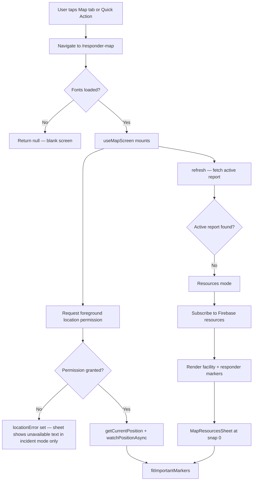
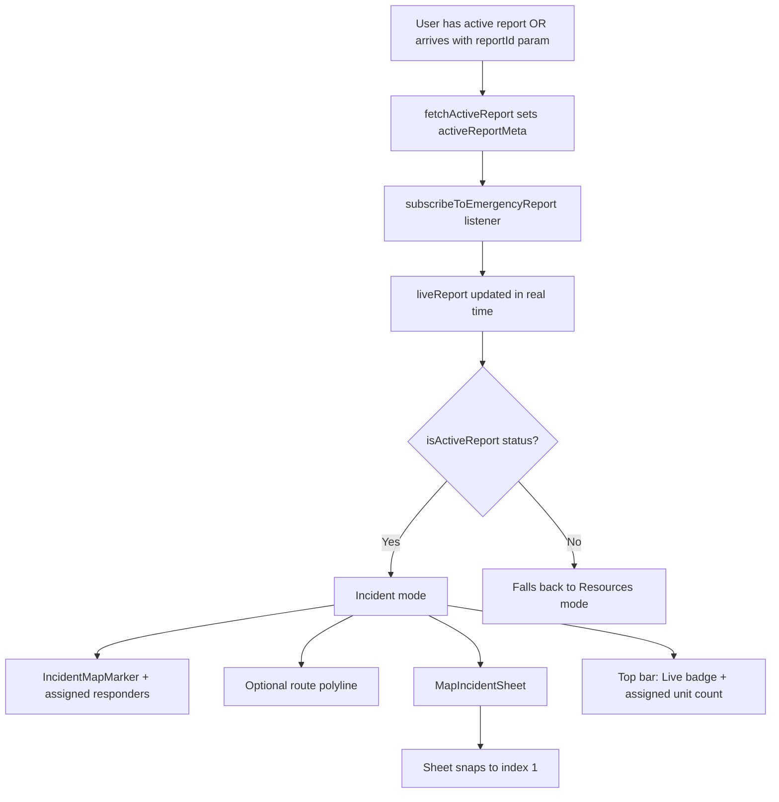
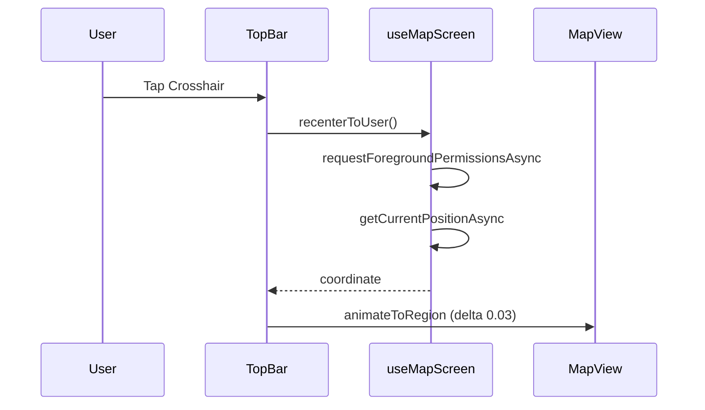
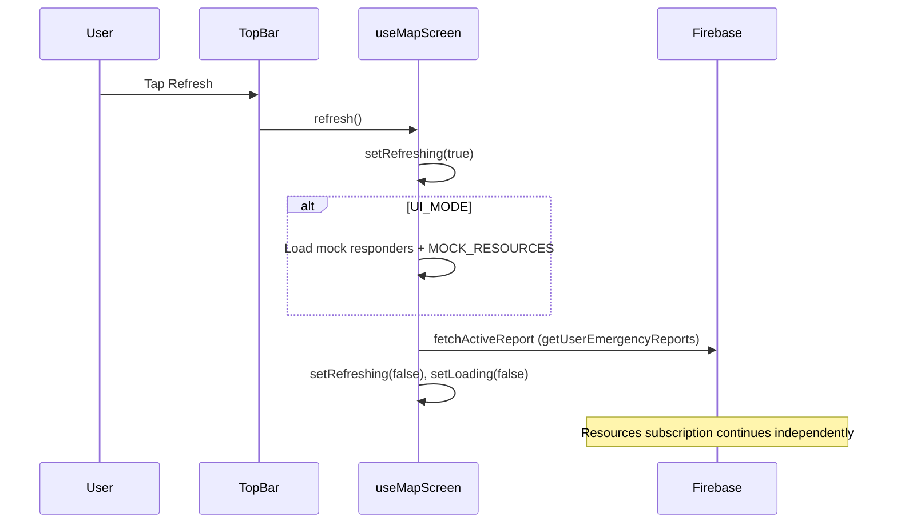
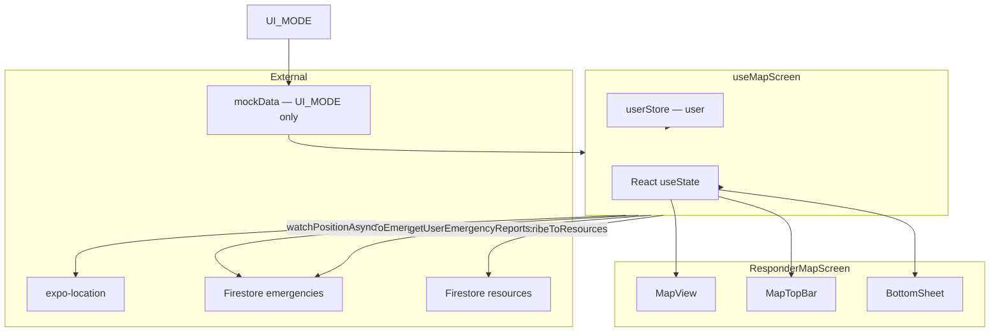

# Civilian Mobile App Map Page Analysis

> **Route:** `/responder-map`  
> **Screen component:** `ResponderMapScreen`  
> **Analysis date:** July 5, 2026  
> **Scope:** Documentation of the current implementation only — no redesign recommendations are applied here.

---

## Overview

The Map page (`ResponderMapScreen`) is a full-screen Google Maps experience embedded in the Civilian Mobile App. It operates in one of two modes determined at runtime:

| Mode | Condition | Map content | Bottom sheet |
|------|-----------|-------------|--------------|
| **Resources mode** | No active incident for the user | Nearby responders + emergency facilities | `MapResourcesSheet` |
| **Incident mode** | User has an active emergency report (`pending`, `active`, or `on_scene`) | Incident marker, assigned responders, optional route polyline | `MapIncidentSheet` |

The screen is reachable from bottom navigation, the dashboard, and several emergency-related flows. It combines `react-native-maps` (Google provider), `@gorhom/bottom-sheet`, `expo-location`, and Firebase real-time subscriptions.

---

## Purpose

The Map page serves two related purposes for civilians:

1. **Situational awareness** — Display nearby emergency resources (mobile responder units, fire stations, hospitals, police stations, RHUs, evacuation centers) when no active incident exists.
2. **Live incident tracking** — When the user has an active report, show the incident location, assigned responder positions, optional route visualization, ETA/distance stats, a status timeline, and a path to the full incident confirmation screen.

---

## Screen Layout

### Overall structure

The screen uses a layered layout: map fills the viewport; UI chrome floats above it.

```
┌─────────────────────────────────────────┐
│  MapTopBar (absolute, top, z-index 20)  │
├─────────────────────────────────────────┤
│                                         │
│         MapView (absolute fill)         │
│   • User location (native blue dot)     │
│   • Incident / responder / facility     │
│     markers (mode-dependent)            │
│   • Route polyline (incident mode only) │
│                                         │
├─────────────────────────────────────────┤
│  BottomSheet (z-index 30, ~24–78% height)│
│   MapResourcesSheet OR MapIncidentSheet │
└─────────────────────────────────────────┘
│  CustomBottomNav (global, z-index 999)  │
└─────────────────────────────────────────┘
```

### Layer details

| Layer | Position | z-index | Notes |
|-------|----------|---------|-------|
| Root `View` | `flex: 1` | — | Background from `mapTheme.background` |
| `MapView` | `StyleSheet.absoluteFill` | default | Full-bleed map |
| `MapTopBar` | `position: absolute`, top | 20 | Frosted bar with title + action buttons |
| `BottomSheet` | Gorhom bottom sheet | 30 | Cannot pan-to-close; 3 snap points |
| `CustomBottomNav` | Global overlay (root layout) | 999 | Visible on map page |

### Safe area handling

- **Top:** `MapTopBar` adds `topInset` (safe area) + 6–8 px padding.
- **Bottom:** Sheet content uses `bottomInset = insets.bottom + 108` to clear the custom bottom navigation bar (~108 px above safe area).
- **Map fit padding:** `fitToCoordinates` uses `top: insets.top + MAP_TOP_BAR_BODY_HEIGHT + 24`, `bottom: insets.bottom + 280`.

### Default map region

If neither user location nor incident coordinates are available at mount:

```javascript
{ latitude: 17.6132, longitude: 121.727, latitudeDelta: 0.05, longitudeDelta: 0.05 }
```

(Tuguegarao, Cagayan Valley area — used as fallback center.)

---

## UI Components

### Header — `MapTopBar`

Floating bar at the top of the screen.

| Element | Behavior |
|---------|----------|
| **Mode badge** | `"Resources"` (default) or `"Live"` (incident mode) — pill with uppercase label |
| **Title** | Resources: `"Map"` · Incident: `"Live Incident Map"` (with `reportId` param) or `"Incident Tracking"` |
| **Subtitle** | Hidden while `loading`. Resources: `"N nearby responder(s)"`. Incident: `"N assigned unit(s) on map"` |
| **Refresh button** | Calls `refresh()`; shows `ActivityIndicator` while `refreshing` |
| **Recenter button** | Crosshair icon; calls `recenterToUser()` then animates map to user |

**Compact variant:** In incident mode, bar uses slightly smaller title (16 vs 18), subtitle (12 vs 13), and action buttons (36×36 vs 40×40).

**Not present:** Back button, search field, map type toggle, zoom +/- controls.

### Google Map — `MapView`

| Property | Value |
|----------|-------|
| Provider | `PROVIDER_GOOGLE` |
| User location | `showsUserLocation={true}` |
| Built-in location button | `showsMyLocationButton={false}` (custom recenter used instead) |
| Compass | `showsCompass={false}` |
| Toolbar (Android) | `toolbarEnabled={false}` |
| Initial region | User location → incident coord → `DEFAULT_REGION` |
| Accessibility | `"Live incident tracking map"` or `"Emergency resources map"` |

**Gestures:** Standard native map gestures (pan, pinch-zoom, rotate where supported). No custom gesture handlers on the map itself.

### Incident marker — `IncidentMapMarker`

- Red circle (22×22 px) with white border and inner white dot.
- Rendered only in **incident mode** when valid incident coordinates exist.
- No `onPress` handler — tapping does not select or open detail.

### User location marker

- Provided natively by `showsUserLocation` (platform blue dot).
- Separate from custom markers; updated via `expo-location` watch in `useMapScreen`.

### Responder markers — `ResponderMapMarker`

- Circular bubble (36×36) with unit-type color from `getResponderMarkerStyle()`.
- Always displays a **Truck** Lucide icon (color varies by unit type; icon does not).
- `title` prop set to responder name (native callout on long-press, platform-dependent).
- Resources mode: all merged responders. Incident mode: `assignedResponders` only.

### Facility markers — `FacilityMapMarker`

- Rendered only in **resources mode**.
- 32×32 colored bubbles with type-specific icons:

| Kind | Color | Icon |
|------|-------|------|
| Fire | `#FF3B30` | Flame |
| Hospital | `#FF2D55` | HeartPulse |
| Police | `#5856D6` | Shield |
| RHU | `#34C759` | HeartPulse |
| Evacuation | `#FF9500` | Building2 |

- No tap interaction implemented.

### Route display — `Polyline`

- Rendered when `getRouteCoordinates(liveReport)` returns ≥ 2 valid points.
- Stroke: `theme.primary`, width 4.
- iOS: dashed via `lineDashPattern={[1]}`.
- **Data source:** Firestore fields `routeCoordinates`, `routePolyline`, or `responderRoute` on the report document. Not computed client-side.

### Floating buttons

Only the two buttons in `MapTopBar` (Refresh, Recenter). No FABs on the map canvas.

### Bottom sheets

**Container (`BottomSheet`):**

| Setting | Resources mode | Incident mode |
|---------|----------------|---------------|
| Snap points | `["24%", "48%", "76%"]` | `["22%", "46%", "78%"]` |
| Initial index | 0 | Auto-snaps to index 1 on mode/report change |
| Pan down to close | `false` | `false` |
| Backdrop | Appears at snap index 2, opacity 0.35 | Same |
| Handle | 44×4 pill, `theme.sheetHandle` | Same |
| Corner radius | 24 top corners | Same |

**Resources content — `MapResourcesSheet`:**

- Headline: "Emergency Resources"
- Subhead: "Nearby responders and public safety facilities"
- Sections with count pills: Nearby Responders, Fire Stations, Hospitals, Police Stations, RHUs, Evacuation Centers
- `ResponderCard` / `FacilityCard` list items (not tappable for navigation)

**Incident content — `MapIncidentSheet`:**

- Live tracking header with Radio icon, incident type, location text, `StatusBadge`
- User location sharing status line
- Stats row: ETA, Distance, Units, or Status chips
- Incident detail rows (Type, Reported, Priority, Location)
- Assigned responders list with status pills
- Vertical timeline with completion dots
- Dispatcher messages (decline reason, viewed-by dispatch)
- CTA: "View Incident Status" → `/emergency-confirmation?reportId=…`

### Status indicators

| Component | Usage |
|-----------|-------|
| `MapModeBadge` | Top bar mode pill |
| `StatusBadge` (`IncidentStatusIndicator`) | Incident sheet header; pulsing dot for active statuses |
| Status pills in lists | Responder availability (`available`, `en_route`, `on_scene`, etc.) via `getStatusBadgeStyle()` |
| Timeline dots | Current step highlighted with `theme.primary`; completed steps show checkmark |

### Icons

Lucide React Native throughout: `Crosshair`, `RefreshCw`, `Truck`, `Flame`, `HeartPulse`, `Shield`, `Building2`, `AlertTriangle`, `Radio`, `Clock`, `Navigation`, `MapPin`, `ChevronRight`, `Check`, `Phone`.

### Colors & typography

**Theme:** `createMapTheme(isLight, colors)` from `src/theme/factories.js`

| Token | Role |
|-------|------|
| `background`, `sheetBg`, `barBg` | Surfaces |
| `text`, `textSecondary` | Copy |
| `primary`, `primarySoft` | Accents, route, CTA |
| `live`, `liveSoft`, `liveBadgeBg`, `liveBadgeText` | Incident/live mode |
| `border`, `shadow`, `sheetHandle` | Chrome |

**Fonts:** Inter (400 Regular, 600 SemiBold, 700 Bold) — loaded in screen; returns `null` until fonts ready.

**Typography scale (representative):**

| Element | Size | Weight |
|---------|------|--------|
| Resources headline | 22 | Bold |
| Top bar title | 18 (16 compact) | Bold |
| Section titles | 16 | SemiBold |
| Body / meta | 12–14 | Regular/SemiBold |
| Section labels | 10 uppercase | SemiBold |

### Spacing

- Horizontal padding: 16 px (incident sheet), 20 px (resources sheet)
- Card border radius: 12–16 px
- Section gaps: 6–18 px
- 8 px grid used in stat chips and timeline rows

### Card hierarchy

1. Bottom sheet panel (bordered container)
2. Inner cards (`cardInner` background) for detail rows and responder lists
3. Individual message rows for dispatch notes
4. Standalone responder/facility cards in resources mode

### Animations

| Animation | Trigger |
|-----------|---------|
| Map `animateToRegion` / `fitToCoordinates` | Initial load, mode change, recenter (450 ms or 400 ms; 0 ms if reduce motion) |
| Bottom sheet snap | Mode/report change → index 1 in incident mode |
| Refresh spinner | Top bar refresh button |
| Status badge pulse | Active incident statuses (via `IncidentStatusIndicator`) |
| Sheet backdrop fade | Gorhom at highest snap point |

**Reduce motion:** `AccessibilityInfo.isReduceMotionEnabled()` disables map animation duration.

---

## Features

### Implemented

| Feature | Implementation |
|---------|----------------|
| Current location | `Location.getCurrentPositionAsync` on mount |
| GPS tracking / live updates | `Location.watchPositionAsync` — 25 m distance interval, 8 s time interval, balanced accuracy |
| User location on map | Native `showsUserLocation` |
| Recenter to user | Top bar button + fresh GPS read |
| Emergency resource markers | Fire stations, hospitals, police, RHUs, evacuation centers from Firebase `resources` collection |
| Mobile responder markers | Units with `currentLatitude/currentLongitude` from resources; merged with API responders in UI mode only |
| Incident marker | Red dot at report lat/lng in incident mode |
| Assigned responder filtering | `filterAssignedResponders()` by incident ID, assigned ID, name match, or status |
| Route visualization | Polyline from Firestore route fields (when present) |
| ETA display | From `estimatedArrivalMinutes`, `etaMinutes`, or `estimatedEtaMinutes` on report |
| Distance display | From `distanceRemainingKm`, `estimatedDistanceKm`, etc. |
| Active incident auto-detection | Fetches user's reports; picks first active status |
| Focused incident via param | `?reportId=` overrides auto-detection |
| Real-time report updates | `subscribeToEmergencyReport` Firestore listener |
| Real-time resource updates | `subscribeToResources` Firestore listener (production) |
| Resource categorization | Pattern/type-based sorting in `categorizeEmergencyResources()` |
| Incident timeline | Built from Firestore timestamp fields |
| Dispatcher messages | Decline reason + viewed-by dispatch |
| Pull-to-refresh equivalent | Top bar refresh button |
| Auto map bounds | `fitImportantMarkers()` on mode/report change |
| Dual-mode UI | Resources vs incident sheets and markers |
| Theme support | Light/dark via `useAppTheme().mapTheme` |
| Bottom nav integration | Map tab + SOS/Call actions remain available |

### Not implemented

| Feature | Status |
|---------|--------|
| Search / geocoding | **Not present** |
| Marker clustering | **Not present** |
| Marker tap / incident selection on map | **Not present** |
| Turn-by-turn navigation | **Not present** |
| Map type switching (satellite/terrain) | **Not present** |
| Custom zoom controls | **Not present** (pinch only) |
| REST API responder fetch in production | **Not wired** — `apiResponders` only populated in `UI_MODE` |
| Offline mode / cached map tiles | **Not present** |
| Background location | **Not requested** — foreground only |
| Loading timeout UI | **Not present** |
| Dedicated error screen | **Not present** |
| Facility/responder card → map focus | **Not present** |
| Deep link handler for `/responder-map` | **No explicit linking config** (scheme `resqlink` exists at app level) |
| Emergency reporting from map | **Not present** (report via dashboard/SOS flows) |
| Nearby incidents of other users | **Not shown on map** (dashboard Nearby strip is separate) |

---

## User Flow

### Flow A — Open map (no active incident)



### Flow B — Active incident (auto-detected or via reportId)



### Flow C — Recenter



### Flow D — Refresh



### Flow E — View incident status (from map)

```mermaid
flowchart LR
    A[MapIncidentSheet CTA] --> B["router.push(/emergency-confirmation?reportId=…)"]
    B --> C[Emergency Confirmation Screen]
    C --> D[User can return via back / bottom nav]
    D --> E[/responder-map — map still in stack]
```

---

## Navigation

### Entry points

| Source | Route | Params |
|--------|-------|--------|
| Bottom nav "Map" tab | `/responder-map` | — |
| Dashboard Quick Actions | `/responder-map` | — |
| Dashboard Nearby "See all" | `/responder-map` | — |
| Dashboard Nearby card tap | `/responder-map` | `{ reportId }` |
| Dashboard Active Incident "View Live Tracking" | `/responder-map` | `{ reportId }` |
| Emergency Confirmation `LiveIncidentMapCard` | `/responder-map` | `{ reportId }` |
| SOS hook (after report created) | `/responder-map` | `{ reportId }` (via confirmation flow) |
| Emergency submit hook | `/emergency-confirmation` first, map via card | `{ reportId }` |

**Note:** History screen navigates to `/emergency-confirmation`, not directly to the map.

### Exit points

| Action | Destination |
|--------|-------------|
| Bottom nav (Home, History, Settings) | Respective tab routes |
| MapIncidentSheet CTA | `/emergency-confirmation?reportId=…` |
| SOS / Call buttons (bottom nav) | SOS flow / phone dialer (via hooks) |
| System back (Android) | Previous stack screen |

### Route file

```
src/app/(main)/responder-map.jsx  →  re-exports ResponderMapScreen
```

Registered under `(main)` Stack with `headerShown: false`.

### Navigation parameters

| Param | Type | Effect |
|-------|------|--------|
| `reportId` | `string` (optional) | Focuses incident subscription on that report ID instead of auto-detecting user's active report |

Read via `useLocalSearchParams()` in `ResponderMapScreen`.

### Back navigation

No in-screen back button. User relies on bottom navigation or system back. Map remains in `(main)` stack.

### Deep links

App scheme: `resqlink` (from `app.json`). No dedicated Expo Router deep-link configuration for `/responder-map` was found in the analyzed files.

---

## Data Flow



### Firestore reads

| Operation | Collection | When | Function |
|-----------|------------|------|----------|
| One-time fetch | `emergencies` | On refresh / mount | `getUserEmergencyReports(userId, 25)` — finds active report |
| Real-time doc listener | `emergencies/{reportId}` | When `activeReportMeta.id` set (non-UI_MODE) | `subscribeToEmergencyReport` |
| Real-time query listener | `resources` | On mount (non-UI_MODE, authenticated) | `subscribeToResources` — up to 300 docs, `isActive !== false` |

### API requests

The REST endpoint `/api/responders/locations` is defined in `src/services/api/index.js` but **is not called** by `useMapScreen` in production. Responder data in production comes exclusively from Firebase `resources` mobile units (`currentLatitude/currentLongitude`).

In `UI_MODE`, mock responders and `MOCK_RESOURCES` are loaded locally on refresh.

### Location services

| Call | Purpose |
|------|---------|
| `requestForegroundPermissionsAsync` | Initial + recenter |
| `getCurrentPositionAsync({ accuracy: Balanced })` | Initial fix + recenter |
| `watchPositionAsync({ distanceInterval: 25, timeInterval: 8000 })` | Continuous updates |

Location state: `{ latitude, longitude, accuracy }` + `locationUpdatedAt` timestamp.

### Caching / refresh

- No explicit map data cache beyond React state and Firestore SDK offline persistence (not configured in analyzed code).
- Manual refresh re-runs `fetchActiveReport` and mock data load (UI mode).
- Resource subscription is independent of refresh button.

### Real-time subscriptions lifecycle

| Subscription | Cleanup |
|--------------|---------|
| `subscribeToResources` | Unsubscribe on hook unmount |
| `subscribeToEmergencyReport` | Unsubscribe when `activeReportMeta` changes or unmount |
| Location watch | `remove()` on unmount |

---

## Firebase Integration

### Packages

`@packages/firebase` — shared monorepo package.

### Functions used by map

| Function | Purpose |
|----------|---------|
| `getUserEmergencyReports` | Find user's active emergency |
| `subscribeToEmergencyReport` | Live report document updates |
| `subscribeToResources` | Live resource/responder positions |
| `normalizeOperationalStatus` | Timeline + active status checks (via history constants) |

### Report fields consumed on map

**Location:** `latitude`, `longitude`, `locationText`  
**Status:** `status`, timestamps (`createdAt`, `viewedAt`, `acknowledgedAt`, `acceptedAt`, `touchdownAt`, `updatedAt`, `movedToHistoryAt`)  
**Assignment:** `incidentId`, `assignedResponderId`, `responder`, `assignedTeamName`  
**Routing/ETA:** `routeCoordinates` / `routePolyline` / `responderRoute`, `estimatedArrivalMinutes`, `etaMinutes`, `distanceRemainingKm`, `etaUpdatedAt`  
**Dispatch:** `declineReason`, `declinedByName`, `viewedByName`, `priority`  
**Auth guard:** Resource subscription returns empty array if Firebase Auth `currentUser` is null.

### UI_MODE behavior

When `Constants.expoConfig.extra.uiMode === true`:

- Skips live Firestore report subscription (uses mock active report with fixed Tuguegarao coordinates).
- Loads mock responders and `MOCK_RESOURCES` on refresh.
- Still runs real location services.

---

## State Management

### React state (`useMapScreen`)

| State | Type | Description |
|-------|------|-------------|
| `apiResponders` | array | Mock/API responders (UI_MODE only in practice) |
| `resources` | array | Raw Firebase resource records |
| `activeReportMeta` | object \| null | Identified active/focused report |
| `liveReport` | object \| null | Real-time merged report |
| `userLocation` | object \| null | GPS coordinates |
| `locationUpdatedAt` | Date \| null | Last GPS update |
| `loading` | boolean | Initial load (subtitle hidden) |
| `refreshing` | boolean | Refresh in progress |
| `locationError` | string \| null | Permission or GPS error message |

### Derived state (useMemo)

| Value | Logic |
|-------|-------|
| `categorized` | `categorizeEmergencyResources(resources)` |
| `allResponders` | `mergeResponders(apiResponders, categorized.mobileUnits)` |
| `isIncidentMode` | `liveReport && isActiveReport(liveReport.status)` |
| `assignedResponders` | `filterAssignedResponders(allResponders, liveReport)` |

### React state (`ResponderMapScreen`)

Local UI state via refs: `mapRef`, `sheetRef`, `reduceMotionRef`.  
Computed: `snapPoints`, `incidentCoord`, `routeCoordinates`, `facilityMarkers`, `initialRegion`, titles.

### Global state

| Store | Usage |
|-------|-------|
| **Zustand** `useUserStore` | Current user (`uid` / `id`) for report fetch |
| **React Context** `AppThemeProvider` | `mapTheme`, `colors`, `isLight` |
| **React Query** | Present in root layout but **not used** by map screen |
| **Redux** | **Not used** |

### Custom hooks

| Hook | Role |
|------|------|
| `useMapScreen` | All map business logic |
| `useAppTheme` | Theme tokens |
| `useLocalSearchParams` | Route params |
| `useSafeAreaInsets` | Layout insets |
| `useFonts` | Inter font loading |

---

## Permissions

### Location

| Permission | Requested | Purpose |
|------------|-----------|---------|
| Foreground location | Yes — `Location.requestForegroundPermissionsAsync()` | Initial position, watch, recenter |
| Background location | **No** | Not requested in map code |

### App manifest (`app.json`)

- Android: `ACCESS_FINE_LOCATION`, `ACCESS_COARSE_LOCATION`
- iOS: Usage strings via `expo-location` plugin for when-in-use / always (always not used by map hook)

### Permission denial flow

1. `locationError` set to `"Location permission denied"`.
2. Map still renders; native user dot may not appear.
3. In incident sheet: `"Location unavailable"` label (no blocking modal or settings redirect).
4. Recenter returns `null` silently if permission denied.

### Other permissions

Map page does not request camera, microphone, or notifications directly.

---

## Component Breakdown

```
ResponderMapScreen
├── MapView (react-native-maps)
│   ├── IncidentMapMarker          — active incident pin (incident mode)
│   ├── ResponderMapMarker (×N)    — mobile units
│   ├── FacilityMapMarker (×N)     — static facilities (resources mode)
│   ├── Polyline                   — optional route (incident mode)
│   └── Native user location dot
├── MapTopBar
│   ├── MapModeBadge               — "Resources" | "Live"
│   ├── Title + Subtitle
│   ├── Refresh button
│   └── Recenter button
├── BottomSheet (@gorhom/bottom-sheet)
│   ├── BottomSheetBackdrop        — at highest snap
│   ├── MapResourcesSheet          — resources mode
│   │   ├── Section (×N)
│   │   ├── ResponderCard
│   │   ├── FacilityCard
│   │   └── Empty text
│   └── MapIncidentSheet           — incident mode
│       ├── StatusBadge
│       ├── StatChip (×N)
│       ├── DetailRow (×N)
│       ├── ResponderRow (×N)
│       ├── Timeline steps
│       ├── Dispatcher messages
│       └── CTA → emergency-confirmation
└── (Global) CustomBottomNav       — from root _layout.jsx
```

### Responsibilities

| Component | Responsibility |
|-----------|----------------|
| `ResponderMapScreen` | Layout orchestration, map ref control, mode switching, font gate |
| `useMapScreen` | Data fetching, subscriptions, location, derived responder lists |
| `MapTopBar` | Mode-aware header and map controls |
| `MapMarkers` | Custom marker visuals (memoized) |
| `MapResourcesSheet` | Scrollable resource directory |
| `MapIncidentSheet` | Live tracking detail panel |
| `mapUtils.js` | Coord validation, categorization, merge/filter, ETA/route helpers |
| `incidentTimeline.js` | Timeline construction from Firestore fields |

---

## File Structure

```
apps/civilian-mobile-app/
├── src/app/(main)/
│   └── responder-map.jsx                    # Route re-export
├── src/features/incident-map/
│   ├── screens/
│   │   └── ResponderMapScreen.jsx           # Main screen (~350 lines)
│   ├── hooks/
│   │   └── useMapScreen.js                  # State + data (~330 lines)
│   ├── components/
│   │   ├── MapTopBar.jsx                    # Header bar
│   │   ├── MapMarkers.jsx                   # Marker components
│   │   ├── MapResourcesSheet.jsx            # Resources bottom sheet content
│   │   └── MapIncidentSheet.jsx             # Incident bottom sheet content
│   └── utils/
│       ├── mapUtils.js                      # Map data utilities
│       └── incidentTimeline.js              # Timeline builder
├── src/components/
│   ├── CustomBottomNav/index.jsx            # Map tab entry
│   └── badges/
│       ├── StatusBadge.jsx                  # Re-export
│       └── IncidentStatusIndicator.jsx      # Pulsing status badge
├── src/theme/
│   ├── AppThemeProvider.jsx                 # Provides mapTheme
│   └── factories.js                         # createMapTheme()
├── src/constants/routes.js                  # responderMap: "/responder-map"
├── src/stores/userStore.js                  # Zustand user state
└── src/services/api/index.js                # UI_MODE, mockData, API URLs
```

### External dependencies

| Package | Usage |
|---------|-------|
| `react-native-maps` | Map rendering |
| `@gorhom/bottom-sheet` | Sheet UI |
| `expo-location` | GPS |
| `@packages/firebase` | Firestore |
| `lucide-react-native` | Icons |
| `expo-router` | Routing |
| `react-native-reanimated` | Used in StatusBadge (not directly in map screen) |

### Interaction diagram

```mermaid
flowchart LR
    Route[responder-map.jsx] --> Screen[ResponderMapScreen]
    Screen --> Hook[useMapScreen]
    Screen --> TopBar[MapTopBar]
    Screen --> Markers[MapMarkers]
    Screen --> Sheets[MapResourcesSheet / MapIncidentSheet]
    Hook --> Utils[mapUtils.js]
    Hook --> Timeline[incidentTimeline.js]
    Hook --> Firebase[@packages/firebase]
    Hook --> Location[expo-location]
    Hook --> Store[userStore]
    Screen --> Theme[useAppTheme → mapTheme]
```

---

## Loading States

| State | UI behavior |
|-------|-------------|
| Fonts not loaded | Entire screen returns `null` (blank) |
| `loading === true` | Map and sheet render; top bar **subtitle hidden** |
| `refreshing === true` | Refresh icon replaced by `ActivityIndicator` in top bar |
| Location acquiring | Incident sheet shows `"Locating your position…"` |
| Firestore subscriptions | No explicit loading indicator — data appears when snapshots arrive |
| No loading skeleton | **Not implemented** for map or sheet content |

Initial `loading` becomes `false` after first `refresh()` completes.

---

## Empty States

| Context | Empty state |
|---------|-------------|
| No responders (resources sheet) | Text: *"No responder locations available right now."* |
| No facility categories | Sections omitted entirely (not shown with zero count) |
| No assigned responders (incident sheet) | Responders section hidden |
| No route data | Polyline not rendered (no message) |
| No ETA/distance | Stat chips omit those fields; may show Status chip instead |
| No timeline steps | Timeline section hidden |
| No dispatcher messages | Dispatch section hidden |
| No active incident | Resources mode — not an "empty map" state; map shows facilities/responders if data exists |

**Map-level empty state:** Not implemented — map always shows at least the default region.

---

## Error Handling

| Error condition | Handling |
|-----------------|----------|
| Location permission denied | `locationError = "Location permission denied"`; sheet label only; console silent to user |
| GPS exception | `locationError = error.message \|\| "Unable to get location"`; `console.error` |
| Recenter failure | Logs error; returns previous `userLocation` or null |
| Active report fetch failure | `console.error("Error fetching active report")` — **no UI feedback** |
| Firestore report subscription error | Callback receives `null`; `liveReport` cleared |
| Firestore resources permission denied | Empty array returned silently |
| Firestore resources other errors | `console.error`; empty array |
| Unauthenticated resources sub | Empty array, no subscription |
| Invalid coordinates | Filtered by `isValidCoord()` — markers skipped |
| Network disconnected | **No explicit handling** — Firestore SDK behavior only |
| Firebase error UI | **Not present** |
| Loading timeout | **Not present** |

---

## Performance Analysis

### Memoization

| Item | Memoized |
|------|----------|
| `IncidentMapMarker`, `ResponderMapMarker`, `FacilityMapMarker` | `React.memo` |
| `categorized`, `allResponders`, `assignedResponders` | `useMemo` in hook |
| `incidentCoord`, `routeCoordinates`, `facilityMarkers`, `snapPoints` | `useMemo` in screen |
| `fitImportantMarkers`, `handleRecenter`, `renderBackdrop` | `useCallback` |
| Timeline, dispatcher messages, ETA in sheet | `useMemo` |

### Rendering behavior

- Markers re-render when responder/resource/report arrays change.
- Bottom sheet **remounts** on mode switch (`key={isIncidentMode ? "incident-sheet" : "resources-sheet"}`).
- Full marker list mapped on every relevant state change — no virtualization on map.
- `fitImportantMarkers` runs on `[isIncidentMode, liveReport?.id]` change — may animate frequently when switching incidents.

### Map optimization

- Native `MapView` handles tile rendering.
- No custom clustering — many markers could impact performance.
- `initialRegion` set once; subsequent moves use imperative `animateToRegion` / `fitToCoordinates`.

### Expensive operations

| Operation | Frequency |
|-----------|-----------|
| `categorizeEmergencyResources` | On every `resources` snapshot |
| `fitToCoordinates` | Mode/report change + dependency updates |
| Location watch callbacks | Every 25 m or 8 s |
| Firestore listeners | Continuous while mounted |

### Current bottlenecks (observed)

1. Re-categorization of up to 300 resources on each snapshot.
2. Unbounded marker count on map (no clustering/limit).
3. Sheet remount on mode toggle resets scroll position and snap index logic.
4. Font gate returns blank screen until Inter loads (duplicate load with root layout).

---

## Current UI Assessment

### Strengths

- Clear dual-mode design (resources vs live tracking) with consistent visual language.
- Bottom sheet provides rich incident context without leaving the map.
- Real-time Firestore integration for reports and resources.
- Thoughtful safe-area and bottom-nav clearance padding.
- Reduce-motion support for map animations.
- Accessible labels on top bar buttons and map view.
- Themed for light/dark modes via centralized `mapTheme`.
- Timeline and dispatch messages add operational transparency in incident mode.

### Weaknesses

- No visual feedback for data fetch errors or Firebase failures.
- `loading` state only hides subtitle — users may not know data is loading.
- Font loading blank screen before any content appears.
- Responder markers always show a Truck icon regardless of unit type.
- `getResponderMarkerStyle` colors are computed but icon variety is not used on map (facilities have distinct icons).

### UX issues

- Markers are not interactive — users cannot tap a responder or facility to focus the map.
- Resources sheet cards are read-only with no call or directions actions (phone shown in meta but not tappable).
- Cannot dismiss bottom sheet completely (`enablePanDownToClose={false}`).
- Refresh button scope is unclear (re-fetches report meta, not Firestore subscriptions).
- Incident mode sheet auto-opens to 46% — may obscure map on small screens.

### Visual inconsistencies

- Incident marker is a simple red dot; facility/responder markers use icon bubbles — visual hierarchy differs.
- Resources sheet uses 20 px horizontal padding; incident sheet uses 16 px.
- Stat chip distance label strips `" away"` suffix inconsistently with stored format.
- Top bar title says "Map" in resources mode but sheet headline says "Emergency Resources".

### Layout problems

- Bottom nav overlaps map but sheet padding accounts for it; map `fitToCoordinates` bottom padding (280) is approximate.
- No landscape/tablet-specific layout adjustments.

### Spacing issues

- Minor: section label `marginVertical: -2` on dividers may cause tight spacing on some devices.

### Accessibility observations

- Good: button `accessibilityRole` and labels on top bar and CTA.
- Good: map `accessibilityLabel` reflects mode.
- Gap: marker accessibility labels are generic ("Incident location", "Fire unit") — no incident type or distance.
- Gap: bottom sheet snap positions not announced to screen readers.
- Gap: no accessibility hint for non-interactive markers.

### Interaction issues

- No haptic feedback on recenter/refresh.
- Backdrop only at highest sheet snap — intermediate snaps have no dimming.
- Pull-to-refresh not available (button only).

---

## Known Limitations

1. **Production responder API not connected** — `/api/responders/locations` exists in config but is never fetched outside UI mode.
2. **Route polyline is passive** — only displays if backend writes coordinates; no client-side routing.
3. **Assigned responder matching is heuristic** — may miss units or include false positives based on status strings.
4. **Single active incident** — only one report tracked; no multi-incident map view.
5. **focusReportId without active status** — falls back to resources mode even if param provided.
6. **Mock coordinates in UI_MODE** — fixed Tuguegarao lat/lng regardless of device location for incident.
7. **Web map polyfills removed** — map is native-focused; web support not analyzed as active target.
8. **No integration test coverage** referenced for map flows in analyzed files.

---

## Technical Notes

### Active status definition

From `src/features/history/constants/index.js`:

```javascript
ACTIVE_STATUSES = new Set(["pending", "active", "on_scene"]);
```

Reports with `resolved`, `cancelled`, etc. do not enter incident mode.

### Responder merge key

API responders keyed as `api-{id}`; resource units as `res-{id}` in `mergeResponders()`.

### Facility deduplication

Stations deduplicated by normalized name + rounded lat/lng (`stationKey()`).

### Google Maps

Uses `PROVIDER_GOOGLE`. API key configuration for native builds is outside the analyzed screen files (typically in platform config / env).

### Bottom sheet library

`@gorhom/bottom-sheet` v5.2.6 — requires `GestureHandlerRootView` (present in root layout).

### Constants

`MAP_TOP_BAR_BODY_HEIGHT = 72` exported from `MapTopBar` for map padding calculations.

---

## Summary

The Civilian Mobile App Map page (`/responder-map` → `ResponderMapScreen`) is a mode-aware full-screen map built on Google Maps, with a floating top bar and a persistent three-snap bottom sheet. In **resources mode**, it visualizes Firebase-sourced emergency facilities and mobile responder units near the user. In **incident mode**, it tracks the user's active emergency report in real time, showing the incident pin, assigned responders, an optional Firestore-provided route, and a detailed live-tracking sheet with ETA, timeline, and dispatch messages.

Data flows through the `useMapScreen` hook combining Zustand user identity, Firestore subscriptions (`emergencies`, `resources`), and `expo-location` foreground tracking. Navigation is primarily via the bottom nav Map tab and dashboard/emergency flows; the optional `reportId` param focuses incident tracking.

The implementation is functional for core tracking and awareness scenarios but lacks search, marker interaction, clustering, turn-by-turn navigation, offline support, production REST responder fetching, and comprehensive error/loading UX. This document captures the current state as a baseline for future redesign planning.
