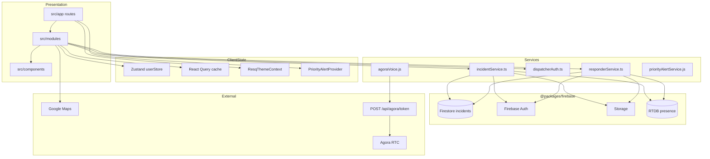
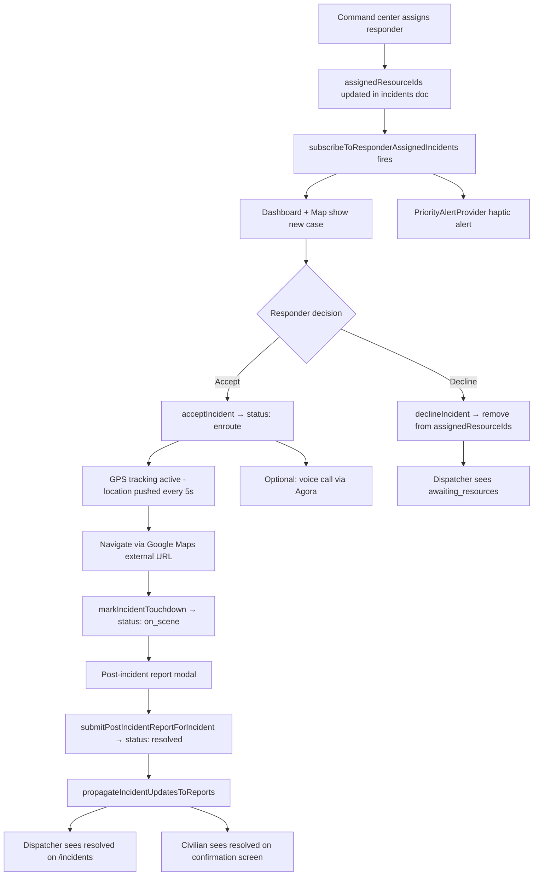

# RESQ Responder Mobile App — Complete Technical Analysis

> **Document version:** 1.0  
> **Generated:** July 5, 2026  
> **App path:** `apps/responder-mobile-app`  
> **Purpose:** Single source of truth for understanding the Responder Mobile App

---

## Table of Contents

1. [Executive Summary](#1-executive-summary)
2. [Project Structure](#2-project-structure)
3. [Application Architecture](#3-application-architecture)
4. [Authentication](#4-authentication)
5. [Navigation Flow](#5-navigation-flow)
6. [Screen-by-Screen Analysis](#6-screen-by-screen-analysis)
7. [Dashboard Analysis](#7-dashboard-analysis)
8. [Incident Workflow](#8-incident-workflow)
9. [Status Management](#9-status-management)
10. [Maps & Navigation](#10-maps--navigation)
11. [Incident Management](#11-incident-management)
12. [Field Assessment](#12-field-assessment)
13. [Notifications](#13-notifications)
14. [Firebase & Database](#14-firebase--database)
15. [API Analysis](#15-api-analysis)
16. [Real-Time Features](#16-real-time-features)
17. [UI/UX Review](#17-uiux-review)
18. [Code Quality Review](#18-code-quality-review)
19. [Performance Review](#19-performance-review)
20. [Security Review](#20-security-review)
21. [Strengths](#21-strengths)
22. [Weaknesses](#22-weaknesses)
23. [Recommended Improvements](#23-recommended-improvements)
24. [Missing Features](#24-missing-features)
25. [Final Assessment](#25-final-assessment)

---

## 1. Executive Summary

### Purpose of the Application

The **RESQ-Link Responder Mobile App** is the field operations client for emergency response personnel in the RESQ platform. It enables responders to receive incident assignments from the command center, accept or decline cases, navigate to scenes, mark arrival (touchdown), submit post-incident reports, share live GPS location, participate in voice calls, and communicate with dispatchers via operational chat.

### Target Users

- **Field responders** — BFP, PNP, MDRRMO, Ambulance, PCG personnel assigned to incidents
- **Designation:** Accounts live in the Firestore `dispatchers` collection (naming reflects shared dispatcher/responder account model)

### Role in the RESQ Ecosystem

```
Civilian Mobile App  →  reports emergency  →  Firestore emergencies
                              ↓
Dispatcher Web App   →  triages & assigns    →  Firestore incidents
                              ↓
Responder Mobile App →  accepts & responds   →  status updates propagate back
                              ↓
Civilian + Dispatcher receive real-time updates
```

The responder app is the **execution layer** — it turns dispatcher assignments into on-scene action and closure.

### High-Level Overview

| Aspect | Detail |
|--------|--------|
| **Stack** | Expo SDK 54, React Native 0.81, React 19, Expo Router 6 |
| **State** | Zustand (session) + TanStack React Query (incident cache) |
| **Backend** | `@packages/firebase` — direct Firestore/Auth/Storage/RTDB |
| **REST API** | Single endpoint: Agora RTC token via dispatcher Next.js app |
| **Architecture** | Feature modules (`src/modules/`) with thin route files (`src/app/`) |

### Main Responsibilities of Responders

1. Monitor assigned incidents on dashboard and map
2. Accept or decline assignments with reason
3. Share live GPS location while on duty
4. Navigate to incident scenes (external Google Maps)
5. Mark touchdown (on-scene arrival)
6. Submit post-incident report with optional photo
7. Answer voice calls from civilians (Agora RTC)
8. Chat with dispatchers (Firestore messaging)

### Overall Workflow

```
Sign in → Dashboard (assigned cases) → Open case → Accept → En route
  → Navigate (Google Maps) → Touchdown → Post-incident report → Resolved
```

Parallel paths: incoming voice calls (dashboard overlay), dispatcher chat (global FAB), priority haptic alerts on new assignments.

---

## 2. Project Structure

### Top-Level Layout

```
apps/responder-mobile-app/
├── app.config.js          # Env → Expo extra (Firebase, Agora)
├── app.json               # Manifest: bundle IDs, permissions, plugins
├── index.tsx              # Entry: polyfills + expo-router/entry
├── metro.config.js        # Monorepo @packages/firebase alias
├── tsconfig.json          # @/* → src/*
├── assets/                # Images, sounds
├── polyfills/web/         # maps.web.jsx (web platform)
├── patches/               # patch-package overrides
├── docs/                  # Architecture guides + this document
└── src/
    ├── app/               # Expo Router — thin route files only
    ├── modules/           # Feature UI + hooks (7 domains)
    ├── components/        # Shared: ui/, feedback/, layout/, badges/
    ├── services/          # Firebase/API adapters (no JSX)
    ├── store/             # Zustand userStore
    ├── query/             # TanStack Query client + keys
    ├── providers/         # PriorityAlertProvider
    ├── context/           # ResqThemeContext
    ├── theme/             # Tokens, palettes, themes
    ├── hooks/             # useAgoraVoiceCall
    ├── utils/             # Pure helpers
    └── constants/         # LOCATION_PAUSED_KEY
```

### Folder Responsibilities

| Folder | Responsibility |
|--------|----------------|
| `src/app/` | URL routing only — each file re-exports a module view |
| `src/modules/auth/` | Login, auth gate |
| `src/modules/dashboard/` | Home screen, stats, location tracking |
| `src/modules/incidents/` | Case list, detail, timeline, post-report, decline |
| `src/modules/map/` | Map explorer with bottom sheet |
| `src/modules/messaging/` | Global dispatcher chat widget |
| `src/modules/calls/` | Agora voice call panel |
| `src/modules/notifications/` | Local notification preference toggles |
| `src/modules/settings/` | Profile, appearance, location pause, logout |
| `src/services/` | Thin wrappers over `@packages/firebase` |
| `src/store/` | Zustand session persistence |
| `src/query/` | React Query configuration and cache keys |
| `src/theme/` | Design tokens, semantic colors, per-screen themes |
| `src/components/` | Generic UI only — domain widgets live in modules |

### Screens (Routes)

| URL | Route File | View Component |
|-----|------------|----------------|
| `/` | `src/app/index.jsx` | `AuthIndexGate` |
| `/login` | `src/app/(auth)/login.jsx` | `LoginView` |
| `/dashboard` | `src/app/(tabs)/dashboard.jsx` | `DashboardView` |
| `/map` | `src/app/(tabs)/map.jsx` | `ResponderMapExplorer` |
| `/settings` | `src/app/(tabs)/settings.jsx` | `SettingsView` |
| `/notifications` | `src/app/(tabs)/notifications.jsx` | `NotificationsView` |
| `/incident/:id` | `src/app/incident/[id].jsx` | `CaseDetailView` |
| `/support/about` | `src/app/support/about.jsx` | `AboutView` |
| `/support/help-support` | `src/app/support/help-support.jsx` | `HelpSupportView` |
| `/support/location` | `src/app/support/location.jsx` | `LocationView` |

### Configuration & Environment Variables

**`app.config.js`** merges `app.json` with dynamic `extra.firebase` and `extra.agora` from env.

| Variable | Purpose |
|----------|---------|
| `EXPO_PUBLIC_FIREBASE_*` | Firebase client config |
| `EXPO_PUBLIC_AGORA_APP_ID` | Agora RTC app ID |
| `EXPO_PUBLIC_API_URL` | Agora token backend (dispatcher Next.js URL) |
| `FIREBASE_*` / `NEXT_PUBLIC_*` | Fallback env resolution |

**`app.json` highlights:**
- Name: RESQ-Link Responder
- Scheme: `resqlink-responder`
- Bundle: `com.tuguegarao.resqlink.responder`
- Permissions: location, microphone
- `extra.apiUrl`: `http://localhost:4000` (should point to dispatcher `:3000`)

### AsyncStorage Keys

| Key | Constant | Purpose |
|-----|----------|---------|
| `dispatcher_user` | `userStore.ts` | Session JSON (`SessionUser`) |
| `resq.appearance.preference` | `RESQ_APPEARANCE_KEY` | light/dark/system theme |
| `responder_location_paused` | `LOCATION_PAUSED_KEY` | Pause GPS sharing |
| `responder_notification_settings` | `NotificationsView` | `{ caseAlerts, statusUpdates }` — **not wired to alerts** |

---

## 3. Application Architecture

### Overall Architecture

The app follows a **Firebase-first, feature-module architecture**:

- **Thin routes** — `src/app/*.jsx` only import and render module views
- **Feature modules** — `src/modules/<domain>/` contain components, hooks, and styles
- **Service adapters** — `src/services/` wrap `@packages/firebase` (no business logic duplication)
- **Realtime data** — Firestore `onSnapshot` subscriptions write into React Query cache
- **Global overlays** — Messaging widget and priority alerts mounted from root layout

### Architecture Diagram



### Navigation Architecture

- **Expo Router** file-based routing with `(tabs)` and `(auth)` groups (groups omitted from URLs)
- **Custom tab bar** — `MainTabBar.jsx` replaces default Expo tabs (3 visible tabs)
- **Stack screens** — `/incident/:id` and `/support/*` pushed on top of tabs
- **Global FAB** — `ResponderMessagingWidget` floats above all screens when authenticated

### State Management

| Layer | Technology | Usage |
|-------|------------|-------|
| Session | Zustand `userStore` | `user`, `isLoading`; persisted to AsyncStorage |
| Server cache | React Query | Assigned incidents, online responder count |
| Realtime | Firestore listeners | Primary data source; patches query cache via `setQueryData` |
| Theme | React Context | `ResqThemeProvider` — appearance, semantic colors |
| Alerts | React Context | `PriorityAlertProvider` — haptic assignment alerts |

**Query keys** (`src/query/queryKeys.ts`):
```typescript
["incidents"]
["incidents", "assigned", uid]
["responders", "onlineCount"]
```

**Query client:** `staleTime: 5min`, `gcTime: 30min`, `retry: 1`

### Service Layer

| Service | File | Firebase Functions Wrapped |
|---------|------|---------------------------|
| Incidents | `incidentService.ts` | `subscribeToResponderAssignedIncidents`, `acceptIncident`, `declineIncident`, `markIncidentTouchdown`, `submitPostIncidentReportForIncident` |
| Responder | `responderService.ts` | `subscribeToOnlineResponderCount`, `updateDispatcherLocation`, `setDispatcherOnlineStatus` |
| Auth | `dispatcherAuth.ts` | `signInDispatcher` + `dispatchers/{uid}` verification |
| Agora | `agoraVoice.js` | REST `POST /api/agora/token` |
| Alerts | `priorityAlertService.js` | Local haptics only (Expo Haptics) |

### Reusable Components

| Component | Path | Used By |
|-----------|------|---------|
| `CustomButton` | `components/ui/` | Login, forms, actions |
| `FormInput` | `components/ui/` | Login |
| `LoadingScreen` | `components/ui/` | Login |
| `ErrorAlert` | `components/feedback/` | Case detail, login |
| `MainTabBar` | `components/layout/` | Tab navigation |
| `IncidentStatusIndicator` | `components/badges/` | Case cards, detail |
| `StatusBadge` | `components/badges/` | Re-export wrapper |

---

## 4. Authentication

### Login Flow

```
App launch → AuthIndexGate
  → loadUser() from AsyncStorage
  → user exists → /dashboard
  → no user → /login

LoginView:
  → signInDispatcherWithVerification(email, password)
    → signInDispatcher() [Firebase Auth]
    → getDoc(dispatchers/{uid})
    → reject if doc missing or active === false
    → signOut + error on failure
  → setUser({ uid, email, role, active })
  → AsyncStorage "dispatcher_user"
  → router.replace("/dashboard")
```

### Logout Flow

```
SettingsView → confirm Alert
  → setDispatcherPresenceOnline(false)
  → clearResponderRealtimePresence()
  → signOut() [Firebase Auth]
  → userStore.logout() [clear AsyncStorage]
  → router.replace("/login")
```

### Session Management

- **Primary store:** Zustand `userStore` with AsyncStorage key `dispatcher_user`
- **Firebase session:** Managed by Firebase Auth SDK; root layout listens via `onAuthStateChanged`
- **Dashboard guard:** Redirects to `/login` if no Zustand user OR no Firebase `currentUser`

### Role Validation

- Login verifies `dispatchers/{uid}` document exists and `active !== false`
- Incident actions verify `user.uid ∈ assignedResourceIds`
- Firestore security rules enforce `isDispatcher()` for incident updates

### Protected Screens

| Screen | Guard |
|--------|-------|
| Dashboard | `useEffect` redirect if `!user \|\| !firebaseUser` |
| Map | Same auth check |
| Case Detail | Accessible only via navigation (no explicit guard, but actions require assignment) |
| Settings | No explicit guard (relies on tab access) |

### Token Handling

- **Firebase ID token:** Used for `POST /api/agora/token` (`Authorization: Bearer`)
- **No custom JWT** — unlike civilian app, no SecureStore JWT path

### Error Handling

| Error | Message |
|-------|---------|
| `user-not-found` | Invalid email or password |
| `wrong-password` | Invalid email or password |
| Access denied (no doc) | Access denied. Not a registered responder. |
| Deactivated account | Your account has been deactivated |

---

## 5. Navigation Flow

### Primary User Journeys

```
┌─────────┐
│  Login  │
└────┬────┘
     ▼
┌─────────────┐     ┌──────────────┐     ┌──────────────┐
│  Dashboard  │────▶│ /incident/:id │────▶│ Post Report  │
│  (tab)      │     │ Case Detail   │     │ Modal        │
└─────┬───────┘     └──────────────┘     └──────────────┘
      │
      ├────────────────▶ ┌─────────────┐
      │                  │  Map (tab)  │──▶ /incident/:id
      │                  └─────────────┘
      │
      └────────────────▶ ┌──────────────┐
                         │ Settings(tab)│──▶ /notifications
                         │              │──▶ /support/*
                         └──────────────┘

Global (any authenticated screen):
  → ResponderMessagingWidget FAB (chat)
  → ResponderCallPanel (dashboard only, incoming calls)
```

### Tab Bar (`MainTabBar`)

| Tab | Route | Icon |
|-----|-------|------|
| Dashboard | `/dashboard` | LayoutDashboard |
| Map | `/map` | Map |
| Settings | `/settings` | Settings |

**Hidden:** `/notifications` — `href: null` in tab layout; reached from Settings screen.

### Navigation Methods

- `router.push('/incident/${id}')` — from dashboard case card or map
- `router.back()` — from case detail
- `router.replace('/login')` — logout
- `Linking.openURL()` — Google Maps directions, tel:, mailto:

---

## 6. Screen-by-Screen Analysis

### Login (`LoginView`)

| Aspect | Detail |
|--------|--------|
| **Purpose** | Authenticate field responder |
| **Features** | Email/password form, loading state, error display |
| **UI Components** | `FormInput`, `CustomButton`, `LoadingScreen`, `ErrorAlert` |
| **Firebase** | `signInDispatcherWithVerification` → Auth + `dispatchers/{uid}` read |
| **Validation** | Email and password required |
| **Navigation** | Success → `/dashboard` |
| **Improvements** | Add biometric login; forgot password flow |

### Dashboard (`DashboardView`)

| Aspect | Detail |
|--------|--------|
| **Purpose** | Home — assigned cases, stats, live tracking |
| **Features** | Case list, stat widgets, pull-to-refresh, live/idle badge, call panel overlay |
| **Displayed** | Active count, done count, online responder count, assigned case cards |
| **Actions** | Tap case → detail; inline accept on card; pull-to-refresh |
| **Firebase** | `useAssignedEmergencies` → `subscribeToResponderAssignedIncidents`; `useOnlineResponderCount` |
| **Location** | `useDashboardLocationTracking` when signed in and location not paused |
| **Loading** | `initialSyncPending` skeleton until first Firestore snapshot |
| **Empty** | "No assigned cases" when list empty |
| **Improvements** | Push notifications for background assignments |

### Map Explorer (`ResponderMapExplorer`)

| Aspect | Detail |
|--------|--------|
| **Purpose** | Geographic view of assigned incidents |
| **Features** | Google Maps, user blue dot, incident markers, bottom sheet case list, active-only filter |
| **Displayed** | Distance from user, incident type, priority, status |
| **Actions** | Select marker → case list; tap case → `/incident/:id`; external navigation |
| **Firebase** | Same `useAssignedEmergencies` data as dashboard |
| **Map** | `react-native-maps` PROVIDER_GOOGLE; dark/light styles from `mapTheme.js` |
| **Improvements** | Live route overlay; ETA calculation |

### Case Detail (`CaseDetailView` + `CaseInfoCard`)

| Aspect | Detail |
|--------|--------|
| **Purpose** | Full incident view with lifecycle actions |
| **Route** | `/incident/:id` (params: `id` or legacy `caseId`) |
| **Data loading** | `onSnapshot(incidents/{id})` + one-shot `users/{userId}` for reporter |
| **Loading** | `CaseDetailSkeleton` |
| **Error** | Full-screen `ErrorAlert` on snapshot failure |
| **Sections** | Header, priority badge, timeline, map, reporter, additional details, action bar |
| **Actions** | Accept, Decline, Touchdown, Post Report, Navigate, Call, Email |
| **Firebase writes** | `acceptIncidentCase`, `declineIncidentCase`, `markIncidentCaseTouchdown`, `submitIncidentPostReport` |
| **File size** | `CaseInfoCard.jsx` — **1313 lines** (largest component) |

**Action visibility logic:**

| Condition | Button |
|-----------|--------|
| Assigned + status ∈ pending/dispatched/awaiting_resources/active | Accept / Decline |
| Assigned + enroute/on_scene + no touchdownAt | Touchdown |
| Assigned + touchdownAt + no post report + not resolved | Post Report |
| Resolved/done or has post report | "Case Completed" overlay |

### Post Report Modal (`PostReportModal`)

| Aspect | Detail |
|--------|--------|
| **Purpose** | Submit post-incident report to close case |
| **Fields** | reasonForIncident, notes, peopleInvolved, peopleStatus, hospital, photoUri, actionPhotoUri (optional) |
| **Presets** | Cause, people status, notes, hospital dropdowns |
| **Validation** | 3/3 key fields: reason + peopleStatus + notes |
| **Submit** | `uploadImageToStorage` (optional) → `submitIncidentPostReport` |
| **Result** | Incident status → `resolved`; `movedToHistoryAt` set |
| **Button** | "Complete Case" |

### Decline Modal (`DeclineModal`)

| Aspect | Detail |
|--------|--------|
| **Purpose** | Decline assignment with mandatory reason |
| **Validation** | Reason required (trimmed non-empty) |
| **Firebase** | `declineIncident` — removes UID from `assignedResourceIds`; status → `awaiting_resources` if no responders left |
| **Navigation** | Modal closes; user returns to dashboard (case removed from list) |

### Notifications (`NotificationsView`)

| Aspect | Detail |
|--------|--------|
| **Purpose** | Notification preference toggles |
| **Toggles** | caseAlerts, statusUpdates |
| **Storage** | AsyncStorage `responder_notification_settings` |
| **Gap** | **Not consumed** by `PriorityAlertProvider` or any push system |

### Settings (`SettingsView`)

| Aspect | Detail |
|--------|--------|
| **Purpose** | Profile, appearance, location, support links, logout |
| **Features** | Responder identity display, appearance picker (light/dark/system), location pause toggle, navigation to sub-screens |
| **Logout** | Full cleanup: presence, Firebase signOut, AsyncStorage |

### Location (`LocationView`)

| Aspect | Detail |
|--------|--------|
| **Purpose** | Pause/resume GPS location sharing |
| **Storage** | `responder_location_paused` AsyncStorage key |
| **Effect** | Dashboard stops `useDashboardLocationTracking` when paused |

### About / Help Support

| Aspect | Detail |
|--------|--------|
| **Purpose** | Static app information and help content |
| **Features** | Version info, support contact |

### Global Overlays

**ResponderMessagingWidget** (all screens):
- FAB bottom-right; thread list + conversation UI
- `subscribeToChatThreads`, `subscribeToChatMessages`
- `createDirectChat`, `sendChatMessage`
- Participants filtered to dispatcher/command_center roles

**ResponderCallPanel** (dashboard only):
- `subscribeToResponderIncomingCallSessions`
- Accept → Agora join → `markIncidentCallConnected`
- Decline/end → session lifecycle updates

### Screens NOT Present

| Expected Screen | Status |
|-----------------|--------|
| Dedicated History screen | ❌ Resolved cases shown on dashboard "Done" count only |
| Field Assessment form | ❌ No responder assessment form (only post-incident report) |
| Dedicated Profile screen | ⚠️ Profile info embedded in Settings |
| In-app turn-by-turn navigation | ❌ Uses external Google Maps |

---

## 7. Dashboard Analysis

### Widgets & Information

| Widget | Data Source | Display |
|--------|-------------|---------|
| **Active cases** | `useAssignedEmergencies` filtered by active statuses | Count badge |
| **Done cases** | Same hook filtered by done/resolved | Count badge |
| **Online responders** | `useOnlineResponderCount` → RTDB presence | Live count |
| **Live/Idle badge** | `LOCATION_PAUSED_KEY` AsyncStorage | "Live" or "Idle" |
| **Case list** | Assigned incidents sorted by priority then createdAt | `CaseCard` per incident |

### Data Loading

```
useAssignedEmergencies(authUid):
  → subscribeAssignedIncidents(uid, callback, { statusFilter: "all", limitCount: 100 })
  → subscribeToResponderAssignedIncidents [Firestore onSnapshot]
  → Firestore query: incidents WHERE assignedResourceIds array-contains uid
  → setQueryData on React Query key ["incidents", "assigned", uid]
  → initialSyncPending = true until first snapshot

useOnlineResponderCount():
  → subscribeOnlineResponderCount → RTDB presence/responders

useDashboardLocationTracking(shouldTrack):
  → watchPositionAsync (5s / 50m) + setInterval 5s
  → pushDispatcherLocation(lat, lng)
  → setDispatcherPresenceOnline(true)
```

### Quick Actions

- **Inline accept** on `CaseCard` without opening detail
- **Pull-to-refresh** triggers callback on next Firebase snapshot
- **Tap case** → navigate to `/incident/:id`

### Optimistic Updates

Dashboard `handleCaseStatusUpdate` patches React Query cache when accepting from card (before Firestore confirmation).

---

## 8. Incident Workflow

### Complete Responder Workflow



### Step-by-Step Detail

| Step | Actor | Action | Firestore Changes | Side Effects |
|------|-------|--------|-------------------|--------------|
| 1. Assignment | Dispatcher | Adds UID to `assignedResourceIds` | `incidents` update | Realtime subscription fires |
| 2. Alert | System | New case detected | — | Haptic pattern by priority |
| 3. View | Responder | Opens dashboard/map/detail | — | — |
| 4. Accept | Responder | `acceptIncident()` | `status: enroute`, `acceptedAt` | Resources → `en_route`; linked emergencies → `enroute` |
| 5. En route | Responder | GPS auto-push | `dispatchers/{uid}` lat/lng | Dispatcher map updates |
| 6. Navigate | Responder | External Google Maps | — | — |
| 7. Touchdown | Responder | `markIncidentTouchdown()` | `status: on_scene`, `touchdownAt`, `responseTimeSeconds` | Resources → `on_scene` |
| 8. Post report | Responder | `submitPostIncidentReportForIncident()` | `status: resolved`, `postIncidentReport`, `resolvedAt`, `movedToHistoryAt` | Resources → `available` |
| 9. Decline | Responder | `declineIncident(reason)` | Remove UID from `assignedResourceIds`; may set `awaiting_resources` | Dispatcher re-assigns |

### Timeline Visualization (`CaseTimeline`)

Five steps displayed vertically with animated pulse on active step:

1. **Incident Reported** — `createdAt`
2. **Case Accepted** — `acceptedAt`
3. **En Route to Scene** — status `enroute`
4. **Touchdown on Scene** — `touchdownAt`
5. **Post-Incident Report** — `postIncidentReport.submittedAt`

---

## 9. Status Management

### Raw Incident Statuses (Firestore)

| Status | Purpose | Updated By | Next States |
|--------|---------|------------|-------------|
| `pending` | Awaiting responder action | Command center (create/assign) | `dispatched`, `enroute` |
| `dispatched` | Resources assigned | Command center | `enroute` |
| `awaiting_resources` | No responder assigned (after decline) | System (decline) | `dispatched` |
| `active` | Legacy active status | — | `enroute` |
| `enroute` | Responder accepted, traveling | Responder (`acceptIncident`) | `on_scene` |
| `on_scene` | Responder at scene | Responder (`markIncidentTouchdown`) | `resolved` |
| `resolved` | Case closed with post report | Responder (`submitPostIncidentReportForIncident`) | Terminal |
| `done` | Legacy resolved | — | Terminal |

### Normalized Operational Status (UI Display)

Via `@packages/firebase` `normalizeOperationalStatus`:

| Normalized | Aliases |
|------------|---------|
| `pending` | pending, new, dispatched, awaiting_resources |
| `active` | active, enroute, dispatched |
| `on_scene` | on_scene |
| `resolved` | resolved, done |
| `cancelled` | cancelled |

### Status Synchronization

| Direction | Mechanism |
|-----------|-----------|
| Responder → Dispatcher | Firestore `incidents` update → `subscribeToIncidents` on dispatcher |
| Responder → Civilian | `propagateIncidentUpdatesToReports()` syncs linked `emergencies` docs |
| Responder → Resources | `updateResourcesForIncidentStatus()` updates fleet status |
| Responder → Self | `onSnapshot` on case detail; React Query cache on dashboard |

### Notifications per Status

| Status Change | Notification |
|---------------|-------------|
| New assignment | Haptic alert (critical/high/medium) |
| Accept → enroute | No push; real-time UI update only |
| Touchdown → on_scene | No push; real-time UI update only |
| Resolved | No push; case moves to "Done" on dashboard |

**Gap:** No FCM push for any status change when app is backgrounded.

---

## 10. Maps & Navigation

### Map Implementation

| Aspect | Detail |
|--------|--------|
| **Library** | `react-native-maps` with `PROVIDER_GOOGLE` |
| **Screens** | `ResponderMapExplorer` (tab), embedded `MapView` in `CaseInfoCard` |
| **Themes** | `MAP_DARK_STYLE` / `MAP_LIGHT_STYLE` from `mapTheme.js` |
| **User marker** | Blue dot via `showsUserLocation` |
| **Incident markers** | Native `pinColor` (avoids Android clipping) |

### GPS & Location Tracking

**`useDashboardLocationTracking`** (when enabled):
- Permission: foreground location
- Initial: `getCurrentPositionAsync({ accuracy: High })`
- Watch: `watchPositionAsync` — `timeInterval: 5000ms`, `distanceInterval: 50m`
- Interval: additional `getCurrentPositionAsync` every 5s (redundant with watch)
- Push: `updateDispatcherLocation(lat, lng)` → `dispatchers/{uid}`
- Online: `setDispatcherOnlineStatus(true)`
- Paused: when `responder_location_paused === "true"` in AsyncStorage

### Navigation to Scene

- **In-app:** No turn-by-turn routing
- **External:** `Linking.openURL` with Google Maps directions URL
- **Distance display:** `mapIncidentHelpers.distanceKm` on map explorer
- **ETA:** Not calculated

### Touchdown Proximity

- `TOUCHDOWN_RADIUS_METERS = 10` defined in `CaseInfoCard` but **never used**
- Touchdown is manual button only (no auto-GPS proximity trigger)
- Distance to incident shown for informational purposes

### Geocoding

- Not implemented in responder app
- Location text comes from incident record (`locationText` field)

---

## 11. Incident Management

### Receiving Incidents

- Firestore query: `incidents` WHERE `assignedResourceIds` array-contains responder UID
- Realtime via `subscribeToResponderAssignedIncidents`
- Sorted: priority (critical first) then `createdAt` desc
- Limit: 100 incidents

### Viewing Details

- `CaseDetailView` — live `onSnapshot` on single incident doc
- Reporter profile fetched from `users/{userId}`
- Civilian additional details shown read-only via `AdditionalDetailsSection`
- Scene photos displayed from `imageUrls`

### Accepting Assignments

```typescript
acceptIncident(incidentId):
  → verify uid ∈ assignedResourceIds
  → status: 'enroute', acceptedAt: now
  → propagateIncidentUpdatesToReports
  → updateResourcesForIncidentStatus('en_route')
```

- Also available inline from `CaseCard` on dashboard

### Rejecting Assignments

```typescript
declineIncident(incidentId, reason):
  → verify uid ∈ assignedResourceIds
  → remove uid from assignedResourceIds
  → if no responders left: status → 'awaiting_resources'
  → propagateIncidentUpdatesToReports
```

- Mandatory reason via `DeclineModal`

### Completing Incidents

```typescript
submitPostIncidentReportForIncident(incidentId, postReport):
  → verify uid ∈ assignedResourceIds
  → postIncidentReport object with submittedAt, submittedBy
  → status: 'resolved', resolutionStatus: 'resolved'
  → resolvedAt, movedToHistoryAt: now
  → propagate + resource status → available
```

### History

- No dedicated history screen
- Resolved cases counted in dashboard "Done" widget
- Resolved cases remain in Firestore; filtered out of active views by status

---

## 12. Field Assessment

### Current State

**There is no dedicated field assessment form for responders.** The codebase contains:

1. **Post-incident report** (`PostReportModal`) — outcome documentation after touchdown
2. **Additional Details section** (`AdditionalDetailsSection`) — **read-only** display of civilian-provided field assessment data

### Post-Incident Report Fields

| Field | Type | Presets |
|-------|------|---------|
| `reasonForIncident` | string (required) | Accidental, Electrical, Medical, Vehicular, Weather-related, Under investigation |
| `notes` | string (required) | Scene secured, Hazards controlled, Area turned over, Further monitoring needed |
| `peopleInvolved` | number (optional) | Free input |
| `peopleStatus` | string (required) | No injuries, Stable, Minor injuries, Critical, Transported |
| `hospital` | string (optional) | No transport, TCPGH, City Health Office, Private clinic |
| `photoUrl` | string (optional) | Camera/gallery → `post-reports/{incidentId}/{photoId}` in Storage |
| `actionPhotoUrl` | string (optional) | Camera/gallery → `post-reports/{incidentId}/{photoId}` in Storage |

### Civilian Field Assessment (Read-Only)

`AdditionalDetailsSection` displays civilian `fieldAssessment` map keyed by incident type:
- `fire`, `medical`, `vehicular_accident`, `police_emergency`, etc.
- Labels and values from `@packages/firebase` `civilianFieldAssessment` module

### Storage

Post-report saved to `incidents.postIncidentReport` object and propagated to linked `emergencies` documents. Optional photo uploaded to Firebase Storage at `post-reports/{incidentId}/{photoId}` (public read per storage rules).

### Gap

No structured on-scene assessment form (vitals, hazards, resources needed) — only post-closure outcome report. The `@packages/firebase` `responderAssessment.ts` module exists but is **not used** by the responder app UI.

---

## 13. Notifications

### Current Implementation

| Type | Trigger | Delivery | Status |
|------|---------|----------|--------|
| **Priority haptic alerts** | New assigned incident (critical/high/medium) | Expo Haptics via `priorityAlertService.js` | ✅ Implemented |
| **Assignment alerts** | New case ID not in `seenIdsRef` | Haptic only when `AppState === "active"` | ✅ Partial |
| **Voice call ringing** | `callSessions` status: ringing | `ResponderCallPanel` UI on dashboard | ✅ Implemented |
| **Push notifications (FCM)** | — | — | ❌ Not implemented |
| **Local notification prefs** | User toggles in NotificationsView | AsyncStorage only | ⚠️ UI only |

### Haptic Alert Patterns

| Priority | Pattern | Repeat |
|----------|---------|--------|
| `critical` | Error notification + Heavy impact | Every 3s (2.4s if intensified) |
| `high` | Warning notification + Medium impact | Every 4s |
| `medium` | Medium impact once | — |
| `low` | Light impact once | — |

**Skip conditions:** `alertAcknowledged` or `acknowledgedBy` set on incident; first load seeds IDs without alerting.

### Notification Flow

```
Firestore: new incident in assignedResourceIds
  → useAssignedEmergencies callback
  → PriorityAlertProvider detects new open case ID
  → shouldAlertForIncident(incident) check
  → playPriorityAlert(normalizePriority(priority))
  → Expo Haptics (only if app foreground)
```

### Gap Analysis

- `responder_notification_settings` toggles (`caseAlerts`, `statusUpdates`) are saved but **never read** by alert logic
- No background notification when app is minimized or device locked
- No notification deep-linking to case detail

---

## 14. Firebase & Database

### Firestore Collections Used

| Collection | Operations | Purpose |
|------------|------------|---------|
| `incidents` | Read (subscribe), Update (accept/decline/touchdown/post-report) | Primary incident data |
| `users` | Read (one-shot) | Reporter profile in case detail |
| `dispatchers` | Read (login verify), Update (location, online) | Auth + GPS tracking |
| `callSessions` | Read (subscribe), Update (accept/decline/connect/end) | Voice call state |
| `chatThreads` | Read (subscribe), Create, Update | Operational messaging |
| `chatThreads/{id}/messages` | Read (subscribe), Create | Chat messages |

### Real-Time Listeners

| Listener | Function | Used In |
|----------|----------|---------|
| Assigned incidents | `subscribeToResponderAssignedIncidents` | Dashboard, Map, PriorityAlertProvider |
| Single incident | `onSnapshot(incidents/{id})` | CaseDetailView |
| Online count | `subscribeToOnlineResponderCount` | Dashboard |
| Incoming calls | `subscribeToResponderIncomingCallSessions` | ResponderCallPanel |
| Chat threads | `subscribeToChatThreads` | ResponderMessagingWidget |
| Chat messages | `subscribeToChatMessages(threadId)` | ResponderMessagingWidget |

### Realtime Database

| Path | Operations | Purpose |
|------|------------|---------|
| `presence/responders/{uid}` | Write (heartbeat), Read (count) | Online presence |

Managed by root layout: `beginResponderRealtimePresence`, `suspend/resume` on AppState, `clear` on logout.

### Firebase Storage

| Path | Operation | Purpose |
|------|-----------|---------|
| `post-reports/{incidentId}/{photoId}` | Write (upload) | Post-incident report photo |

### Firebase Authentication

- `signInDispatcher` — email/password
- `signOut` — on logout
- `onAuthStateChanged` — root layout presence lifecycle
- ID token — Agora API auth

### Queries

```javascript
// Assigned incidents (packages/firebase)
query(collection(db, 'incidents'),
  where('assignedResourceIds', 'array-contains', responderUid),
  limit(100)
)
```

---

## 15. API Analysis

### Implemented Endpoints

The responder app uses **only one REST endpoint**. All other data flows through Firebase SDK.

| Method | Endpoint | Auth | Request | Response | Purpose |
|--------|----------|------|---------|----------|---------|
| POST | `/api/agora/token` | `Authorization: Bearer {firebaseIdToken}` | `{ incidentId, channelName }` | `{ token, appId, channelName, uid }` | Agora RTC token for voice calls |

**Implementation:** `src/services/agoraVoice.js`

**Base URL resolution:**
1. `EXPO_PUBLIC_API_URL`
2. `app.json` `extra.apiUrl` (default `http://localhost:4000`)
3. Expo dev host IP:4000
4. `http://localhost:4000`

**⚠️ URL mismatch:** Actual route lives on dispatcher Next.js app (port 3000). Set `EXPO_PUBLIC_API_URL=http://localhost:3000` for local dev.

### Error Handling

- Non-OK response → thrown Error with status text
- Missing token → call cannot connect; error shown in `ResponderCallPanel`
- Network failure → `failIncidentCallSession` called

### No Other REST APIs

All incident CRUD, auth, location, messaging, and presence operations use `@packages/firebase` directly.

---

## 16. Real-Time Features

| Feature | Mechanism | Latency |
|---------|-----------|---------|
| Assigned incident list | Firestore `onSnapshot` | Near-instant |
| Case detail updates | Firestore doc listener | Near-instant |
| Location sharing | Firestore `dispatchers` write every 5s | 5-second intervals |
| Online presence | RTDB heartbeat | Real-time |
| Voice call state | Firestore `callSessions` listener | Near-instant |
| Chat messages | Firestore subcollection listener | Near-instant |
| Priority alerts | Derived from incident subscription | On new document |

### Background Synchronization

- **App backgrounded:** `suspendResponderRealtimePresence()` — pauses RTDB heartbeat
- **App foregrounded:** `resumeResponderRealtimePresence()` — resumes heartbeat
- **Firestore:** Default SDK offline cache (not explicitly configured)
- **No offline action queue** — accept/touchdown/post-report require network

### Synchronization to Other Apps

```
Responder action → incidents doc update
  → propagateIncidentUpdatesToReports() → linked emergencies updated
  → Dispatcher subscribeToIncidents / subscribeToEmergencyReports sees change
  → Civilian subscribeToEmergencyReport sees change
```

---

## 17. UI/UX Review

### Navigation

| Aspect | Assessment |
|--------|------------|
| Tab structure | ✅ Clear 3-tab layout (Dashboard, Map, Settings) |
| Case detail access | ✅ Consistent from dashboard and map |
| Notifications discoverability | ❌ Hidden from tab bar — only via Settings |
| Back navigation | ✅ Standard `router.back()` from case detail |
| Global chat FAB | ✅ Always accessible when authenticated |

### Layout & Visual Design

| Aspect | Detail |
|--------|--------|
| **Font** | Space Grotesk (400, 600, 700) |
| **Theme** | Light/dark/system via `ResqThemeProvider` |
| **Colors** | Semantic tokens: workflow statuses, priorities, accents |
| **Dashboard** | Gradient header, glass stat cards, case list |
| **Map** | Themed map styles, bottom sheet with Reanimated gestures |
| **Case detail** | Collapsible sections, vertical timeline with pulse animation |
| **Icons** | Lucide React Native throughout |

### Dark Mode

- Full support via `ResqThemeProvider`
- Separate `dashboardThemeDark/Light` and `MAP_DARK_STYLE`/`MAP_LIGHT_STYLE`
- Settings appearance picker: Light / Dark / System

### Accessibility

| Aspect | Status |
|--------|--------|
| `accessibilityLabel` on interactive elements | ❌ Not found |
| Screen reader testing | ❌ No evidence |
| Color-only status indicators | ⚠️ Dot + text but no icon alternatives |
| Touch target sizes | ✅ Appear adequate |
| Haptic feedback | ✅ Priority alerts provide non-visual feedback |

### Component Consistency

| Component | Consistency |
|-----------|-------------|
| Status badges | ✅ Shared `IncidentStatusIndicator` from `@packages/firebase` tokens |
| Priority badges | ✅ Module-level `PriorityBadge` |
| Buttons | ✅ Shared `CustomButton` |
| Error display | ✅ Shared `ErrorAlert` |
| Case cards | ✅ Consistent between dashboard and map sheet |

### UX Strengths

- Clear 5-step timeline shows responder exactly where they are in the workflow
- Inline accept from dashboard reduces taps
- Post-report presets speed up common entries
- Live/Idle badge gives immediate location-sharing awareness

### UX Weaknesses

- No push notifications — miss assignments when app backgrounded
- Touchdown requires manual tap (no proximity auto-trigger despite constant defined)
- Notifications settings don't affect actual alert behavior
- No dedicated history/browse for past cases
- Large `CaseInfoCard` (1313 lines) may cause scroll performance on low-end devices

---

## 18. Code Quality Review

### Folder Organization

| Rating | Notes |
|--------|-------|
| ✅ Good | Feature modules with thin routes; services separated from UI |
| ✅ Good | Shared components are truly generic |
| ⚠️ Mixed | Some dead legacy components remain in `incidents/components/` |

### Naming Conventions

| Issue | Impact |
|-------|--------|
| "Dispatcher" for responders | `signInDispatcher`, `dispatchers` collection — confusing |
| `CaseInfoCard` vs `CaseDetailView` | Unclear boundary (detail view wraps info card) |

### Large Files

| Lines | File | Concern |
|------:|------|---------|
| 1313 | `CaseInfoCard.jsx` | All action logic, map, sections, styles in one file |
| 941 | `ResponderMapExplorer.jsx` | Map + sheet + list combined |
| 856 | `PostReportModal.jsx` | Form + presets + styles |
| 656 | `SettingsView.jsx` | Profile + appearance + links + logout |
| 595 | `ResponderMessagingWidget.jsx` | Full chat UI |

### Dead Code

| File | Status |
|------|--------|
| `StickyActionBar.jsx` (307 lines) | Never imported — superseded by inline actions |
| `DetailHeader.jsx` (307 lines) | Never imported |
| `CaseMapSection.jsx` (367 lines) | Never imported — map inlined in CaseInfoCard |
| `TOUCHDOWN_RADIUS_METERS` | Defined, never used |
| `theme/palettes/colors.js` | Marked `@deprecated` |
| `responder_notification_settings` consumer | Saved but never read |

### SOLID Assessment

- **SRP violation:** `CaseInfoCard` handles display, actions, map, modals, and styles
- **DIP:** Good — modules depend on service adapters, not Firebase directly
- **OCP:** Firebase package is extensible; UI modules less so due to monolithic components

### Technical Debt Summary

| Item | Severity |
|------|----------|
| Monolithic CaseInfoCard | Medium |
| Dead legacy components (3 files, ~980 lines) | Low |
| Unwired notification settings | Medium |
| Unused touchdown proximity constant | Low |
| Redundant GPS interval + watch | Low |

---

## 19. Performance Review

### Rendering

| Concern | Detail | Recommendation |
|---------|--------|----------------|
| CaseInfoCard size | 1313 lines, many sections | Split into sub-components |
| Map re-renders | Marker updates on subscription | Memoize markers |
| Bottom sheet | Reanimated + Gesture Handler | Already optimized |

### Database

| Concern | Detail | Recommendation |
|---------|--------|----------------|
| Assigned incidents query | Up to 100 docs, no status server filter | Add `statusFilter` server-side when possible |
| Duplicate listeners | Dashboard + Map + PriorityAlert all subscribe | Consider shared subscription provider |
| Case detail listener | Separate from list subscription | Acceptable for detail view |

### Location Tracking

| Concern | Detail |
|---------|--------|
| Redundant GPS pushes | Both `watchPositionAsync` AND `setInterval(5s)` push location |
| Battery impact | High accuracy + 5s interval continuously |
| Recommendation | Remove redundant interval; use geofencing for touchdown |

### API Calls

- Agora token: one POST per call session — efficient
- No polling — all realtime via Firestore

### Memory

- React Query cache: 30min gcTime — reasonable
- Firestore listeners cleaned up in `useEffect` returns — generally good
- Global messaging widget always mounted — maintains thread subscription

### Recommendations

1. Remove redundant 5s `setInterval` in location tracking (watch alone is sufficient)
2. Extract `CaseInfoCard` sections into separate memoized components
3. Share assigned-incidents subscription via context to avoid triple subscription
4. Add `React.memo` to `CaseCard` list items
5. Lazy-load map in case detail (currently always rendered)

---

## 20. Security Review

### Authentication

| Aspect | Status |
|--------|--------|
| Firebase email/password | ✅ Standard |
| Dispatcher doc verification | ✅ Checks `dispatchers/{uid}` exists and active |
| Logout cleanup | ✅ signOut + presence clear + AsyncStorage clear |
| Session on shared device | ✅ Logout clears Firebase session (unlike civilian app) |

### Authorization

| Action | Enforcement |
|--------|-------------|
| Accept/decline/touchdown/post-report | Client checks `assignedResourceIds`; server enforces via Firestore rules `isDispatcher()` |
| Location update | Own `dispatchers/{uid}` doc only |
| Chat | Participant-only per Firestore rules |

### Location Privacy

| Aspect | Detail |
|--------|--------|
| Pause toggle | ✅ User can pause GPS sharing |
| Visibility | All authenticated users can read dispatcher locations (by Firestore rules) |
| Tracking scope | Only when signed in and not paused |

### API Security

| Aspect | Status |
|--------|--------|
| Agora token | Requires Firebase ID token |
| Channel name validation | Server validates `incident_{incidentId}` format |

### Input Validation

| Input | Validation |
|-------|------------|
| Login email/password | Required fields |
| Decline reason | Trimmed non-empty |
| Post-report | 3 required fields (reason, peopleStatus, notes) |
| Chat message | Non-empty text |

### Firestore Rules (Relevant)

- `incidents`: update allowed for `isDispatcher()` — responder can update assigned incidents
- `dispatchers`: update own doc — location fields
- `callSessions`: update allowed for all authenticated (⚠️ broad rule)

### Recommendations

1. **High:** Restrict `callSessions` update to participants only
2. **Medium:** Scope dispatcher location read to command center + assigned incidents
3. **Low:** Add rate limiting on location updates client-side
4. **Low:** Validate post-report field lengths before submit

---

## 21. Strengths

1. **Clean feature-module architecture** — Thin routes, domain-organized modules, service adapters
2. **Firebase-first realtime** — Instant assignment visibility via Firestore subscriptions
3. **Complete incident lifecycle** — Accept → en route → touchdown → post-report fully implemented
4. **Priority haptic alerts** — Tiered haptic patterns give immediate assignment awareness
5. **Proper logout** — Full cleanup: Firebase signOut, presence clear, AsyncStorage clear
6. **Global operational chat** — Dispatcher messaging accessible from any screen
7. **Voice call integration** — Agora RTC with Firestore session coordination
8. **Shared status tokens** — Consistent status colors/labels via `@packages/firebase`
9. **Location pause control** — Responder can stop sharing GPS when off-duty
10. **Post-report presets** — Speed up common report entries with dropdown presets
11. **Timeline visualization** — Clear 5-step progress indicator with animated active step
12. **Theme system** — Comprehensive light/dark/system with semantic color tokens

---

## 22. Weaknesses

1. **No push notifications** — Miss assignments when app is backgrounded or device locked
2. **Monolithic CaseInfoCard** — 1313 lines mixing UI, logic, styles, and actions
3. **No field assessment form** — Only post-incident report; no on-scene structured assessment
4. **Dead code** — 3 unused components (~980 lines): StickyActionBar, DetailHeader, CaseMapSection
5. **Notification settings unwired** — Toggles saved but not consumed by alert system
6. **Agora URL mismatch** — Defaults to port 4000; actual API on dispatcher port 3000
7. **Redundant GPS tracking** — Both watch and interval push location every 5s
8. **No auto-touchdown** — Proximity constant defined but unused
9. **No history screen** — Cannot browse past resolved cases
10. **Naming confusion** — "Dispatcher" used for responder accounts throughout
11. **No offline action queue** — Cannot accept/touchdown/report without network
12. **Accessibility gaps** — No accessibility labels; color-dependent status indicators
13. **Public post-report photos** — Storage rules allow unauthenticated read

---

## 23. Recommended Improvements

### Critical

| # | Problem | Impact | Solution | Complexity |
|---|---------|--------|----------|------------|
| C1 | No push notifications | Miss assignments when backgrounded | Integrate FCM + Expo Notifications; trigger on new assignment | High |
| C2 | Agora URL mismatch | Voice calls fail without manual config | Default `extra.apiUrl` to dispatcher port 3000; document env var | Low |

### High

| # | Problem | Impact | Solution | Complexity |
|---|---------|--------|----------|------------|
| H1 | No field assessment | Incomplete on-scene documentation | Build assessment form using `responderAssessment.ts` module | High |
| H2 | Monolithic CaseInfoCard | Maintainability, performance | Split into CaseHeader, CaseMap, CaseActions, CaseSections | Medium |
| H3 | Notification settings unwired | User toggles have no effect | Wire `responder_notification_settings` into PriorityAlertProvider | Low |
| H4 | No offline queue | Cannot act without network | Firestore offline persistence + action queue with retry UI | High |
| H5 | Triple incident subscription | Redundant Firestore listeners | Shared AssignedIncidentsProvider context | Medium |

### Medium

| # | Problem | Impact | Solution | Complexity |
|---|---------|--------|----------|------------|
| M1 | Dead code (~980 lines) | Code clutter, confusion | Remove StickyActionBar, DetailHeader, CaseMapSection | Low |
| M2 | Redundant GPS interval | Battery drain | Remove setInterval; rely on watchPositionAsync only | Low |
| M3 | No history screen | Cannot review past cases | Add history tab or section in dashboard | Medium |
| M4 | Manual touchdown only | Extra tap; proximity unused | Implement auto-touchdown within TOUCHDOWN_RADIUS_METERS | Medium |
| M5 | No ETA/distance routing | Responder plans manually | Calculate ETA from GPS to incident; show on case card | Medium |

### Low

| # | Problem | Impact | Solution | Complexity |
|---|---------|--------|----------|------------|
| L1 | Notifications tab hidden | Poor discoverability | Add badge on Settings or expose in tab bar | Low |
| L2 | Naming confusion | Developer onboarding | Add README clarifying dispatcher=responder account model | Low |
| L3 | Accessibility labels | Excludes disabled users | Add accessibilityLabel to all interactive elements | Medium |
| L4 | Deprecated colors palette | Dead code | Remove `theme/palettes/colors.js` | Low |

---

## 24. Missing Features

| Feature | Value | Priority | Notes |
|---------|-------|----------|-------|
| **Push notifications (FCM)** | Critical for production | Critical | No implementation exists |
| **On-scene field assessment** | Structured incident documentation | High | `responderAssessment.ts` exists in firebase package but unused |
| **Offline mode** | Low-connectivity areas | High | No action queue |
| **Incident history browser** | Review past cases | Medium | Only "Done" count on dashboard |
| **Auto-touchdown (GPS proximity)** | Reduce manual steps | Medium | Constant defined, not implemented |
| **ETA sharing with dispatcher** | Situational awareness | Medium | Distance shown but no ETA |
| **In-app turn-by-turn navigation** | Faster response | Medium | Currently external Google Maps only |
| **Civilian ↔ Responder messaging** | Direct field communication | Medium | Only dispatcher ↔ responder chat |
| **Team coordination view** | Multi-responder incidents | Medium | No peer responder visibility on scene |
| **Shift management** | Duty tracking | Low | No shift start/end |
| **Equipment checklist** | Pre-deployment verification | Low | Not implemented |
| **Digital signatures** | Report authentication | Low | Not implemented |
| **QR code scanning** | Asset/patient identification | Low | Not implemented |
| **Media upload (scene photos)** | Document conditions on arrival | Medium | Only post-report photo, not on-scene |
| **AI-assisted field assessment** | Guided on-scene questions | Low | Not implemented |
| **Voice communication (PTT)** | Hands-free field comms | Low | Agora calls exist but no push-to-talk |
| **Incident timeline export** | Reporting/audit | Low | Timeline view only, no export |

---

## 25. Final Assessment

### Ratings

| Dimension | Rating | Justification |
|-----------|--------|---------------|
| **Architecture** | 8/10 | Clean feature modules, service adapters, Firebase-first — minor monolithic components |
| **Code Quality** | 6/10 | Good structure but CaseInfoCard bloat and ~980 lines dead code |
| **UI/UX** | 7/10 | Polished themed UI, clear workflow timeline — missing push, hidden notifications |
| **Performance** | 7/10 | Realtime is fast; redundant GPS and triple subscriptions are concerns |
| **Security** | 7/10 | Proper auth verification and logout; broad callSessions rule |
| **Scalability** | 6/10 | 100-incident limit, no pagination, unfiltered subscriptions |
| **Maintainability** | 6/10 | Good module boundaries undermined by 1300-line components |
| **Production Readiness** | 5/10 | Core workflow works; no push notifications is blocking for production |

### Technical Debt

| Category | Level |
|----------|-------|
| Dead code | Low (~980 lines) |
| Monolithic components | Medium |
| Unwired features | Medium (notifications, proximity) |
| Infrastructure gaps | High (no FCM, no offline queue) |

### Highest-Priority Improvements Before Production

1. **Integrate FCM push notifications** — Responders must receive assignments when app is backgrounded
2. **Fix Agora API URL** — Ensure voice calls work out of the box
3. **Wire notification settings** — Make user toggles functional
4. **Remove dead code** — StickyActionBar, DetailHeader, CaseMapSection
5. **Split CaseInfoCard** — Improve maintainability before adding field assessment
6. **Implement field assessment** — Use existing `responderAssessment.ts` module
7. **Add incident history** — Allow responders to review past cases

### Summary

The RESQ Responder Mobile App is a **well-architected, Firebase-realtime field operations client** with a complete incident lifecycle (accept → en route → touchdown → post-report). Its feature-module structure, service adapter pattern, and shared Firebase package integration provide a solid foundation. The primary blockers for production are **missing push notifications**, the **lack of on-scene field assessment**, and **monolithic components** that will impede future development. Addressing the critical and high-priority recommendations will bring the app to production readiness for municipal emergency response operations.

---

## Appendix A: Key File Reference

| Purpose | Path |
|---------|------|
| Root layout | `src/app/_layout.jsx` |
| Auth gate | `src/modules/auth/components/AuthIndexGate.jsx` |
| Login | `src/modules/auth/components/LoginView.jsx` |
| Dashboard | `src/modules/dashboard/components/DashboardView.jsx` |
| Location tracking | `src/modules/dashboard/hooks/useDashboardLocationTracking.js` |
| Assigned incidents hook | `src/modules/incidents/hooks/useAssignedEmergencies.js` |
| Case detail | `src/modules/incidents/components/CaseDetailView.jsx` |
| Case actions | `src/modules/incidents/components/CaseInfoCard.jsx` |
| Post report | `src/modules/incidents/components/PostReportModal.jsx` |
| Timeline | `src/modules/incidents/components/CaseTimeline.jsx` |
| Map explorer | `src/modules/map/components/ResponderMapExplorer.jsx` |
| Messaging | `src/modules/messaging/components/ResponderMessagingWidget.jsx` |
| Voice calls | `src/modules/calls/components/ResponderCallPanel.jsx` |
| Priority alerts | `src/providers/PriorityAlertProvider.jsx` |
| Incident service | `src/services/incidentService.ts` |
| Auth service | `src/services/auth/dispatcherAuth.ts` |
| Theme | `src/context/ResqThemeContext.jsx` |
| User store | `src/store/userStore.ts` |
| Firebase incidents | `packages/firebase/src/incidents.ts` |

## Appendix B: Dependencies

| Package | Version | Purpose |
|---------|---------|---------|
| expo | ~54 | Runtime |
| react-native | 0.81.5 | UI framework |
| expo-router | ~6 | File-based navigation |
| zustand | 5.0.3 | Session state |
| @tanstack/react-query | ^5.72.2 | Server state cache |
| @packages/firebase | monorepo | All backend operations |
| react-native-maps | — | Google Maps |
| react-native-agora | ^4.5.4 | Voice calls |
| expo-location | — | GPS tracking |
| @gorhom/bottom-sheet | — | Map bottom sheet |
| lucide-react-native | — | Icons |
| moti / reanimated | — | Animations |

---

*This document was generated by analyzing the complete Responder Mobile App source code and the shared `@packages/firebase` package. It should be updated as the application evolves.*
