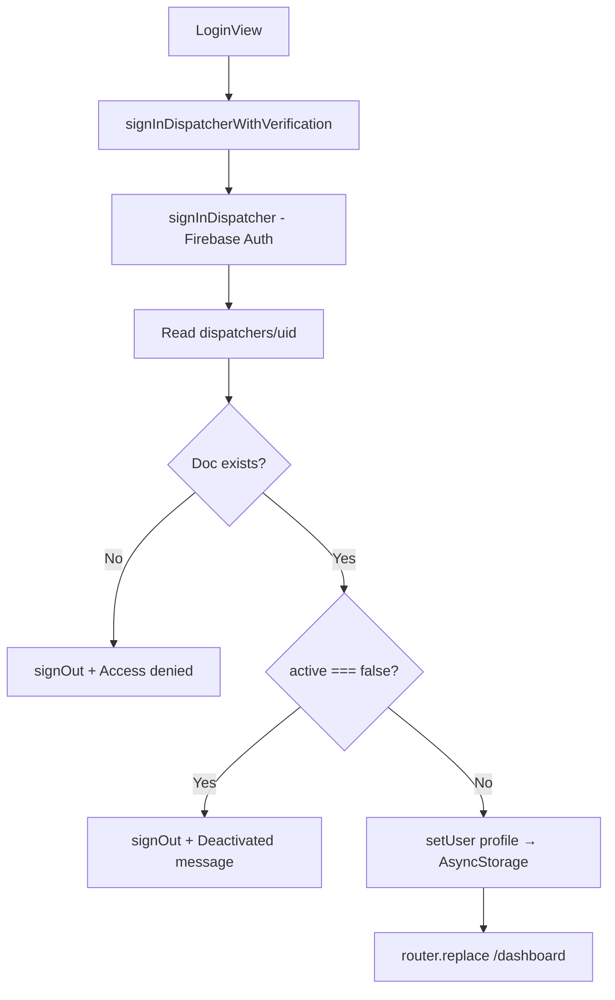
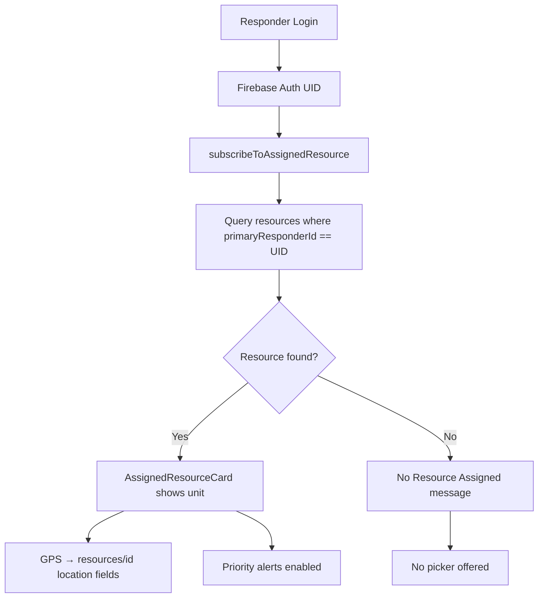
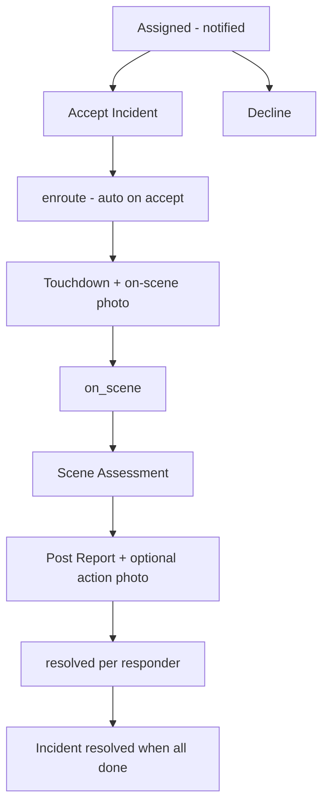
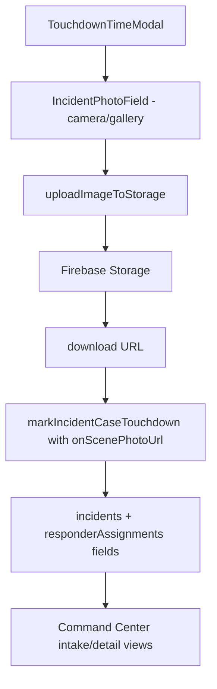
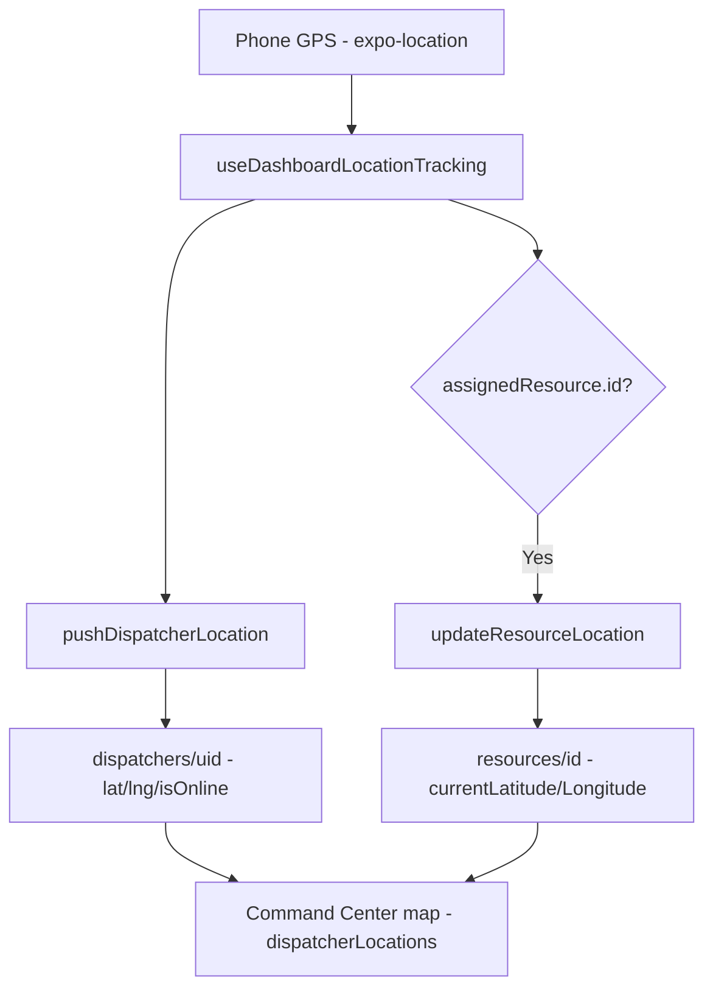
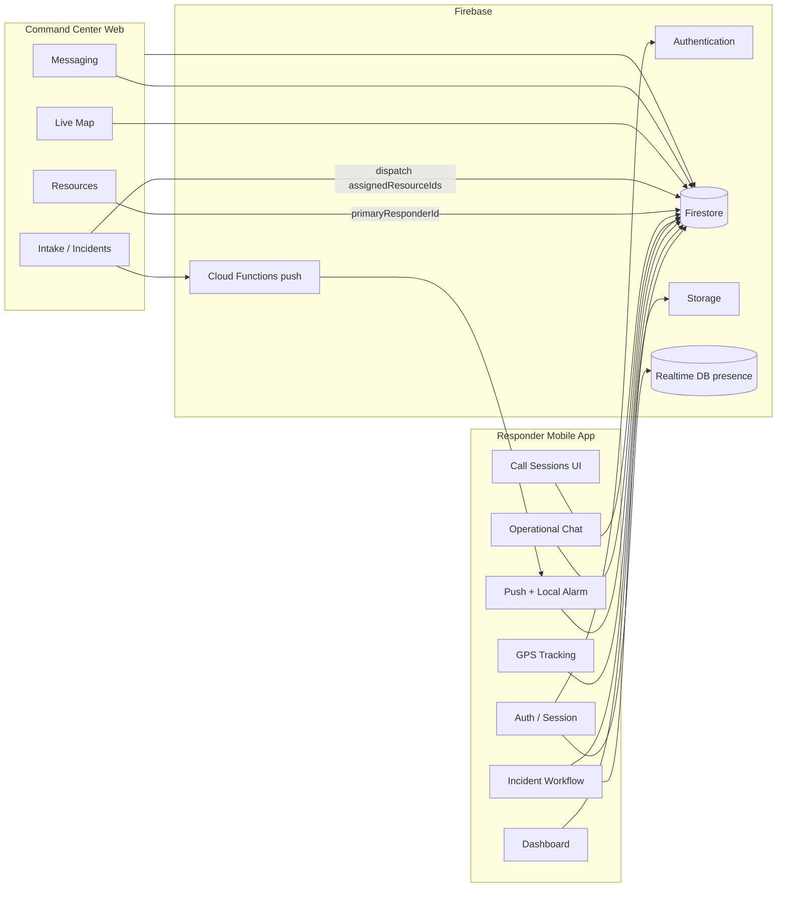

# RESQ-Link Responder Mobile App — Current System Analysis

> **Scope:** Documentation of the **current implementation only**, traced from source code in `apps/responder-mobile-app` and shared package `@packages/firebase`.  
> **Generated:** 2026-08-30  
> **App package:** `responder-mobile-app` (Expo SDK ~54, React Native 0.81, Expo Router ~6)

---

## Executive Summary

The **RESQ Responder Mobile App** (`RESQ Responder`) is the field operations client for emergency responders (fire, police, ambulance, MDRRMO, etc.) in the RESQ-Link / Tuguegarao Rescue System. Responders sign in with email and password, view assigned incidents from Command Center dispatch, accept and progress incidents through En Route → Touchdown (On Scene) → Scene Assessment → Post Report, share live GPS when enabled, receive priority push/local alarms for new assignments, chat with operational participants, and initiate call sessions (UI present; real-time audio not implemented in mobile).

**Command Center relationship:** Both apps share Firebase (Auth, Firestore, Storage, Realtime Database for presence). Command Center creates/manages resources, dispatches incidents, and assigns responders. The mobile app **reads** its assigned resource from Firestore (`resources.primaryResponderId == auth UID`) and **does not** offer a resource picker in the active UI. GPS updates write to `dispatchers/{uid}` and, when assigned, to `resources/{id}`.

**Incidents:** Assigned via Firestore query on `incidents` where `assignedResourceIds` contains the responder UID. Realtime listeners keep dashboard, map, and alerts in sync.

**Resource assignment (current):** Command Center sets `primaryResponderId` on a resource document. Mobile subscribes via `subscribeToAssignedResource` and displays a read-only `AssignedResourceCard`. Legacy duty-claim files may remain on disk but are not wired into navigation.

**Completion:** Responder submits a post-incident report (optional action photo). When all assigned responders resolve or decline, incident status becomes `resolved`.

---

## Table of Contents

1. [Application Architecture](#1-application-architecture)
2. [Folder / File Structure](#2-folder--file-structure)
3. [Startup Flow](#3-startup-flow)
4. [Authentication Flow](#4-authentication-flow)
5. [Navigation and Screens](#5-navigation-and-screens)
6. [Dashboard / Home Behavior](#6-dashboard--home-behavior)
7. [Resource System (Current Implementation)](#7-resource-system-current-implementation)
8. [Command Center ↔ Responder Relationship](#8-command-center--responder-relationship)
9. [Incident Lifecycle](#9-incident-lifecycle)
10. [Incident Acceptance](#10-incident-acceptance)
11. [En Route Workflow](#11-en-route-workflow)
12. [Touch Down / On Scene Workflow](#12-touch-down--on-scene-workflow)
13. [On-Scene Photo](#13-on-scene-photo)
14. [Scene Assessment](#14-scene-assessment)
15. [Action Photo](#15-action-photo)
16. [Incident Completion](#16-incident-completion)
17. [GPS and Live Tracking](#17-gps-and-live-tracking)
18. [Notifications](#18-notifications)
19. [Messaging](#19-messaging)
20. [Calling](#20-calling)
21. [Firebase Architecture](#21-firebase-architecture)
22. [Firestore Collections](#22-firestore-collections)
23. [Data Models](#23-data-models)
24. [State Management](#24-state-management)
25. [Local Storage](#25-local-storage)
26. [Permissions](#26-permissions)
27. [Error Handling](#27-error-handling)
28. [Loading and Realtime Behavior](#28-loading-and-realtime-behavior)
29. [Security Review (Firestore Rules)](#29-security-review-firestore-rules)
30. [Screen-to-Data Mapping](#30-screen-to-data-mapping)
31. [Function / Service Mapping](#31-function--service-mapping)
32. [Current Issues / Risks](#32-current-issues--risks)
33. [Potential Legacy / Dead Code](#33-potential-legacy--dead-code)
34. [Current End-to-End Mermaid Diagram](#34-current-end-to-end-mermaid-diagram)
35. [Resource Flow Mermaid Diagram](#35-resource-flow-mermaid-diagram)
36. [Command Center Integration Diagram](#36-command-center-integration-diagram)
37. [Current System Summary](#37-current-system-summary)

---

## 1. Application Architecture

| Layer | Technology |
|-------|------------|
| Framework | Expo ~54, React Native 0.81, React 19 |
| Routing | Expo Router (file-based under `src/app/`) |
| Backend | `@packages/firebase` (Firestore, Auth, Storage, RTDB presence) |
| Server state | TanStack React Query v5 (incident list cache) |
| Client session | Zustand + AsyncStorage |
| Theming | `ResqThemeContext` + design tokens |
| Maps | `react-native-maps` (native), web polyfill |
| Location | `expo-location` (foreground) |
| Push | `expo-notifications` + Expo Push Service |
| Alarms | `expo-audio` + `expo-haptics` (local looping alarm) |

**Provider tree** (`src/app/_layout.jsx`, outer → inner):

1. `QueryClientProvider`
2. `ResqThemeProvider`
3. `MessagingProvider`
4. `PriorityAlertProvider`
5. `GestureHandlerRootView` → `Stack` + `MessagingUnreadTracker` + `ThemedToaster`

**Entry chain:**

```
package.json "main": "index"
  → index.tsx (polyfills + expo-router/entry)
  → App.tsx (SafeAreaProvider)
  → src/app/_layout.jsx
```

---

## 2. Folder / File Structure

```
apps/responder-mobile-app/
├── index.tsx                    # JS entry
├── App.tsx                      # SafeAreaProvider shell
├── app.config.js / app.json     # Expo config, permissions, Firebase extra
├── assets/sounds/incident_alarm.wav
├── docs/                        # Documentation (this file)
├── src/
│   ├── app/                     # Expo Router routes
│   │   ├── _layout.jsx          # Root layout + providers
│   │   ├── index.jsx            # Auth gate → /login or /dashboard
│   │   ├── (auth)/login.jsx
│   │   ├── (tabs)/              # Bottom tab screens
│   │   ├── incident/[id]/       # Case detail + incident messages
│   │   └── support/             # Settings sub-pages
│   ├── components/              # Shared UI (badges, forms, layout, ui)
│   ├── constants/               # legal.js, location.js
│   ├── context/                 # ResqThemeContext.jsx
│   ├── hooks/                   # useImmersiveAndroidNavigation.js
│   ├── modules/
│   │   ├── auth/                # LoginView, AuthIndexGate
│   │   ├── dashboard/           # Dashboard, resource card, GPS hooks
│   │   ├── incidents/           # Case detail, workflow modals, hooks
│   │   ├── map/                 # ResponderMapExplorer
│   │   ├── messaging/           # ResponderMessagesScreen, unread tracker
│   │   ├── notifications/       # NotificationsView (settings)
│   │   └── settings/            # Settings, location, privacy, about
│   ├── providers/               # PriorityAlertProvider, MessagingProvider
│   ├── query/                   # queryClient.ts, queryKeys.ts
│   ├── services/                # auth, incidents, push, alerts, responder
│   ├── store/                   # userStore.ts (Zustand)
│   ├── theme/                   # palettes, tokens, dashboard theme
│   └── utils/                   # formatting, maps, errors, toast
└── packages/firebase/           # Shared Firebase SDK (monorepo)
```

**~108 source files** under `src/` (excluding build artifacts).

---

## 3. Startup Flow

```mermaid
flowchart TD
    A[App Launch] --> B[index.tsx polyfills]
    B --> C[expo-router entry]
    C --> D[App.tsx SafeAreaProvider]
    D --> E[_layout.jsx]
    E --> F[loadUser from AsyncStorage]
    E --> G[Load Inter fonts]
    F --> H{Route / index AuthIndexGate}
    H --> I{user in store?}
    I -->|No| J[/login]
    I -->|Yes| K[waitForFirebaseAuthUser]
    K -->|Session OK| L[/dashboard]
    K -->|No session| M[logout + /login]
    E --> N{user set?}
    N -->|Yes| O[onAuthStateChanged → RTDB presence]
```

**Splash:** `_layout.jsx` hides splash when fonts load. `AuthIndexGate` shows blank themed view while routing.

**Authentication determination:**

1. **AsyncStorage** `dispatcher_user` → Zustand `user` (profile cache)
2. **Firebase Auth** session → `waitForFirebaseAuthUser()` / `onAuthStateChanged`

Both must align: stale AsyncStorage without Firebase session triggers `logout()` and redirect to login.

---

## 4. Authentication Flow



| Step | File | Function |
|------|------|----------|
| Login UI | `src/modules/auth/components/LoginView.jsx` | `handleLogin` |
| Verification | `src/services/auth/dispatcherAuth.ts` | `signInDispatcherWithVerification` |
| Firebase sign-in | `packages/firebase/src/auth.ts` | `signInDispatcher` |
| Session store | `src/store/userStore.ts` | `setUser` → key `dispatcher_user` |
| Logout | `src/modules/settings/components/SettingsView.jsx` | clears presence, online, Firebase signOut, AsyncStorage |

**Credentials:** Email + password (min 6 chars client validation).

**Role / agency validation at login:**

- **Confirmed:** `dispatchers/{uid}` must exist; `active !== false`
- **Not confirmed:** Explicit agency or “responder-only” designation check at login (agency comes from resource/incident data later)

**Error messages (login):**

- Invalid email / short password (client)
- `"Access denied. Responder account required."`
- `"Your dispatcher account has been deactivated..."`
- Generic `"Login failed. Please try again."`

---

## 5. Navigation and Screens

Root: **Stack** (no headers). Main tabs: **custom `MainTabBar`** (4 visible tabs).

### `/` — Auth Index Gate

| | |
|---|---|
| **File** | `src/app/index.jsx` → `AuthIndexGate.jsx` |
| **Purpose** | Route authenticated users to dashboard or login |
| **Actions** | Redirect only |

### `/login`

| | |
|---|---|
| **File** | `src/app/(auth)/login.jsx` → `LoginView.jsx` |
| **Purpose** | Email/password sign-in |
| **Data** | Firestore `dispatchers/{uid}` after Firebase Auth |
| **Actions** | Login → `/dashboard` |

### `/dashboard` — Dispatch

| | |
|---|---|
| **File** | `src/app/(tabs)/dashboard.jsx` → `DashboardView.jsx` |
| **Purpose** | Mission dashboard: assigned resource, stats, active case, queue |
| **Reads** | `useAssignedResource`, `useAssignedEmergencies`, location snapshot |
| **Actions** | Open incident, accept from list, pull-to-refresh, notifications, profile |

### `/map`

| | |
|---|---|
| **File** | `src/app/(tabs)/map.jsx` → `ResponderMapExplorer.jsx` |
| **Purpose** | Map of assigned incidents |
| **Reads** | `useAssignedEmergencies` |

### `/messages`

| | |
|---|---|
| **File** | `src/app/(tabs)/messages.jsx` → `ResponderMessagesScreen.jsx` |
| **Purpose** | Operational chat threads |
| **Reads/Writes** | `chatThreads`, messages subcollection |

### `/notifications`

| | |
|---|---|
| **File** | `src/app/(tabs)/notifications.jsx` → `NotificationsView.jsx` |
| **Purpose** | Alert sound/vibration preferences (hidden from tab bar) |
| **Reads/Writes** | AsyncStorage notification settings |

### `/settings` — Profile

| | |
|---|---|
| **File** | `src/app/(tabs)/settings.jsx` → `SettingsView.jsx` |
| **Purpose** | Profile, theme, location sharing, logout |
| **Actions** | Navigate to support routes, logout |

### `/incident/:id`

| | |
|---|---|
| **File** | `src/app/incident/[id]/index.jsx` → `CaseDetailView.jsx` → `CaseInfoCard.jsx` |
| **Purpose** | Full incident workflow |
| **Reads** | Firestore `incidents/{id}` realtime snapshot |
| **Actions** | Accept, decline, touchdown, scene assessment, post report, call, messages |

### `/incident/:id/messages`

| | |
|---|---|
| **File** | `src/app/incident/[id]/messages.jsx` |
| **Purpose** | Incident-scoped messaging (same component, scoped context) |

### Support routes

| Route | File | Purpose |
|-------|------|---------|
| `/support/about` | `AboutView.jsx` | App info |
| `/support/help-support` | `HelpSupportView.jsx` | Help (exists; limited settings links) |
| `/support/location` | `LocationView.jsx` | Pause/resume GPS sharing |
| `/support/privacy-security` | `PrivacySecurityView.jsx` | Privacy settings |

### `+not-found`

| **File** | `src/app/+not-found.tsx` |

---

## 6. Dashboard / Home Behavior

**File:** `src/modules/dashboard/components/DashboardView.jsx`

| UI element | Source |
|------------|--------|
| Responder name | `formatResponderName(user.email)` |
| Initials | `getResponderInitials` |
| Role label | `getResponderRoleLabel(assignment.assignedResource)` — from resource `type` |
| Assigned unit pill (top bar) | `assignment.assignedResource?.name` via `DashboardTopBar` |
| **Assigned Resource card** | `AssignedResourceCard` ← `useAssignedResource` → `subscribeToAssignedResource` |
| Response summary stats | Derived from `useAssignedEmergencies` cases |
| Active assignment | Highest-priority open case from `pickActiveAssignment` |
| Incident queue | Remaining cases in `useAssignedEmergencies` |
| Notification badge | `PriorityAlertProvider.alertingCount` |
| GPS tracking | `useDashboardLocationTracking` when auth ready and location not paused |

**Quick actions:** Tap incident → `/incident/:id`; bell → `/notifications`; avatar → `/settings`; assigned resource pill scrolls to resource card.

---

## 7. Resource System (Current Implementation)

### CURRENT IMPLEMENTATION

Resources live in Firestore collection **`resources`**. Command Center assigns a primary responder via **`primaryResponderId`** (UID, not display name). Legacy mirror field: **`assignedResponderId`**. Crew: **`assignedResponderIds[]`**.

**Mobile does NOT allow manual resource selection in the active UI.**

| Component | File | Behavior |
|-----------|------|----------|
| Hook | `src/modules/dashboard/hooks/useAssignedResource.js` | Subscribes to assigned resource |
| Firebase | `packages/firebase/src/resources.ts` | `subscribeToAssignedResource` |
| UI | `src/modules/dashboard/components/AssignedResourceCard.jsx` | **Read-only** card |
| GPS | `useDashboardLocationTracking.js` | Writes to assigned resource when present |
| Alerts | `PriorityAlertProvider.jsx` | Requires assigned resource before alarming |

**Assignment resolution flow:**



**Query:** `resources` WHERE `primaryResponderId == currentUser.uid`, limit 5; first active resource returned.

**Fields displayed:** `name`, `resourceCode`, `agency`, `teamName`/`teamId`, `stationName`, `status`.

**Local storage:** No selected resource cached in AsyncStorage/SecureStore. Firestore is authoritative.

**Status updates:** Mobile updates resource `status` indirectly via incident workflow (`updateResourcesForIncidentStatus` in `@packages/firebase`) — only for responder's primary resource when `responderId` passed.

**Deprecated mutations** (`packages/firebase/src/responderDuty.ts`):

- `startResponderDuty()` → **throws** error
- `endResponderDuty()` → **throws** error
- `subscribeToResponderDuty()` → no-op returns `{ resourceId: null }`

**GPS ownership validation:** `updateResourceLocation` calls `assertOwnsResource` — requires `primaryResponderId === auth.uid`.

### POTENTIAL ISSUE (documented separately)

Legacy files `useResponderDuty.js` and `DutyResourceCard.jsx` may still exist under `src/modules/dashboard/` but are **not imported** by active screens (see [Legacy / Dead Code](#33-potential-legacy--dead-code)).

---

## 8. Command Center ↔ Responder Relationship

| Data | Command Center writes | Responder writes | Realtime |
|------|----------------------|------------------|----------|
| Resource assignment (`primaryResponderId`, crew) | Yes (`/command-center/resources`) | No (rules block assignment field changes) | Yes (`subscribeToAssignedResource`) |
| Resource GPS (`currentLatitude/Longitude`) | Yes (manual CC edit) | Yes (when primary, via GPS hook) | Yes |
| Resource status | Yes | Yes (via incident workflow, own resource only) | Yes |
| Incident dispatch (`assignedResourceIds`, assignments) | Yes | No (create); Yes (accept/decline/touchdown/report via `isDispatcher()`) | Yes |
| Dispatcher location | — | Yes (`dispatchers/{uid}`) | Yes |
| Dispatcher online | — | Yes | Yes |
| Push tokens | — | Yes (`pushTokens[]`) | — |
| Scene assessment / post report | — | Yes (on incident doc) | Yes |
| On-scene / action photos | — | Yes (Storage upload + URL on incident) | Yes |
| Operational chat | Yes | Yes (participant threads) | Yes |
| Call sessions | CC can observe/update | Yes (create/accept/decline/end) | Yes |
| RTDB presence | — | Yes (`presence/responders/{uid}`) | Yes |
| Teams | Yes (`teams`) | Read only | Yes (CC); mobile reads via incidents |

---

## 9. Incident Lifecycle

### Status names (from code)

**Incident top-level (`incidents.status`):**  
`new`, `awaiting_resources`, `liaison_pending`, `dispatched`, `enroute`, `on_scene`, `resolved`, `unresolved`, plus legacy `pending`, `active`, `done` used in UI filters.

**Per-responder (`responderAssignments[uid].status`):**  
`assigned` → `enroute` → `on_scene` → `resolved` | `declined`

**Resource (`resources.status`):**  
`available`, `assigned`, `en_route`, `on_scene`, `maintenance`, `offline`

### Responder-facing progression



| Stage | User action | App function | Primary Firestore impact |
|-------|-------------|--------------|-------------------------|
| Assigned | Receive alert | Push + `PriorityAlertProvider` | — |
| Accept | Tap Accept | `acceptIncidentCase` → `acceptIncident` | `responderAssignments[uid].status = enroute`, incident status, resource `en_route` |
| Touchdown | Touchdown modal + photo | `markIncidentCaseTouchdown` | `on_scene`, photo URLs, timestamps |
| Scene assessment | Modal form | `submitIncidentSceneAssessment` | `responderAssignments[uid].responderAssessment` |
| Complete | Post report modal | `submitIncidentPostReport` | `postIncidentReport`, status `resolved`, resource `available` |
| Decline | Decline modal | `declineIncidentCase` | `declined`, removed from `assignedResourceIds` |

---

## 10. Incident Acceptance

**Notification sources:**

1. **Push:** Cloud Function `onIncidentAssigned` (Expo push to `dispatchers/{uid}.pushTokens`)
2. **Local alarm:** `PriorityAlertProvider` + `priorityAlertService` (requires assigned resource + unacknowledged assignment)

**Listener:** `useAssignedEmergencies` → `subscribeToResponderAssignedIncidents` — query `incidents` where `assignedResourceIds array-contains uid`.

**Accept:** `acceptIncidentCase` → `packages/firebase/src/incidents.ts` `acceptIncident`

**Updated fields (confirmed):**

- `responderAssignments.{uid}.status` → `enroute`
- `responderAssignments.{uid}.acceptedAt`
- Incident `status`, `acceptedAt`, `updatedAt`
- Linked `emergencies` propagated
- `updateResourcesForIncidentStatus(incidentId, 'en_route', { responderId })`

**Resource relationship:** Resource resolved by `primaryResponderId == uid` during status update; not chosen by user at accept time.

---

## 11. En Route Workflow

**There is no separate “En Route” button.** Accepting an incident **automatically** sets En Route.

```text
Responder taps Accept
   ↓
acceptIncidentCase(caseId)
   ↓
acceptIncident (Firebase)
   ↓
responderAssignments[uid].status = 'enroute'
incident.status updated (most advanced across assignments)
   ↓
updateResourcesForIncidentStatus → resource.status = 'en_route'
   ↓
Command Center sees update via existing incident/resource listeners
```

**UI:** `CaseInfoCard` progress bar shows Accepted → En Route → Touchdown.

---

## 12. Touch Down / On Scene Workflow

**Touchdown IS on-scene** in the current app — no separate “On Scene” button.

| | |
|---|---|
| **Button** | `WorkflowActionPanel` → “Touchdown” when `canMarkTouchdown` |
| **Modal** | `TouchdownTimeModal.jsx` — date/time + **required** on-scene photo |
| **Handler** | `CaseInfoCard.handleTouchdown` |
| **Function** | `markIncidentCaseTouchdown` → `markIncidentTouchdown` |
| **GPS** | Manual `source: 'manual'`; distance may be passed but **`TOUCHDOWN_RADIUS_METERS = 10` is unused** for auto-arrival |
| **Resource** | Status → `on_scene` |

---

## 13. On-Scene Photo



| Item | Detail |
|------|--------|
| Component | `IncidentPhotoField.jsx` |
| Upload | `uploadImageToStorage` (`@packages/firebase`) |
| Storage path pattern | `emergencies/photos/responder-on-scene_{caseId}_{timestamp}.jpg` (from Firebase package) |
| Firestore fields | `onScenePhotoUrl`, `onScenePhotoUploadedAt`, per-assignment copies |
| Badge | `PhotoPurposeBadge` — purpose `onScene` |

---

## 14. Scene Assessment

| | |
|---|---|
| **Availability** | After touchdown; before post report (`canSubmitSceneAssessment` in `CaseInfoCard`) |
| **UI** | `SceneAssessmentModal.jsx`, display `SceneAssessmentSection.jsx` |
| **Fields** | Dynamic via `getSceneAssessmentFieldDefs` / `RESPONDER_SCENE_ASSESSMENT_FIELDS` (`@packages/firebase`) |
| **Save** | `submitIncidentSceneAssessment` → `submitResponderSceneAssessmentForIncident` |
| **Storage** | `incidents/{id}.responderAssignments.{uid}.responderAssessment` + shared `responderAssessment` root |
| **Sync** | Best-effort to linked `emergencies/{reportId}` |

---

## 15. Action Photo

| | |
|---|---|
| **When** | Optional during **Post Report** (`PostReportModal.jsx`) |
| **Mandatory** | No |
| **Upload** | Same `uploadImageToStorage` flow |
| **Field** | `postIncidentReport.actionPhotoUrl` / assignment-level report object |
| **CC visibility** | Stored on incident document fields consumed by Command Center |

---

## 16. Incident Completion

**Trigger:** Submit Post Report in `PostReportModal`.

**Required fields (modal):** Reason, notes, people involved/status, hospital, etc. (see `PostReportModal.jsx`).

**Function:** `submitIncidentPostReport` → `submitPostIncidentReportForIncident`

**Effects:**

- `responderAssignments[uid].status` → `resolved`
- `postIncidentReports[uid]` populated
- If all responders resolved/declined: incident `status = resolved`, `resolutionStatus = resolved`
- Resource: `updateResourcesForIncidentStatus(..., 'available', { clearAssignment: true })`
- GPS continues on dashboard unless user paused location (not auto-stopped on completion)

---

## 17. GPS and Live Tracking



| Topic | Current behavior |
|-------|------------------|
| Library | `expo-location` |
| Background tracking | **Not implemented** (foreground only) |
| Frequency | `watchPositionAsync` 5s / 50m + 5s interval poll |
| Pause | AsyncStorage `responder_location_paused` = `"true"` disables tracking |
| Enabled when | Signed in, Firebase auth ready, location not paused |
| Offline | Errors logged; no confirmed offline queue |
| App restart | Tracking restarts when dashboard mounts; assignment from Firestore listener |
| RTDB presence | Separate from GPS — `beginResponderRealtimePresence` in `_layout.jsx` |

**Also:** `useResponderLocationSnapshot` — one-shot GPS for distance labels on dashboard rows.

---

## 18. Notifications

| Topic | Implementation |
|-------|----------------|
| Provider | Expo Notifications (`expo-notifications`) |
| Registration | `registerForIncidentPush` in `pushNotificationService.js` |
| Token storage | `dispatchers/{uid}.pushTokens[]` via `saveResponderPushToken` |
| Channel | `incident-alerts-v2`, sound `incident_alarm.wav` |
| Local alarm | `priorityAlertService.js` — haptics + looping `expo-audio` |
| Gating | Assigned resource required + unacknowledged assignment + priority medium+ |
| Acknowledge | `acknowledgeIncidentAlert(incidentId)` + stop local alarm |
| Settings | `notificationSettingsService.js` → AsyncStorage `responder_notification_settings` |
| Tray actions | Acknowledge / View → routes to incident |

**Cloud Function:** `functions/src/index.ts` — `onIncidentAssigned` sends Expo push when responder added to `assignedResourceIds`.

**Not confirmed from mobile code alone:** Whether push is suppressed without assigned resource (function loads tokens from dispatcher doc; mobile gating is separate for local alarm).

---

## 19. Messaging

| | |
|---|---|
| **Screen** | `ResponderMessagesScreen.jsx` |
| **Routes** | `/messages`, `/incident/:id/messages` |
| **Collections** | `chatThreads/{threadId}`, `chatThreads/{threadId}/messages/{messageId}` |
| **API** | `subscribeToChatThreads`, `subscribeToChatMessages`, `sendChatMessage`, `createDirectChat`, `markThreadRead` |
| **Unread badge** | `MessagingUnreadTracker` + `MessagingProvider.unreadCount` → tab badge |
| **Attachments** | Not confirmed from responder screen implementation |

---

## 20. Calling

**CURRENT IMPLEMENTATION:** Call session **signaling/state only** — no LiveKit, WebRTC, or Agora in `package.json` or active imports.

| | |
|---|---|
| **UI** | `ResponderCallModal.jsx` |
| **Orchestration** | `CaseInfoCard.jsx` — `startIncidentCallSession`, incoming via `subscribeToUserIncomingCalls` |
| **Collection** | `callSessions` |
| **Actions** | Accept, decline, end session; mute/speaker are **local UI state only** |
| **Fallback** | `Linking.openURL('tel:911')` |
| **`markIncidentCallConnected`** | Imported in modal but **not called** |

---

## 21. Firebase Architecture

| Firebase Service | Usage in responder app |
|------------------|------------------------|
| **Authentication** | Email/password sign-in; session restoration |
| **Firestore** | Incidents, resources, dispatchers, chat, call sessions, emergencies (read) |
| **Storage** | On-scene and action photo uploads |
| **Realtime Database** | Responder presence (`presence/responders/{uid}`) |
| **Cloud Functions** | Push on incident assign (not invoked directly from app) |
| **FCM** | Used indirectly via Expo push infrastructure |

**Config:** `EXPO_PUBLIC_FIREBASE_*` env vars → `app.config.js` / `@packages/firebase` config.

---

## 22. Firestore Collections

### `dispatchers`

| | |
|---|---|
| **Purpose** | Responder profile, GPS, online status, push tokens |
| **Read by** | Login verification; CC; peer dispatchers (rules) |
| **Written by** | Mobile: location, `isOnline`, `pushTokens`; CC: full profile |
| **Key fields** | `email`, `role`, `active`, `latitude`, `longitude`, `lastUpdated`, `isOnline`, `pushTokens[]`, legacy `onDutyResourceId` |

### `resources`

| | |
|---|---|
| **Purpose** | Vehicles/units/assets |
| **Read by** | `subscribeToAssignedResource`, CC |
| **Written by** | CC: assignment, metadata; Mobile: GPS + operational status (own primary resource) |
| **Key fields** | `name`, `resourceCode`, `type`, `agency`, `teamId`, `teamName`, `status`, `stationName`, `primaryResponderId`, `assignedResponderIds`, `assignedIncidentId`, `currentLatitude`, `currentLongitude`, `lastLocationAt`, `isActive` |

### `incidents`

| | |
|---|---|
| **Purpose** | Master incident records |
| **Read by** | `subscribeToResponderAssignedIncidents`, case detail snapshot |
| **Written by** | CC dispatch; Mobile: accept, decline, touchdown, assessment, post report, acknowledge alert |
| **Key fields** | `status`, `assignedResourceIds[]`, `responderAssignments{}`, `priority`, location fields, photo URLs, `responderAssessment`, `postIncidentReports`, alert ack fields |

### `emergencies`

| | |
|---|---|
| **Purpose** | Civilian reports linked to incidents |
| **Read by** | Case detail (reporter info, photos) |
| **Written by** | Mobile indirectly via Firebase package propagation from incident updates |

### `incidentDispatches`

| | |
|---|---|
| **Purpose** | Dispatch audit ledger |
| **Read by** | Not confirmed in mobile app directly |
| **Written by** | Command Center (`dispatchIncidentResources`) |

### `chatThreads` / `messages`

| | |
|---|---|
| **Purpose** | Operational messaging |
| **Read/Write** | Mobile messaging screen |

### `callSessions`

| | |
|---|---|
| **Purpose** | Voice call session state |
| **Read/Write** | Mobile call UI + Firebase call session APIs |

### `teams`

| | |
|---|---|
| **Purpose** | Operational team definitions |
| **Read by** | Indirectly via incident team fields |
| **Written by** | Command Center only (rules) |

### `incidentChats` (legacy/alternate path)

| | |
|---|---|
| **Purpose** | Incident-linked chat (rules exist) |
| **Mobile usage** | Primary messaging uses `chatThreads`; incident chat API exported but **not confirmed** used in `ResponderMessagesScreen` |

---

## 23. Data Models

Summarized from `@packages/firebase` (responder-relevant):

**`ResourceRecord`** — `id`, `name`, `resourceCode`, `type`, `agency`, `teamId`, `teamName`, `status`, `stationName`, `primaryResponderId`, `assignedResponderIds`, `assignedIncidentId`, `currentLatitude`, `currentLongitude`, `lastLocationAt`, `isActive`

**`IncidentRecord`** — `id`, `status`, `priority`, `assignedResourceIds[]`, `responderAssignments`, location fields, `responderAssessment`, `postIncidentReports`, `onScenePhotoUrl`, linked report IDs, timestamps

**`IncidentResponderAssignment`** — `responderId`, `agency`, `resourceId`, `resourceName`, `status` (`assigned`|`enroute`|`on_scene`|`resolved`|`declined`), `acceptedAt`, `touchdownAt`, `onScenePhotoUrl`, `responderAssessment`, `postIncidentReport`, `declineReason`

**`DispatcherProfile` (app)** — `uid`, `email`, `role`, `active`

**`SessionUser` (store)** — `uid`, `email`, `role?`, `active?`

---

## 24. State Management

| State | Mechanism | Location |
|-------|-----------|----------|
| Auth session profile | Zustand | `userStore.ts` |
| Assigned incidents | React Query + Firestore subscription | `useAssignedEmergencies.js` |
| Assigned resource | React `useState` + Firestore subscription | `useAssignedResource.js` |
| Priority alerts | React Context | `PriorityAlertProvider.jsx` |
| Messaging unread | React Context | `MessagingProvider.jsx` |
| Theme | React Context | `ResqThemeContext.jsx` |
| Case detail | Local component state + `onSnapshot` | `CaseDetailView.jsx` |
| Location pause | AsyncStorage + local state | `DashboardView`, `LocationView` |
| Notification prefs | AsyncStorage + event bus | `notificationSettingsService.js` |

---

## 25. Local Storage

| Key | File | Purpose |
|-----|------|---------|
| `dispatcher_user` | `userStore.ts` | Cached session profile JSON |
| `responder_location_paused` | `constants/location.js` | `"true"` pauses GPS sharing |
| `resq.appearance.preference` | `ResqThemeContext.jsx` | Theme: light/dark/system |
| `responder_notification_settings` | `notificationSettingsService.js` | `{ caseAlerts: boolean }` |
| `resq-link-list-team-filter` | Command Center only | **Not used in responder app** |

**SecureStore / MMKV:** Plugin may be listed; **no SecureStore usage confirmed in responder `src/`**.

**Selected resource:** **Not stored locally** (Firestore `primaryResponderId` binding only).

---

## 26. Permissions

Declared in `app.json` / requested at runtime:

| Permission | When requested |
|------------|----------------|
| Foreground location | `useDashboardLocationTracking`, map, case detail |
| Camera / photos | Touchdown photo, post report photo (`expo-image-picker`) |
| Notifications | `registerForIncidentPush` |
| Microphone | Declared in manifest; **not explicitly requested** in call UI |

**Background location:** Declared in iOS plist strings; **no background watcher confirmed in code**.

---

## 27. Error Handling

| Area | Behavior |
|------|----------|
| Firebase permission denied (resource subscribe) | Silently returns null assigned resource |
| GPS permission denied | Tracking skipped (logged) |
| Resource location update failure | Logged; dispatcher location still updates |
| Login failure | Error message in `LoginView` |
| Operational actions | `toOperationalError` + toast in `CaseInfoCard` |
| Upload failures | Surfaced via toast/alert in modals |
| Stale session | AsyncStorage cleared, redirect login |
| Call connection | No real RTC — session state only |

**Weak areas (see Issues):** Limited offline queue; call audio stub; unused auto-touchdown constant.

---

## 28. Loading and Realtime Behavior

| Data | Mechanism | Auto-update |
|------|-----------|-------------|
| Assigned incidents | Firestore `onSnapshot` → React Query | Yes |
| Assigned resource | Firestore `onSnapshot` | Yes |
| Case detail | Firestore `onSnapshot` on single doc | Yes |
| Chat threads/messages | Firestore subscriptions | Yes |
| Incoming calls | `subscribeToUserIncomingCalls` | Yes |
| Dispatcher profile (login) | One-time `getDoc` | No |
| Online responder count | Subscription hook | Yes |

Dashboard shows `LoadingScreen` until first incident snapshot (`initialSyncPending`).

---

## 29. Security Review (Firestore Rules)

Rules file: `packages/firebase/firestore.rules` (current as of analysis).

### Responders (`dispatchers/{uid}`)

- **Read:** Owner, CC, super admin, any dispatcher
- **Update (self):** Allowed except **`onDutyResourceId` / `onDutySince`** (legacy duty fields blocked)
- **Update (CC/admin):** Full

### Resources

- **Read:** Any authenticated user
- **Update (responder):** Only if **primary responder** AND assignment fields unchanged AND only: `currentLatitude`, `currentLongitude`, `lastLocationAt`, `status`, `assignedIncidentId`, `updatedAt`
- **Update (CC/admin):** Full
- **Create/delete:** CC, dispatcher role, super admin (broad — pre-existing)

### Incidents

- **Read:** Authenticated
- **Update:** Super admin, CC, **any dispatcher** (field responders in `dispatchers` collection qualify)
- **Create:** CC, dispatcher, super admin

### Call sessions

- **Read/update:** Any authenticated (broad)

### Chat threads

- Participant-scoped read/write

**Risk:** Field responders can update **entire incident documents** under `isDispatcher()` — not field-level restricted on incidents. Resource assignment changes are blocked on resources collection.

---

## 30. Screen-to-Data Mapping

| Screen | Reads | Writes | Realtime |
|--------|-------|--------|----------|
| Dashboard | `resources`, `incidents`, `dispatchers` (GPS) | `dispatchers` GPS/presence | Yes |
| Map | `incidents` | — | Yes |
| Messages | `chatThreads`, messages | messages, thread read state | Yes |
| Notifications settings | AsyncStorage | AsyncStorage | No |
| Settings | user store | logout → presence, online, Auth | Partial |
| Incident detail | `incidents/{id}`, emergencies | accept/decline/touchdown/assessment/report/calls | Yes |
| Login | `dispatchers/{uid}` | — | No |

---

## 31. Function / Service Mapping

| Function | File | Purpose |
|----------|------|---------|
| `signInDispatcherWithVerification` | `services/auth/dispatcherAuth.ts` | Login + dispatcher doc validation |
| `subscribeToAssignedResource` | `packages/firebase/src/resources.ts` | Realtime assigned unit |
| `useAssignedResource` | `dashboard/hooks/useAssignedResource.js` | React hook for resource card |
| `useDashboardLocationTracking` | `dashboard/hooks/useDashboardLocationTracking.js` | GPS publish loop |
| `pushDispatcherLocation` | `services/responderService.ts` | Write dispatcher GPS |
| `updateResourceLocation` | `packages/firebase/src/responderDuty.ts` | Write resource GPS (owned unit) |
| `subscribeAssignedIncidents` | `services/incidentService.ts` | Incident feed for uid |
| `useAssignedEmergencies` | `incidents/hooks/useAssignedEmergencies.js` | React Query + subscription |
| `acceptIncidentCase` | `services/incidentService.ts` | Accept dispatch |
| `markIncidentCaseTouchdown` | `services/incidentService.ts` | On-scene + photo |
| `submitIncidentSceneAssessment` | `services/incidentService.ts` | Scene form save |
| `submitIncidentPostReport` | `services/incidentService.ts` | Complete incident |
| `registerForIncidentPush` | `services/pushNotificationService.js` | Expo token registration |
| `playPriorityAlert` | `services/priorityAlertService.js` | Local alarm |
| `acknowledgeIncidentAlert` | `@packages/firebase` | Mark alert seen on incident |
| `beginResponderRealtimePresence` | `@packages/firebase` | RTDB online state |

---

## 32. Current Issues / Risks

| Issue | Location | Current behavior | Potential impact |
|-------|----------|------------------|------------------|
| Broad incident write access for dispatchers | `firestore.rules` incidents | Any dispatcher can update full incident doc | Malicious client could alter fields beyond own assignment if not validated server-side |
| Call UI without RTC | `ResponderCallModal.jsx` | Mute/speaker cosmetic; no audio | Users expect working voice calls |
| `markIncidentCallConnected` unused | `ResponderCallModal.jsx` | Never called | CC may not see connected state from mobile |
| Legacy duty files on disk | `useResponderDuty.js`, `DutyResourceCard.jsx` | Not imported by active routes | Confusion for developers; accidental reuse |
| `TOUCHDOWN_RADIUS_METERS` unused | `CaseInfoCard.jsx` | Auto proximity touchdown not implemented | Manual touchdown only despite constant suggesting otherwise |
| No background GPS | `useDashboardLocationTracking.js` | Foreground only | Location gaps when app backgrounded |
| Permission-denied swallowed for resource | `subscribeToAssignedResource` | Returns null silently | “No resource assigned” when rules/network issue |
| Alerts require assigned resource | `PriorityAlertProvider.jsx` | No local alarm without CC resource | Dispatched responder without resource assignment gets push but no in-app alarm gate path |
| `assignedResourceIds` naming | Incident model | Array holds **responder UIDs**, not resource IDs | Confusing cross-system tracing |
| Expo Go Android push skipped | `pushNotificationService.js` | `isRemotePushAvailable()` false in Expo Go | Dev testing limitation |
| Duplicate team keys (CC web) | Separate from mobile | Intake list React key collision | Console warning in Command Center (not mobile) |

---

## 33. Potential Legacy / Dead Code

| Item | Path | Notes |
|------|------|-------|
| `useResponderDuty` | `src/modules/dashboard/hooks/useResponderDuty.js` | **Not imported** by active screens; superseded by `useAssignedResource` |
| `DutyResourceCard` | `src/modules/dashboard/components/DutyResourceCard.jsx` | Unit picker UI; **not imported** by `DashboardView` |
| `startResponderDuty` / `endResponderDuty` | `packages/firebase/src/responderDuty.ts` | Throw errors if called |
| `subscribeToResponderDuty` | `packages/firebase/src/responderDuty.ts` | No-op stub |
| `expo-av` | `package.json` | Dependency present; **not imported in src/** (alarms use `expo-audio`) |
| `CaseCard.jsx` | incidents components | Legacy card pattern; may be unused in primary routes |
| `docs/RESPONDER_MOBILE_APP_ANALYSIS.md` | docs | Partially outdated (references Agora, duty claiming as active) |

**Do not delete** as part of this documentation task.

---

## 34. Current End-to-End Mermaid Diagram

```mermaid
flowchart TD
    A[Launch App] --> B[Load AsyncStorage profile]
    B --> C{Firebase session?}
    C -->|No| D[Login]
    C -->|Yes| E[Dashboard]
    D --> F[signInDispatcherWithVerification]
    F --> E

    E --> G[subscribeToAssignedResource]
    E --> H[useAssignedEmergencies listener]
    E --> I[useDashboardLocationTracking]

    H --> J{New assignment?}
    J -->|Yes + has resource| K[PriorityAlertProvider alarm]
    K --> L[Acknowledge or open incident]

    L --> M[/incident/:id]
    M --> N{Accept?}
    N -->|Yes| O[acceptIncident - enroute]
    O --> P[Touchdown + photo]
    P --> Q[Scene Assessment]
    Q --> R[Post Report]
    R --> S[resolved + resource available]

    I --> T[dispatchers + resources GPS]
    T --> U[Command Center map]

    S --> U
    O --> U
    P --> U
```

---

## 35. Resource Flow Mermaid Diagram

```mermaid
flowchart TD
    CC[Command Center Resources Page] -->|sets primaryResponderId| FS[(Firestore resources/id)]

    A[Responder Login] --> B[Firebase Auth UID]
    B --> C[subscribeToAssignedResource]
    FS --> C
    C --> D{primaryResponderId == UID?}
    D -->|Yes| E[AssignedResourceCard read-only]
    D -->|No| F[No Resource Assigned - no picker]

    E --> G[useDashboardLocationTracking]
    G --> H[dispatchers/uid location]
    G --> I[resources/id location]

    E --> J[PriorityAlertProvider gate]
    J --> K[Incident alarms enabled]

    H --> CCMAP[Command Center map]
    I --> CCMAP

    style F fill:#333
    style CC fill:#224
```



**Note:** Responders **cannot** manually select or change resources in the current active UI.

---

## 36. Command Center Integration Diagram



---

## 37. Current System Summary

The RESQ Responder Mobile App is an Expo Router application that authenticates field users against Firebase Auth and the `dispatchers` collection, caches a minimal profile locally, and drives operations from a realtime incident feed keyed by responder UID. Command Center remains the authority for resource assignment via `resources.primaryResponderId`; the mobile client subscribes to that binding and shows it read-only, using it for GPS association and alert gating.

Incident handling is centralized in `CaseInfoCard` with a linear workflow: accept (en route) → touchdown with mandatory on-scene photo → scene assessment → post-incident report with optional action photo. All writes go through `@packages/firebase` incident helpers; the app does not write raw Firestore from UI components except via those services and location/presence helpers.

Secondary capabilities include operational chat (`chatThreads`), call session signaling without native RTC audio, Expo push plus local priority alarms, and foreground GPS shared with Command Center maps. Realtime listeners keep dashboard, resource card, and case detail synchronized without requiring logout/login on reassignment.

---

## Documentation Metadata

| Item | Value |
|------|-------|
| **File created** | `apps/responder-mobile-app/docs/RESPONDER_MOBILE_APP_CURRENT_SYSTEM.md` |
| **Major sections** | 37 (Executive Summary through Current System Summary) |
| **Responder-mobile files analyzed** | ~108 under `src/` + shared `@packages/firebase` modules (resources, incidents, responderDuty, dispatchers, messaging, callSessions, presence, pushTokens, auth) |
| **Areas not fully confirmed from mobile code alone** | Cloud Function push gating vs assigned resource; `incidentChats` vs `chatThreads` usage boundary; exact Storage bucket/path config; whether all dispatcher accounts pass strict “responder designation” checks beyond `active` flag |

---

*This document describes the system as implemented in the repository at analysis time. It is not a specification for future changes.*
