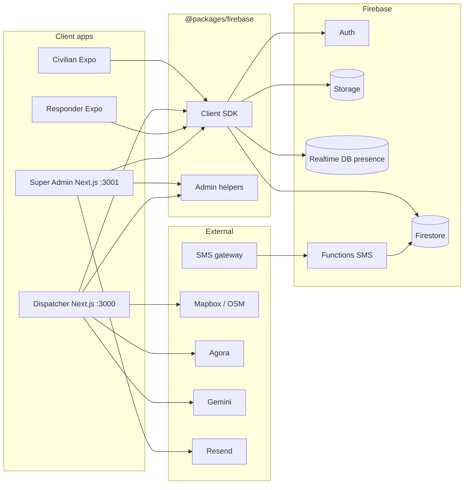
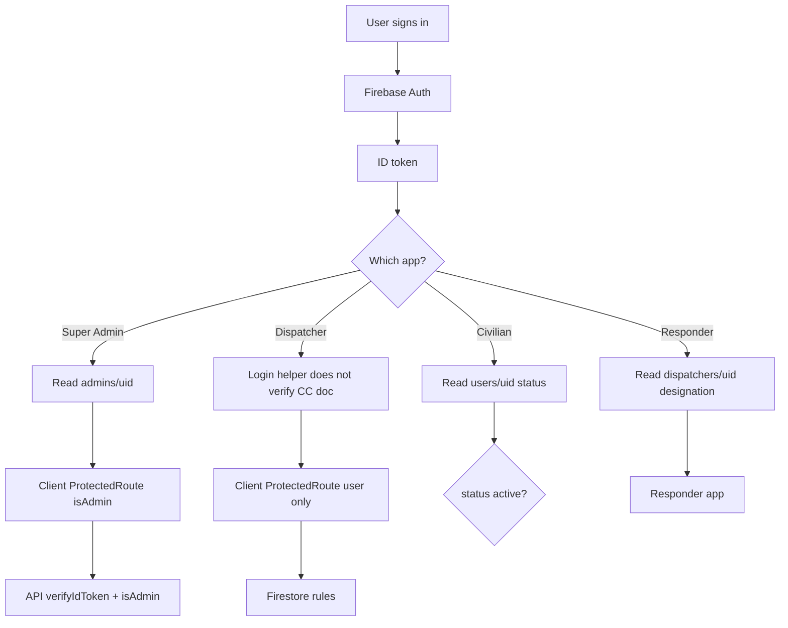
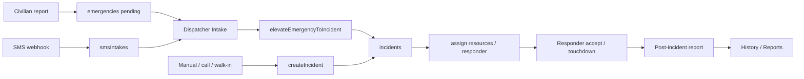
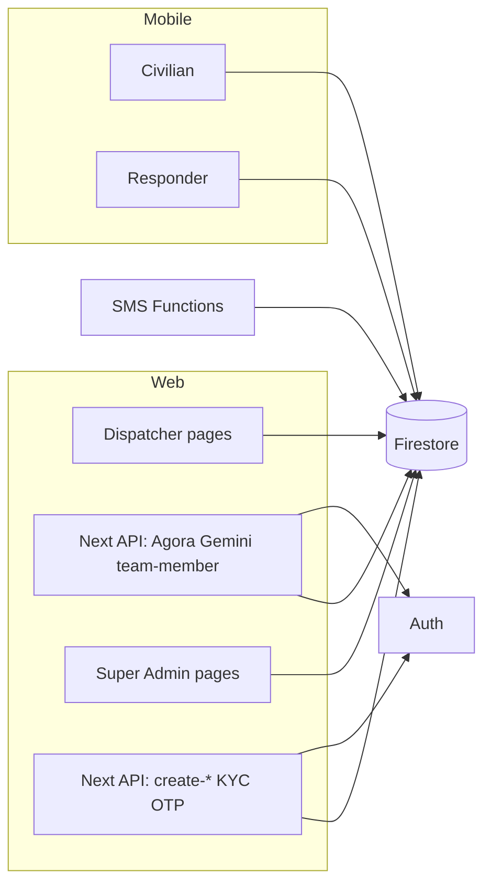
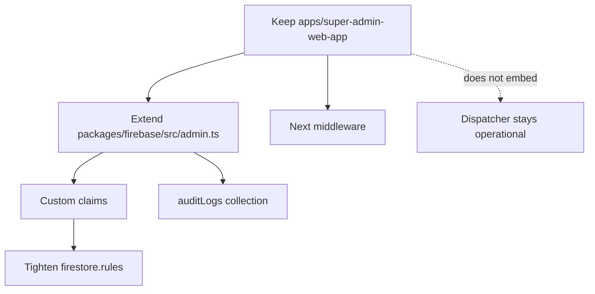

# RESQ-LINK Full Project Analysis

> **Updated 21 August 2026 — web consolidation:** Dispatcher and Super Admin are now a single Next.js app at `apps/resq-link-web-app` (`/login`, `/command-center/*`, `/admin/*`, port 3000). Historical findings below that still mention `dispatcher-web-app`, `super-admin-web-app`, or port 3001 describe the **pre-consolidation** architecture.

> **Document type:** Architecture, security, and Super Admin readiness audit  
> **Generated:** 21 August 2026  
> **Scope:** Entire `c:\projects\resq-link` repository, verified against current source  
> **Rule:** This document originally did **not** implement Super Admin. It separates **Current System** from **Proposed Changes**.

Evidence labels used throughout:

- `[CONFIRMED]` — verified in current source
- `[LIKELY]` — strongly indicated by code, not fully proven at runtime
- `[UNCERTAIN]` — could not be fully verified from the repo alone
- `[NOT FOUND]` — searched and not present
- `[SECURITY CONCERN]` — privilege, data exposure, or secret-handling issue
- `[PERFORMANCE CONCERN]` — likely contributor to dispatcher slowness

---

## 1. Executive Summary

### Current System

RESQ-LINK (npm package name `tuguegarao-rescue-system`) is an **npm workspaces monorepo** for Tuguegarao emergency response. There is **no standalone Express/Nest/Fastify API**. Four client apps share one TypeScript Firebase SDK (`@packages/firebase`). Persistence is **Cloud Firestore**, identity is **Firebase Auth**, files are **Firebase Storage**, responder presence uses **Firebase Realtime Database**, and SMS uses **Firebase Cloud Functions**.

| Application | Path | Stack | Users |
| ----------- | ---- | ----- | ----- |
| RESQ-LINK Web | `apps/resq-link-web-app` | Next.js 15, React 19, Tailwind, Leaflet | Command-center operators and Super Admins |
| Civilian mobile | `apps/civilian-mobile-app` | Expo 54, React Native, Expo Router | Citizens |
| Responder mobile | `apps/responder-mobile-app` | Expo 54, React Native, Expo Router | Field responders |

**Super Admin is a protected workspace** at `/admin/*` inside the unified web app. It can create dispatcher, responder, civilian, and command-center accounts, and it reviews civilian KYC.

### Most important findings

| Area | Finding |
| ---- | ------- |
| Super Admin status | Workspace at `/admin/*` inside `apps/resq-link-web-app` |
| Roles | Collection-based identity (`admins`, `commandCenters`, `dispatchers`, `users`) plus agency codes (`BFP`, `PNP`, …) stored as `role` |
| Biggest security concern | Broad Firestore read of emergencies/incidents for **any authenticated user**, plus dispatcher UI that only checks “is signed in”, not “is command center” |
| Biggest architecture concern | Dual operational models (`emergencies` civilian reports vs `incidents` command records) and mixed role semantics |
| Biggest performance concern | Root-layout `DispatcherDataProvider` attaches multiple live Firestore listeners for every authenticated dispatcher page |

**Do not create a second Super Admin app.** Extend the existing one after security prerequisites.

---

## 2. Repository Structure

[CONFIRMED] npm workspaces monorepo.

Evidence:

- `package.json` (`name: tuguegarao-rescue-system`, `workspaces: ["apps/*", "packages/*"]`)
- `README.md`

```text
RESQ-LINK
│
├── apps/
│   ├── resq-link-web-app/       Next.js — /login, /command-center/*, /admin/* (dev :3000)
│   ├── civilian-mobile-app/     Expo civilian client
│   └── responder-mobile-app/    Expo responder client
│
├── packages/
│   └── firebase/                Shared SDK, rules, Cloud Functions, seed scripts
│       ├── src/                 Client TypeScript sources
│       ├── functions/           SMS gateway Cloud Functions
│       └── scripts/             Admin bootstrap / seed
│
├── docs/                        Screenshots + this analysis
├── patches/                     patch-package fixes for Expo/RN
├── scripts/                     Python doc generators
├── .github/                     Deploy workflows (Vercel Git + legacy E2B)
├── package.json                 Root workspaces + dependency overrides
└── README.md
```

### Directory purpose

| Path | Purpose | Layer | Entry / config | Depends on |
| ---- | ------- | ----- | -------------- | ---------- |
| `apps/resq-link-web-app` | Command Center + Super Admin UI and API routes | Frontend + Next API routes | `app/layout.tsx`, `app/page.tsx`, `next.config.js` | `@packages/firebase`, `firebase-admin`, Resend |
| `apps/civilian-mobile-app` | Citizen reporting | Mobile frontend | `src/app/_layout.jsx`, `src/app/index.jsx` | `@packages/firebase` |
| `apps/responder-mobile-app` | Field case handling | Mobile frontend | `src/app/_layout.jsx` | `@packages/firebase` |
| `packages/firebase` | Shared data/auth/realtime layer | Shared library + rules + functions | `src/index.ts`, `src/admin.ts`, `firestore.rules` | Firebase SDK / Admin SDK |
| `patches/` | Dependency patches | Tooling | applied via `postinstall` | Expo/RN packages |
| `.github/` | CI/deploy | Infra | `workflows/deploy.yml` | Vercel, Slack, E2B |

Ignored for architecture: `node_modules/`, `.next/`, `dist/`, `coverage/`, `.git/`.

[DOCUMENTED BUT OUTDATED] Root `README.md` says “There is no root `package.json`”. A root `package.json` **does** exist and defines workspaces and overrides.

---

## 3. Technology Stack

[CONFIRMED]

| Layer | Technology | Evidence |
| ----- | ---------- | -------- |
| Monorepo | npm workspaces | root `package.json` |
| Web | Next.js 15 App Router, React 19, Tailwind 3 | each web `package.json` |
| Mobile | Expo ~54, Expo Router, React Native 0.81 | mobile `package.json` files |
| Database | Cloud Firestore | `packages/firebase/src/*.ts`, `firestore.rules` |
| Auth | Firebase Auth (email/password; phone helpers exist) | `packages/firebase/src/auth.ts` |
| Files | Firebase Storage | `packages/firebase/src/storage.ts`, `storage.rules` |
| Presence | Firebase Realtime Database | `packages/firebase/src/responderPresence.ts`, `database.rules.json` |
| Server privileged ops | Firebase Admin SDK | `packages/firebase/src/admin.ts`, Next API routes |
| SMS | Firebase Functions v2 HTTPS + external SMS gateway | `packages/firebase/functions/src/index.ts` |
| Maps (web) | Leaflet + react-leaflet; Mapbox tiles optional, OSM fallback | `apps/dispatcher-web-app/components/MapComponent.tsx` |
| Maps (mobile) | `react-native-maps` | mobile `package.json` |
| Voice | Agora RTC | dispatcher `agora-rtc-sdk-ng`, `app/api/agora/token/route.ts` |
| AI assistant | Google Gemini | `apps/dispatcher-web-app/app/api/agent/chat/route.ts` |
| Email | Resend | `apps/super-admin-web-app/lib/resend.ts` |
| Hosting | Vercel Git integration | `.github/workflows/deploy.yml`, `vercel.json` in both web apps |

[NOT FOUND] Prisma, PostgreSQL, MySQL, Supabase, Redis, Express, Nest, Fastify, Playwright, Cypress, Vitest config.

---

## 4. Applications

### Application: Dispatcher / Command Center

- **Name:** `dispatcher-web-app`
- **Location:** `apps/dispatcher-web-app`
- **Purpose:** Operational command center: intake, SMS, active incidents, map, footage status, reports, history, resources, teams, incident-type rules
- **Users:** Command-center operators (Firestore `commandCenters/{uid}`)
- **Framework:** Next.js 15 App Router
- **Entry points:** `app/layout.tsx`, public `app/page.tsx`, login `app/login/page.tsx`, shell via `components/Navigation.tsx`
- **Authentication:** Firebase email/password via `signInCommandCenter`; client `AuthProvider`
- **Backend/API:** Direct Firestore through `@packages/firebase`; Next routes for Agora, Gemini, team-member creation; Cloud Functions for SMS
- **Database:** `emergencies`, `incidents`, `resources`, `teams`, `footageRequests`, `sms*`, `dispatchers`, `incidentTypeRules`, `callSessions`, `chatThreads`
- **Shared dependencies:** `@packages/firebase`
- **Status:** Production-oriented and feature-rich; local uncommitted performance work is in progress on `main`

### Application: Super Admin

- **Name:** `super-admin-web-app`
- **Location:** `apps/super-admin-web-app`
- **Purpose:** Provision accounts and review civilian KYC
- **Users:** Super admins (`admins/{uid}` with `role: super_admin`)
- **Framework:** Next.js 15
- **Entry points:** `app/page.tsx` → `/dashboard` or `/login`; `app/layout.tsx`
- **Authentication:** Firebase email/password; `AdminAuthContext` checks `admins/{uid}`
- **Backend/API:** Next API routes using Firebase Admin SDK
- **Database:** writes `dispatchers`, `users`, `commandCenters`; reads `users` / `dispatchers`; KYC updates `users.status`
- **Shared dependencies:** `@packages/firebase` (`admin` export), Resend
- **Status:** **Partial / operational prototype.** Deployed via Vercel (`spup/resq-super-admin` mentioned in CI). Missing deactivation, audit, settings, stats, agency management.

### Application: Civilian Mobile

- **Name:** `civilian-mobile-app`
- **Location:** `apps/civilian-mobile-app`
- **Purpose:** Register (KYC), report emergencies with GPS/photos/field assessment, view history, voice call
- **Users:** Civilians (`users/{uid}`, `role: civilian`)
- **Framework:** Expo Router
- **Entry points:** `src/app/_layout.jsx`, `src/app/index.jsx`, `(auth)`, `(main)`, `(settings)`
- **Authentication:** `signInCivilian` / `registerCivilian`; email OTP + KYC before `active`
- **Backend/API:** Firestore client SDK; Super Admin OTP/KYC APIs
- **Database:** `users`, `emergencies`, `callSessions`, Storage `kyc-documents/` and `emergencies/photos/`
- **Shared dependencies:** `@packages/firebase`
- **Status:** Production-oriented; KYC/OTP recently added

### Application: Responder Mobile

- **Name:** `responder-mobile-app`
- **Location:** `apps/responder-mobile-app`
- **Purpose:** Receive assigned cases, accept/decline, navigate, touchdown, post-incident report, chat, presence
- **Users:** Field responders stored in `dispatchers/{uid}` with `designation` containing `"responder"`
- **Framework:** Expo Router, feature modules under `src/modules/`
- **Entry points:** `src/app/_layout.jsx`, `(auth)/login`, `(tabs)/dashboard|map|notifications|settings`, `incident/[id]`
- **Authentication:** `signInDispatcher` wrapped by `apps/responder-mobile-app/src/services/auth/dispatcherAuth.ts`, which then requires `dispatchers/{uid}` to exist and `active !== false`
- **Backend/API:** Firestore + RTDB presence; Agora via dispatcher token API
- **Database:** `emergencies`, `incidents`, `dispatchers`, `callSessions`, `chatThreads`, RTDB `presence/responders`
- **Shared dependencies:** `@packages/firebase`
- **Status:** Production-oriented; active UX work in git history

---

## 5. Dispatcher / Command Center

### Current System — routes

Public (no command shell; `Navigation.tsx` bypass list):

| Route | Page | Purpose | Main components | API/Data | Permissions |
| ----- | ---- | ------- | --------------- | -------- | ----------- |
| `/` | `app/page.tsx` | Marketing landing | landing layout, `PublicFooter` | none | public |
| `/login` | `app/login/page.tsx` | Command-center login | form calling `signInCommandCenter` | Firebase Auth | public |
| `/contact` | `app/contact/page.tsx` | Placeholder contact | `PublicInfoPage` | none | public |
| `/privacy-policy` | `app/privacy-policy/page.tsx` | Placeholder privacy | `PublicInfoPage` | none | public |
| `/data-privacy` | `app/data-privacy/page.tsx` | Placeholder data privacy | `PublicInfoPage` | none | public |

Authenticated operational routes (sidebar groups in `components/Navigation.tsx`):

| Route | Page | Purpose | Main components | API/Data | Permissions |
| ----- | ---- | ------- | --------------- | -------- | ----------- |
| `/overview` | `app/overview/page.tsx` + `OverviewClient.tsx` | Operational overview | widgets, counts | `DispatcherDataContext` listeners | signed-in only (client) |
| `/map` | `app/map/page.tsx` | Live map | `MapComponent`, Leaflet | incidents, dispatcher locations | signed-in only |
| `/intake` | `app/intake/page.tsx` | Create/validate incidents; elevate civilian reports | `IntakeDetailView`, assign modals | `createIncident`, `elevateEmergencyToIncident`, emergencies | signed-in only; Firestore create requires command center |
| `/sms` | `app/sms/page.tsx` | SMS triage inbox | `SmsWorkspace` | `smsIntakes`/`smsMessages`; Cloud Functions `sendSms`, `updateSmsIntake` | signed-in; functions require dispatcher or command center |
| `/incidents` | `app/incidents/page.tsx` | Active incident queue | incident cards/modals | `incidents` | signed-in |
| `/footage-requests` | `app/footage-requests/page.tsx` | CCTV/evidence request queue | `FootageRequestCard` | `footageRequests` via context | signed-in; rules: command/dispatcher update |
| `/report` | `app/report/page.tsx` | Analytics dashboard | `ReportSubNav` | resolved incidents | signed-in |
| `/report/incidents` | `app/report/incidents/page.tsx` | Export PDF/Excel | jspdf, xlsx | resolved incidents | signed-in |
| `/history` | `app/history/page.tsx` | Closed incident archive | list/detail | resolved records | signed-in |
| `/incident-management` | `app/incident-management/page.tsx` | Incident type routing rules | forms | `incidentTypeRules` | signed-in; rules allow command/dispatcher/super admin |
| `/resources` | `app/resources/page.tsx` | Vehicles/units | resource forms/maps | `resources` | signed-in |
| `/teams` | `app/teams/page.tsx` | Teams + create dispatcher accounts | team CRUD, `/api/create-team-member` | `teams`, `dispatchers` | signed-in; API requires command center |
| `/dashboard` | redirect | legacy alias | `next.config.js` redirects to `/overview` | — | — |

Next.js API routes:

| Endpoint | Method | Purpose | Auth |
| -------- | ------ | ------- | ---- |
| `/api/agora/token` | POST | RTC publisher token | any verified Firebase ID token |
| `/api/agent/chat` | POST | Gemini advisory assistant | command-center UID |
| `/api/create-team-member` | POST | Admin SDK create dispatcher/responder | command-center UID |

### Navigation and guards

Evidence:

- `apps/dispatcher-web-app/app/layout.tsx` — wraps entire app in `AuthProvider` → `DispatcherDataProvider` → `OperationalTeamProvider` → `PriorityAlertProvider` → `Navigation`
- `apps/dispatcher-web-app/components/Navigation.tsx` — sidebar groups; public path bypass; `ProtectedRoute` around children
- `apps/dispatcher-web-app/components/ProtectedRoute.tsx` — redirects if `!user`
- `[NOT FOUND]` `middleware.ts`

[SECURITY CONCERN] Dispatcher `ProtectedRoute` only checks Firebase Auth session. It does **not** call `verifyCommandCenterUser()`. Login uses `signInCommandCenter`, but that function only performs `signInWithEmailAndPassword` and does not verify a `commandCenters` document (`packages/firebase/src/auth.ts`). After any successful Firebase login, `app/login/page.tsx` redirects to `/intake`. A civilian or responder who opens the dispatcher origin while signed in would pass the UI guard.

Firestore still blocks **creating** incidents unless `isCommandCenter()`, but **reading** `emergencies` and `incidents` is allowed for any authenticated user (`firestore.rules`).

---

## 6. Civilian System

### Current System

Routes (Expo Router under `apps/civilian-mobile-app/src/app/`):

- `(auth)/login`, `register`, `email-verification`, `account-pending`, `forgot-password`, `forgot-password-otp`, `reset-password`
- `(main)/dashboard`, `emergency-form`, `emergency-confirmation`, `calling`, `responder-map`
- `(main)/(tabs)/history`, `profile`
- `(settings)/` appearance, FAQ, help, notifications, privacy, report-issue

Incident origin:

1. Authenticated civilian with `status: active` (after email OTP + KYC)
2. `src/features/emergency/hooks/useReportEmergency.js` and `src/hooks/useSOS.js` call `submitEmergencyReport`
3. Writes `emergencies/{id}` with `userId = auth.uid`, `status: pending`

[CONFIRMED] Footage request **API exists** in `@packages/firebase` (`submitFootageRequest`) but **no civilian UI calls it**. Dispatcher can only manage requests that already exist.

[CONFIRMED] Civilian email OTP and password-reset HTTP calls target the **Super Admin** origin (`apps/civilian-mobile-app/src/features/auth/utils/emailOtpApi.js`, `src/services/api/index.js`). Those Super Admin routes are public helpers, not admin UI.

[CONFIRMED] The package subpath `@packages/firebase/civilian-auth` exists to avoid pulling incident modules into civilian bundles; the civilian app currently imports the **main** `@packages/firebase` barrel instead.

---

## 7. Responder System

### Current System

Responders are **not** a separate Firestore collection. They are `dispatchers` documents with `designation` including `"responder"` (`isResponderDesignation` in `packages/firebase/src/responderPresence.ts`). Super Admin create-responder sets `designation: 'responder'`.

Assigned work arrives via Firestore listeners:

- Incidents: `subscribeToResponderAssignedIncidents` via `incidentService.ts` → `useAssignedEmergencies` queries `assignedResourceIds array-contains responderId` (`packages/firebase/src/incidents.ts`) — [LIKELY] this field is also used for resource IDs, so assignment semantics are mixed
- Cold start: `AuthIndexGate` routes from the Zustand store; it does not re-verify Firebase Auth on every launch the way Super Admin does

Actions: `acceptIncident` / `declineIncident`, `markIncidentTouchdown`, `submitPostIncidentReportForIncident`. Package `responderAssessment` helpers exist; [NOT FOUND] a responder on-scene assessment UI that calls them.

Presence: RTDB `presence/responders/{uid}` with `onDisconnect` cleanup; foreground GPS via `useDashboardLocationTracking.js` → `updateDispatcherLocation`.

Push: `expo-notifications` is a dependency, but both mobile apps only persist notification *preferences* (AsyncStorage). [NOT FOUND] FCM / Expo push token registration in `src/`. In-app alerts use haptics (`PriorityAlertProvider`).

---

## 8. Other Applications

[CONFIRMED] No fifth operational app. Root also contains:

- `scripts/` Python documentation generators
- `patches/` Expo/RN patches
- Untracked `RESQ_SYSTEM_COMPLETE_ANALYSIS.md` (July 2026 prior analysis)
- Untracked `TEST_ACCOUNTS.md` (seed credentials — do not commit)

CI names two Vercel projects: `spup/resq-link` (dispatcher) and `spup/resq-super-admin`.

---

## 9. Database Architecture

### Current System — Firestore inventory

| Entity | Purpose | Important fields | Relationships | Used by |
| ------ | ------- | ---------------- | ------------- | ------- |
| `admins/{uid}` | Super Admin identity | `email`, `role: super_admin`, `createdAt` | Auth UID | Super Admin app, `isAdmin()`, rules `isSuperAdmin()` |
| `users/{uid}` | Civilian profiles | `email`, `name`, `phone`, `role: civilian`, `status`, KYC fields | Auth UID | Civilian app, Super Admin KYC |
| `dispatchers/{uid}` | Dispatcher **and** responder accounts | `email`, `role` (agency), `designation`, `teamCode`, `active` | Auth UID, teams | Dispatcher, responder, Super Admin, Teams page |
| `commandCenters/{uid}` | Command-center login | `email`, `name`, `location` | Auth UID | Dispatcher login, APIs `isCommandCenterAccount` |
| `emergencies/{id}` | Civilian reports | `userId`, `incidentType`, location, `status`, assignment fields, photos | `incidentId`, `assignedResponderId` | Civilian, dispatcher, responder |
| `incidents/{id}` | Command-center master incident | `referenceNumber`, `source`, `status`, `resolutionStatus`, agencies, team, coords | `associatedReportIds`, `assignedResourceIds` | Dispatcher, responder |
| `incidents/{id}/teamAssignmentHistory` | Team reassignment audit | assignment snapshot | parent incident | `reassignIncidentTeam`. [LIKELY] no nested `match` under `incidents` in `firestore.rules`, so client reads may hit the default deny |
| `incidentTypeRules/{id}` | Routing catalog | `category`, `priority`, `recommendedAgencies` | incidents | Dispatcher incident-management |
| `incidentDispatches/{id}` | Resource dispatch ledger | `incidentId`, `resourceId`, `agency` | incident, resource | `dispatchIncidentResources` |
| `resources/{id}` | Units/vehicles | `type`, `status`, station coords, `assignedIncidentId` | teams, incidents | Dispatcher resources |
| `teams/{id}` | Operational teams | `code`, `label`, `isActive` | dispatchers, incidents | Dispatcher teams |
| `footageRequests/{id}` | Evidence requests | `userId`, `purpose`, `status` | civilian user | Dispatcher footage page |
| `smsThreads`, `smsMessages`, `smsIntakes` | SMS inbox | phone, body, `status` | threadId | Cloud Functions + dispatcher SMS |
| `smsQuickReplies` | Canned replies | `label`, `text` | — | Dispatcher SMS |
| `emailOtps`, `passwordResetOtps` | OTP records | `otp`, `uid`, `expiresAt` | Admin SDK only | Super Admin APIs |
| `callSessions/{id}` | Agora call signaling | `incidentId`, `status`, caller/responder | incidents | Civilian, dispatcher, responder |
| `chatThreads` + `messages` | Operational chat | `participantIds`, roles | dispatchers/command | Dispatcher + responder widgets |

Realtime Database:

| Path | Purpose | Used by |
| ---- | ------- | ------- |
| `presence/responders/{uid}` | Online responder presence | responder app, dispatcher count |

Storage:

| Path | Purpose | Access |
| ---- | ------- | ------ |
| `kyc-documents/{uid}/` | Government ID photos | owner write; owner or super admin read |
| `emergencies/photos/` | Scene photos | any authenticated read/write (size/type limited) |
| `post-reports/{incidentId}/` | Post-incident photos | authenticated write; **public read** |

### Relationship diagram (actual)

```text
FirebaseAuthUser
 ├── admins/{uid}            super_admin
 ├── commandCenters/{uid}    command-center operator
 ├── dispatchers/{uid}       dispatcher OR responder (via designation)
 │      ├── role: BFP|PNP|MDRRMO|AMBULANCE|PCG
 │      └── teamCode → teams
 └── users/{uid}             civilian (status: pending_* | active | rejected)

emergencies (civilian report)
 ├── userId → users
 ├── assignedResponderId → dispatchers
 ├── incidentId → incidents
 └── photos → Storage

incidents (command record)
 ├── commandCenterAdminId → commandCenters
 ├── associatedReportIds[] → emergencies
 ├── assignedTeamId → teams
 ├── assignedResourceIds[] → resources (and sometimes responder UIDs)
 ├── incidentDispatches
 └── teamAssignmentHistory

footageRequests.userId → users
smsIntakes.threadId → smsThreads / smsMessages
callSessions.incidentId → incidents
```

There is **no** first-class Agency, Station, Permission, or AuditLog collection.

---

## 10. Authentication

### Current System

```text
Login (app-specific UI)
  → Firebase Auth signInWithEmailAndPassword
  → Client session (Firebase ID token in IndexedDB / mobile persistence)
  → Optional Firestore profile lookup (admins / commandCenters / users / dispatchers)
  → UI route guard (client component)
  → Privileged Next API: verifyIdToken + collection existence check
  → Most writes: client Firestore SDK (security rules)
```

| Step | Dispatcher | Super Admin | Civilian | Responder |
| ---- | ---------- | ----------- | -------- | --------- |
| Login UI | `apps/dispatcher-web-app/app/login/page.tsx` | `apps/super-admin-web-app/app/login/page.tsx` | `(auth)/login.jsx` | `(auth)/login.jsx` |
| Auth function | `signInCommandCenter` | `signInWithEmailAndPassword`; `isAdmin` = `admins/{uid}` **exists** (does not read `role`) | `signInCivilian` | `signInDispatcher` then `dispatcherAuth.ts` requires `dispatchers/{uid}` and `active !== false` |
| Session | `AuthContext` `onAuthStateChanged` | `AdminAuthContext` | `useAuth` / user store | Zustand user store (`AuthIndexGate`) |
| Route guard | `ProtectedRoute` (user only) | `ProtectedRoute` (user **and** `isAdmin`) | KYC/status screens | store-based gate |
| Server verify | selected API routes only | create/KYC APIs | OTP APIs (weak) | Agora via dispatcher API |

[CONFIRMED] No Next.js middleware. No cookie session layer. JWT = Firebase ID token.

[SECURITY CONCERN] Package helpers `signInCommandCenter` and `signInDispatcher` only call Firebase Auth. Dispatcher web does **not** wrap that with `verifyCommandCenterUser` at login. The responder app **does** wrap `signInDispatcher` in `dispatcherAuth.ts` (profile must exist and `active !== false`). Super Admin client `isAdmin` is **document existence**, not a `role === 'super_admin'` check (`AdminAuthContext.tsx`, `packages/firebase/src/admin.ts`).

[CONFIRMED] Custom claims are **never written** in `@packages/firebase`. `verifyCommandCenterUser` optionally *reads* claims `role` / `designation` / `isCommandCenter` as a fallback.

---

## 11. Roles & Permissions

### Current System — roles that actually exist

| Role | How it is stored | Application access | Main capabilities | Restrictions |
| ---- | ---------------- | ------------------ | ----------------- | ------------ |
| Civilian | `users.role = 'civilian'` + `status` | Civilian app | Report emergencies, KYC, calls | Must be `active` to operate; cannot create incidents |
| Command Center | `commandCenters/{uid}` | Dispatcher web | Intake, dispatch, teams, reports, SMS, footage status | Incident **create** limited to own UID in rules |
| Dispatcher (agency operator) | `dispatchers.role` in `{BFP,PNP,MDRRMO,AMBULANCE,PCG}`, `designation: dispatcher` | Intended for command-side; shares dispatcher collection | Update emergencies/incidents per rules `isDispatcher()` | Not the same as command-center create |
| Responder | same `dispatchers` collection, `designation` contains `responder` | Responder mobile | Accept/touchdown/post-report | Same Firestore `isDispatcher()` as dispatchers |
| Super Admin | `admins/{uid}.role = 'super_admin'` | Super Admin web | Create accounts, KYC approve/reject | UI does not operate incidents; rules allow incident update/delete |

[NOT FOUND] Separate `administrator` role, permission documents, RBAC matrix UI, ACL package.

Permissions are:

- **Role-based** (collection membership)
- **Hard-coded** in Firestore rules and a few API routes
- **Frontend-only** for dispatcher page access
- **Backend-enforced** for Super Admin create/KYC APIs and some dispatcher APIs
- **Not permission-based** (no `can:incident.close` style grants)

[SECURITY CONCERN] `isDispatcher()` treats responders as dispatchers for emergency/incident **updates**. A responder can update any incident the rules allow, not only assigned ones.

---

## 12. Incident Lifecycle

### Current System — discovered flow (not the idealized linear pipeline)

```text
Channel A: Civilian app
  registerCivilian → email OTP → KYC (super admin) → status active
  submitEmergencyReport → emergencies status pending
  Dispatcher Intake sees report via subscribeToEmergencyReports
  optional assignResponderToEmergency / request additional details
  elevateEmergencyToIncident → incidents source civilian_app
  responder accept / enroute / on_scene / post-report
  moveEmergencyReportToHistory / resolved statuses → History + Reports

Channel B: Dispatcher manual / call / walk-in / radio
  createIncident(source: call|sms|walk_in|radio|manual)
  incidents status awaiting_resources
  dispatchIncidentResources → incidentDispatches + assignedResourceIds
  same responder/status/close path

Channel C: SMS
  gateway webhook smsGatewayInbound → smsMessages + smsIntakes (untriaged)
  dispatcher SMS page → triage / reply via sendSms
  “Create incident” deep-link to /intake?source=sms&callerContact=...
  createIncident(source: 'sms')  [manual; SMS record is not auto-converted]
```

Status fields:

- Emergency: `pending | linked | enroute | on_scene | done | active | resolved`
- Incident: `new | awaiting_resources | liaison_pending | dispatched | enroute | on_scene | resolved | unresolved` plus legacy `done`/`cancelled` in lifecycle helpers
- Resolution: `open | resolved | unresolved`

Intake sources type: `civilian_app | call | sms | walk_in | radio | manual` (`IncidentSource`).

Realtime: Firestore `onSnapshot` in `DispatcherDataContext` and mobile hooks. Priority alerts via `PriorityAlertContext`.

Notifications: in-app sound/pulse; Expo notifications packages present on mobile; no dedicated notification collection.

Location: civilian GPS on report; dispatcher map markers; responder location via `updateDispatcherLocation` / `dispatchers` location fields + dashboard tracking hook.

Audit: `[NOT FOUND]` system-wide audit log. Only `teamAssignmentHistory` subcollection and KYC `kycReviewedBy` fields.

---

## 13. API Architecture

There is no central REST backend. Groups below mix Next.js routes, Cloud Functions, and client SDK functions.

### Authentication / identity

| Endpoint/Function | Method | Purpose | Authentication | Authorization | Used by |
| ----------------- | ------ | ------- | -------------- | ------------- | ------- |
| `signInCommandCenter` | client | Login | Firebase Auth | none beyond Auth | Dispatcher |
| `signInDispatcher` | client | Login | Firebase Auth | none | Responder |
| `signInCivilian` / `registerCivilian` | client | Login/register | Firebase Auth | self profile | Civilian |
| `/api/email-otp/send` | POST | Send email OTP | **none** | email matches `users/{uid}` | Civilian |
| `/api/email-otp/verify` | POST | Verify OTP, set `pending_kyc_review` | **none** | possession of OTP | Civilian |
| `/api/auth/forgot-password/send` | POST | Password-reset OTP | **none** | civilian email | Civilian |
| `/api/auth/forgot-password/reset` | POST | Reset password | **none** | OTP | Civilian |

### Users / administration

| Endpoint/Function | Method | Purpose | AuthN | AuthZ | Used by |
| ----------------- | ------ | ------- | ----- | ----- | ------- |
| `/api/create-dispatcher` | POST | Create dispatcher | ID token | `isAdmin` | Super Admin |
| `/api/create-responder` | POST | Create responder | ID token | `isAdmin` | Super Admin |
| `/api/create-civilian` | POST | Create civilian (`status: active`) | ID token | `isAdmin` | Super Admin |
| `/api/create-command-center` | POST | Create command center | ID token | `isAdmin` | Super Admin |
| `/api/kyc/approve` | POST | Set civilian `active` | ID token | `isAdmin` | Super Admin |
| `/api/kyc/reject` | POST | Set civilian `rejected` | ID token | `isAdmin` | Super Admin |
| `/api/create-team-member` | POST | Create dispatcher from Teams page | ID token | `isCommandCenterAccount` | Dispatcher |

### Incidents / dispatch (client SDK)

`submitEmergencyReport`, `createIncident`, `elevateEmergencyToIncident`, `assignResponderToEmergency`, `dispatchIncidentResources`, `updateIncidentCaseStatus`, `moveEmergencyReportToHistory`, `submitPostIncidentReport*` — all client Firestore writes gated by rules.

### SMS

| Function | Method | Purpose | Auth |
| -------- | ------ | ------- | ---- |
| `smsGatewayInbound` | POST | Inbound webhook | query `token` == `SMS_GATEWAY_WEBHOOK_SECRET` |
| `sendSms` | POST | Outbound SMS | Bearer ID token; dispatcher or command center |
| `updateSmsIntake` | POST | Triage status | same |

### Footage / notifications / reports / system

Footage: client `submitFootageRequest`, `updateFootageRequestStatus`.  
Reports: client-side PDF/Excel in dispatcher.  
Agent: `/api/agent/chat` (command center).  
Agora: `/api/agora/token` (any authenticated UID).

[SECURITY CONCERN] Powerful client writes (assign, close, delete incident) are not wrapped in Admin SDK APIs; they rely on Firestore rules.

---

## 14. Realtime Architecture

[CONFIRMED] Primary mechanism is **Firestore `onSnapshot`**. Secondary is **RTDB presence**. No Socket.IO / Redis pub-sub.

What is live:

| Data | Mechanism | Where |
| ---- | --------- | ----- |
| Emergency reports | `subscribeToEmergencyReports` | `DispatcherDataContext` |
| Incidents | `subscribeToIncidents` | same |
| Resources | `subscribeToResources` | same |
| Footage | `subscribeToFootageRequests` | same |
| Incident type rules | `subscribeToIncidentTypeRules` | same |
| Dispatcher GPS | `subscribeToDispatcherLocations` | same |
| SMS inbox | `subscribeToSmsIntakes` / `Messages` | `/sms` page (additional listeners) |
| Chat | `subscribeToChatThreads` | widgets |
| Calls | `subscribeToIncidentCallSessions` | call panels |
| Responder cases | assigned subscriptions | responder `useAssignedEmergencies` |
| Online responders | RTDB `onValue` | `subscribeToOnlineResponderCount` |

Flow:

```text
Writer (any app) → Firestore/RTDB
        → onSnapshot/onValue
        → React context / React Query
        → UI
```

---

## 15. Maps & Location

| Concern | Implementation | Files |
| ------- | -------------- | ----- |
| Web map library | Leaflet + react-leaflet | `MapComponent.tsx`, `IncidentMap.tsx`, others |
| Tiles | Mapbox if `NEXT_PUBLIC_MAPBOX_ACCESS_TOKEN`; else OSM | same |
| GIS layer | Tuguegarao barangay GeoJSON + quadrant mapping | `lib/barangayGeojson.ts`, `packages/firebase/src/quadrants.ts` |
| Incident coordinates | `latitude`/`longitude` on emergencies and incidents | schema in `emergencies.ts`, `incidents.ts` |
| Responder/dispatcher GPS | `updateDispatcherLocation`, map markers | `dispatchers.ts`, `MapComponent.tsx` |
| Mobile maps | `react-native-maps` | civilian `responder-map.jsx`, responder map module |
| Routing | `[NOT FOUND]` turn-by-turn routing engine | — |
| Geocoding | `[UNCERTAIN]` location mostly captured as text + GPS | intake location picker |

[PERFORMANCE CONCERN] Map page `prefetch: false` already; Leaflet + GeoJSON is heavy. Root listeners still run even when not on `/map`.

---

## 16. SMS Architecture

### Current System

```text
External SMS gateway
  → POST smsGatewayInbound?token=SECRET  (asia-southeast1)
  → normalize PH numbers to +63
  → smsMessages (inbound), smsThreads, smsIntakes status untriaged
  → Dispatcher /sms page onSnapshot
  → sendSms (Basic auth to gateway) or updateSmsIntake
  → optional manual createIncident via /intake query params
```

Evidence: `packages/firebase/functions/src/index.ts`, `packages/firebase/src/sms.ts`, `apps/dispatcher-web-app/app/sms/page.tsx`.

Env/secrets (names only): `SMS_GATEWAY_WEBHOOK_SECRET`, `SMS_GATEWAY_USERNAME`, `SMS_GATEWAY_PASSWORD`, `SMS_GATEWAY_BASE_URL`, `NEXT_PUBLIC_SMS_FUNCTIONS_BASE_URL`.

Rules: client cannot write SMS collections (`allow write: if false`).

---

## 17. Footage Requests

### Current System

Purpose: civilian request for CCTV/evidence; dispatcher marks `footage_found` or `footage_not_found`.

Lifecycle: `pending` → `footage_found` | `footage_not_found`.

Users: intended civilian submitter + command/dispatcher reviewers.

Storage: Firestore metadata only — **no video blob storage** in this module.

[CONFIRMED] Dispatcher UI exists. Shared `submitFootageRequest` exists. **Civilian app does not call it** — `[NOT FOUND]` in `apps/civilian-mobile-app`.

[SECURITY CONCERN] Any dispatcher/command center can update any request. Super Admin is not in footage read rules (unlike SMS). No audit of status changes. Requests may contain investigation notes.

---

## 18. Shared Packages

Only one workspace package: `@packages/firebase`.

```text
Package: @packages/firebase
Purpose: Firebase init, Auth helpers, Firestore domain functions, Admin SDK helpers
Used by: all four apps
Important exports: src/index.ts (client), src/admin.ts (server), src/civilian-auth.ts
Authentication relevance: all sign-in/register helpers, isAdmin, verifyIdToken
Database relevance: entire operational schema lives here
Super Admin relevance: create*AccountAdmin, isAdmin, emailOtpDocId
```

There is **no** shared UI library, design-system package, or API client package. Super Admin duplicates Tailwind styling independently from dispatcher (Inter vs Space Grotesk).

---

## 19. Infrastructure & Integrations

### Environment variable names (values omitted)

Firebase client: `NEXT_PUBLIC_FIREBASE_API_KEY`, `NEXT_PUBLIC_FIREBASE_AUTH_DOMAIN`, `NEXT_PUBLIC_FIREBASE_PROJECT_ID`, `NEXT_PUBLIC_FIREBASE_STORAGE_BUCKET`, `NEXT_PUBLIC_FIREBASE_MESSAGING_SENDER_ID`, `NEXT_PUBLIC_FIREBASE_APP_ID`, `NEXT_PUBLIC_FIREBASE_DATABASE_URL` (and `EXPO_PUBLIC_*` / `FIREBASE_*` equivalents).

Admin: `GOOGLE_APPLICATION_CREDENTIALS`, `FIREBASE_SERVICE_ACCOUNT_JSON`.

[CONFIRMED] Default Firebase CLI project alias is `city-rescue-dispatch` (`packages/firebase/.firebaserc`). Confirm console rules match the repo file before changing them.

Maps: `NEXT_PUBLIC_MAPBOX_ACCESS_TOKEN`, `NEXT_PUBLIC_MAPBOX_STYLE`.

Agora: `AGORA_APP_ID`, `AGORA_APP_CERTIFICATE`, `AGORA_TOKEN_TTL_SECONDS`, `EXPO_PUBLIC_AGORA_APP_ID`.

AI: `GEMINI_API_KEY`, `GEMINI_MODEL`.

Email: `RESEND_API_KEY`, `RESEND_FROM_EMAIL`.

SMS: `SMS_GATEWAY_*`, `NEXT_PUBLIC_SMS_FUNCTIONS_BASE_URL`.

Bootstrap scripts: `ADMIN_EMAIL`, `ADMIN_PASSWORD`.

Deploy: GitHub `SLACK_BOT_TOKEN`, `SLACK_CHANNEL_ID`; Vercel Git on `main`.

### Integrations

Firebase (Auth, Firestore, Storage, RTDB, Functions), Mapbox/OSM, Agora, Gemini, Resend, SMS gateway (not Twilio/Semaphore by name), Vercel, Expo, GitHub Actions. `[NOT FOUND]` Cloudinary, AWS app services, Docker compose, PostgreSQL.

---

## 20. Existing Administrative Features

| Capability | Route / surface | Backend | Permissions | Reusable for Super Admin? |
| ---------- | --------------- | ------- | ----------- | ------------------------- |
| Super Admin dashboard cards | `/dashboard` | none (links) | client `isAdmin` | Yes — extend |
| KYC review | `/kyc` | `/api/kyc/*` | `isAdmin` | Already Super Admin |
| Create dispatchers | `/dispatchers` | `/api/create-dispatcher` | `isAdmin` | Already Super Admin |
| Create responders | `/responders` | `/api/create-responder` | `isAdmin` | Already Super Admin |
| Create civilians | `/civilians` | `/api/create-civilian` | `isAdmin` | Already Super Admin (bypasses KYC) |
| Create command centers | `/command-centers` | `/api/create-command-center` | `isAdmin` | Already Super Admin |
| Teams + member create | Dispatcher `/teams` | `/api/create-team-member` | command center | Reuse patterns, not embed in SA |
| Incident type rules | Dispatcher `/incident-management` | client Firestore | command/dispatcher/SA rules | Operational — keep in dispatcher |
| Resources | Dispatcher `/resources` | client Firestore | command/dispatcher | Operational |
| Reports/export | Dispatcher `/report*` | client | signed-in | Operational, not SA |
| First admin bootstrap | `packages/firebase/scripts/create-first-admin.ts` | Admin SDK | local creds | Keep as break-glass only |

---

## 21. Security Findings

### Authentication

| Issue | Evidence | Severity |
| ----- | -------- | -------- |
| `[SECURITY CONCERN]` No Next middleware; UI guards are client-only | no `middleware.ts`; `ProtectedRoute.tsx` | High for dispatcher |
| `[SECURITY CONCERN]` Dispatcher guard does not require command-center profile | `ProtectedRoute` vs `verifyCommandCenterUser` only in some modals | High |
| `[SECURITY CONCERN]` `signInCommandCenter` does not check `commandCenters` | `auth.ts` | High |
| Email OTP send/verify have no caller auth | `app/api/email-otp/*/route.ts` | Medium (OTP guessing / email spam) |
| Password-reset OTP unauthenticated | `forgot-password/send` | Medium; enumerates civilian emails (`404` vs success) |

### Authorization

| Issue | Evidence | Severity |
| ----- | -------- | -------- |
| `[SECURITY CONCERN]` `emergencies` and `incidents` **read if authenticated** | `firestore.rules` | Critical for emergency PII |
| `[SECURITY CONCERN]` `isDispatcher()` includes responders for incident updates | rules + `isResponderDesignation` | High |
| `[SECURITY CONCERN]` `callSessions` `allow update: if isAuthenticated()` | `firestore.rules` | High |
| Agora token for any authenticated user | `app/api/agora/token/route.ts` | Medium |
| Super Admin create APIs **do** verify `isAdmin` | create-* routes | Good |
| Super Admin UI is still client-gated; APIs are the real control | `ProtectedRoute` + API checks | Acceptable if APIs stay strict |

### Data security

| Issue | Evidence |
| ----- | -------- |
| `[SECURITY CONCERN]` Post-incident photos `allow read: if true` | `storage.rules` `post-reports/{incidentId}` |
| Emergency photos readable by any authenticated user | `storage.rules` |
| Super Admin KYC page loads all `users` client-side | `app/kyc/page.tsx` `getDocs(users)` |

### Secrets

```text
Potential secret detected
File: packages/firebase/scripts/seed-test-dedup.ts
Type: Hard-coded Firebase web API key
Recommended action: remove from source; load from environment; rotate the key if this file was pushed

Potential secret detected
File: packages/firebase/scripts/create-first-admin.ts
Type: Default ADMIN_EMAIL / ADMIN_PASSWORD fallbacks in source
Recommended action: require env vars; delete defaults; rotate any account created with defaults

Potential secret detected
File: TEST_ACCOUNTS.md (untracked at repo root)
Type: Seed account passwords in a markdown file
Recommended action: do not commit; keep in a secret manager; rotate if shared broadly

Potential secret detected
File: local Firebase Admin SDK JSON files matching *firebase-adminsdk*.json
      (gitignored; present under packages/firebase, dispatcher-web-app, and super-admin-web-app)
Type: Service-account private key
Recommended action: confirm they were never committed; rotate keys; keep only in env/secret store; do not copy keys into the Super Admin app folder
```

Values are intentionally omitted.

### Input validation

Create-account APIs check required fields and agency enum. Incident create validates location, team, subtype in `createIncident`. OTP is 6-digit. SMS body max 480. KYC reject reason optional.

### Auditability

[CONFIRMED] Insufficient for Super Admin. KYC stores `kycReviewedBy`. Team reassignment writes `teamAssignmentHistory`. Account creation is not logged. No immutable admin audit collection.

---

## 22. Performance Findings

Dispatcher navigation slowness — analysis only, no fixes applied.

| Issue | Evidence | File(s) | Why it may delay | Severity | Recommended investigation |
| ----- | -------- | ------- | ---------------- | -------- | ------------------------- |
| Global realtime fan-out | 6+ `onSnapshot` at login | `DispatcherDataContext.tsx`, `app/layout.tsx` | Every route waits on/competes with full collections (limit 200) | High | Confirm; measure first snapshot times (dev already has `console.time`) |
| Authenticated shell always mounted | Providers + sidebar in root layout | `layout.tsx`, `Navigation.tsx` | Route change still inside heavy client tree; map/chat/agent widgets | High | Confirm which widgets still mount on all pages (`AppShellWidgets`, deferred chat/agent) |
| All operational pages are `"use client"` | page.tsx files | `app/intake/page.tsx` (~2k lines), others | Large JS parse/hydrate per route | High | Hypothesis: split intake; code-split maps |
| Leaflet + GeoJSON | Map components import leaflet CSS/JS | `MapComponent.tsx` | Heavy even if dynamically imported on map page; listeners still live | Medium | Confirm bundle; keep map route-only |
| No middleware but client auth spinner | `ProtectedRoute` | `ProtectedRoute.tsx` | Extra round-trip `onAuthStateChanged` before paint | Medium | Hypothesis |
| Sequential Auth → data | listeners start only after `user` | `DispatcherDataContext` | Waterfall after login | Medium | Confirm |
| Duplicate SMS listeners | `/sms` subscribes again | `sms/page.tsx` vs context | Extra sockets on SMS route | Low | Confirm |
| Extra history listener | resolved-report subscribe on `/history` | `app/history/page.tsx` | Second emergencies query besides the global context | Medium | Confirm overlap with `DispatcherDataContext` |
| Webpack lazyCompilation in dev | `next.config.js` | first visit to a heavy import compiles then | Dev-only delay | Medium (dev) | Confirm in production separately |
| `reactStrictMode: false` | `next.config.js` | workaround for Leaflet double-init | Not a delay; masks issues | Info | — |

**Confirmed vs hypothesis:** Global listeners + client-only pages + huge intake module are **confirmed architecture**. That they are *the* cause of slow navigation is **[LIKELY]** pending profiling. Uncommitted files (`DispatcherDataContext`, `RoutePrefetcher`, `Deferred*`) show the team already targeting this.

---

## 23. Documentation vs Current Code

| Claim / doc | Classification | Notes |
| ----------- | -------------- | ----- |
| Root README app list including Super Admin | DOCUMENTED + VERIFIED IN CODE | Structure matches |
| README “no root package.json” | DOCUMENTED BUT OUTDATED | Root `package.json` exists |
| `RESQ_SYSTEM_COMPLETE_ANALYSIS.md` (5 Jul 2026) | DOCUMENTED BUT OUTDATED in parts | SMS, landing page, KYC, Vercel split, dispatcher perf work landed after |
| Super Admin README (responders/civilians/command centers) | DOCUMENTED + VERIFIED | KYC/dispatchers pages exist but README omits KYC |
| AUTHENTICATION_SETUP.md / FIREBASE_INTEGRATION.md | UNCERTAIN / likely stale | Login no longer verifies command-center profile in the sign-in helper |
| Footage civilian submit | CODE EXISTS BUT NOT DOCUMENTED as missing UI | Package + dispatcher only |
| SMS Cloud Functions | CODE EXISTS; light docs | `firebase.json` functions codebase `sms` |
| `TEST_ACCOUNTS.md` | CODE EXISTS BUT NOT DOCUMENTED in README | Untracked seed list |
| Playwright/Cypress suites | NOT FOUND | Jest config exists on mobile apps; almost no tests |

---

## 24. Super Admin Gap Analysis

**Current vs requirements** (requirements are proposed; current is factual).

| Requirement | Already Exists | Partial | Missing | Reusable Component | Required Backend Change |
| ----------- | -------------- | ------- | ------- | ------------------ | ----------------------- |
| Separate Super Admin app | Yes (`apps/super-admin-web-app`) | | | Entire app | No (keep) |
| Super Admin login | Yes | Client-only guard | Server middleware | `AdminAuthContext` | Add middleware/claims |
| Create dispatcher/responder/civilian/CC | Yes | No edit/deactivate | Disable, reset, role change APIs | Existing forms | New Admin SDK routes |
| KYC | Yes | | Bulk tools, audit trail UI | `/kyc` | Audit collection |
| Dashboard stats | | Cards only | Counts, health, agency stats | Dashboard layout | Aggregation queries or scheduled rollups |
| Role/permission editor | | Hard-coded agencies | True RBAC | — | Design claims + rules first |
| Agency/station management | | Agency is an enum on users | Agency entities | Dispatcher resources/teams (operational) | New collections only if product requires |
| Audit logs | | KYC reviewer fields | Admin audit log | — | New collection, Admin SDK writes |
| System settings | | Incident type rules in dispatcher | Feature flags, SMS config UI | — | Prefer not to put gateway secrets in SA UI |
| View all incidents | Rules allow SA update/delete | No SA UI | Decide **not** to add | Dispatcher | Policy, not a feature |
| Reports (admin) | Dispatcher reports | | Account/KYC reports | Export patterns in dispatcher | New queries |
| User search/pagination | Client `getDocs` full scan | | Server query APIs | Table UI to build | Indexed queries |
| Tests | | | SA authz tests | Jest on mobile only | New test harness |

---

## 25. Proposed Super Admin Responsibilities

**Proposed Changes** (not current behavior).

| Module | Classification | Why |
| ------ | -------------- | --- |
| Account inventory (list/search dispatchers, responders, civilians, command centers, admins) | REQUIRED | Core of existing app; currently list+create only |
| Activate / deactivate accounts | REQUIRED | `active` exists on dispatchers; no SA API to flip it; civilians use `status` |
| KYC queue | REQUIRED | Already exists; keep |
| Command-center provisioning | REQUIRED | Already exists; add edit location/name |
| Audit log of admin actions | REQUIRED | Emergency system privilege |
| System overview (account counts, pending KYC, not live incident board) | RECOMMENDED | Situational awareness without operational control |
| Password reset / force reset for staff accounts | RECOMMENDED | Support; must be audited |
| Agency catalog (if product wants more than enum) | OPTIONAL | Today agency is `DispatcherRole` |
| Incident type rules | OPTIONAL / prefer leave in dispatcher | Operational config already in command center |
| Live incident console inside Super Admin | NOT RECOMMENDED | Mixes platform admin with operations; dispatcher already does this |
| Delete incidents / footage | NOT RECOMMENDED | Destroys legal/operational record |
| Edit audit logs | NOT RECOMMENDED | Breaks accountability |
| SMS gateway secret management in UI | NOT RECOMMENDED | Put in hosting secrets, not a web form |

---

## 26. Super Admin Security Boundary

**Proposed** least privilege for an emergency platform admin:

| Action | Allow? | Rationale |
| ------ | ------ | --------- |
| View all incidents | No by default | Operational data; use command center. Optional break-glass later with audit |
| Edit incidents | No | Operational integrity |
| Delete incidents | No | Evidence retention |
| Create staff/civilian/command accounts | Yes | Existing purpose |
| Disable accounts | Yes | Essential safety control |
| Reset staff passwords | Yes, audited | Support |
| Change roles/designation/agency | Yes, audited, never self-escalate without second admin | Prevents silent privilege changes |
| Create command centers | Yes | Existing |
| Delete command centers | No or soft-disable only | Avoid locking out a city |
| Modify responders (profile, team, active) | Yes | Overlaps dispatcher Teams; SA is platform-wide |
| View KYC documents | Yes | Existing |
| View incident footage/photos | No | Sensitive; dispatcher/authorized ops only |
| Delete footage requests | No | |
| Modify audit logs | No | |
| Modify Firestore security rules / secrets | No | Infra, not the app |
| Create additional super admins | Restricted | Bootstrap script + dual control |

Current rules already let Super Admin **update/delete incidents**. That is **wider than recommended**. Tightening rules is a prerequisite, not a Super Admin UI feature.

---

## 27. Recommended Architecture

**Current:** Super Admin is already `apps/super-admin-web-app`, deployed separately, sharing `@packages/firebase`.

**Proposed:** Keep that location. Do **not** fold Super Admin into dispatcher. Do **not** create `apps/super-admin`.

Reasons:

1. Monorepo already isolates it (port 3001, own Vercel project).
2. Auth identity is a different collection (`admins` vs `commandCenters`).
3. Security isolation: platform admin should not share the dispatcher shell or global incident listeners.
4. UI may follow dispatcher Tailwind tokens, but operational widgets (map, SMS, Agora) should stay out.
5. Shared package already has Admin SDK helpers to extend.

Alternative rejected: admin section inside dispatcher — would mix `isCommandCenter` and `isSuperAdmin`, inherit performance listeners, and blur the operational/platform boundary.

---

## 28. Reusable Components

| Existing Component | Location | Current Purpose | Reusable for Super Admin? | Notes |
| ------------------ | -------- | --------------- | ------------------------- | ----- |
| `AdminAuthContext` / `ProtectedRoute` / `Navigation` | super-admin-web-app | SA shell | Yes — extend | Add middleware later |
| Create-account forms | SA `dispatchers/responders/civilians/command-centers` | Create + list | Yes | Add deactivate, search |
| KYC table + ID preview | `app/kyc/page.tsx` | Review | Yes | Add pagination |
| `create*AccountAdmin` / `isAdmin` / `verifyIdToken` | `packages/firebase/src/admin.ts` | Server account ops | Yes | Add disableUser, setCustomClaims |
| Dispatcher `CommandBar`, tables, dialogs | dispatcher-web-app | Ops UI | Pattern only | Do not import across apps (no shared UI package) |
| Tailwind + lucide-react | both web apps | Look | Yes | Align tokens with dispatcher |
| Resend helper | `lib/resend.ts` | OTP/KYC email | Yes | Staff invite emails |
| Firestore rules `isSuperAdmin()` | `firestore.rules` | AuthZ | Yes — tighten | |

---

## 29. Required Backend/Database Changes

**Proposed**, in dependency order:

1. **Rotate** exposed/default credentials (API key in seed script; default admin password; confirm service-account JSON never pushed).
2. **Firebase custom claims** (`role: super_admin | command_center | dispatcher | responder | civilian`) set only by Admin SDK. Use claims in rules instead of `exists(commandCenters/...)` on every request where possible.
3. **Tighten Firestore rules:** emergencies/incidents read by command/dispatcher/owner (and maybe assigned responder), not `isAuthenticated()`. Super Admin should not update incidents.
4. **`callSessions` update** must be owner, assigned responder, or command center.
5. **Storage:** stop public read of `post-reports`.
6. **`auditLogs` collection** (Admin SDK write only).
7. **Account lifecycle APIs:** disable, enable, update designation/team, list with pagination.
8. **Next middleware** on Super Admin (and dispatcher) verifying claims/session.
9. Optional: `disabledAt` on profiles; Auth `disabled: true`.

No Prisma/SQL migration exists; all changes are Firestore rules + documents + Auth.

---

## 30. Development Roadmap

**Proposed** (adjusted to existing Super Admin app).

### PHASE 0 — Security prerequisites

- Objective: make expansion safe
- Frontend: none required
- Backend: claims helper, rule tightening, OTP rate limits
- Database: rules deploy; no new product collections yet
- Security: rotate secrets
- Dependencies: owner approval
- Testing: rules unit tests (Firebase emulator) `[NOT FOUND]` today

### PHASE 1 — Super Admin foundation

- Objective: treat existing app as the product; document routes; add middleware
- Frontend: loading/error consistency
- Backend: shared `requireSuperAdmin` helper (already duplicated in KYC)
- Testing: unauthorized API calls

### PHASE 2 — Authentication + authorization

- Objective: claims + server guards
- Frontend: fail closed if claim missing
- Backend: set claims on create-* APIs
- Database: backfill claims for existing UIDs (script)

### PHASE 3 — Dashboard

- Objective: counts (pending KYC, users by collection) — not live incidents
- Frontend: dashboard stats
- Backend: Admin SDK aggregation or cached stats doc
- Testing: only admins see numbers

### PHASE 4 — User management

- Objective: search, filter, deactivate, edit designation/team
- Frontend: tables
- Backend: new APIs; never trust client `setDoc` for role changes
- Testing: privilege escalation attempts

### PHASE 5 — Agency / command-center management

- Objective: edit command-center metadata; optional agency catalog
- Keep stations/resources in dispatcher unless product demands otherwise

### PHASE 6 — Roles and permissions

- Objective: claims documented; still avoid a free-form permission matrix unless required
- Do not let SA UI write arbitrary custom claims

### PHASE 7 — Audit logs

- Objective: append-only `auditLogs`
- Frontend: read-only table
- Backend: every create/disable/KYC/role change writes a log
- Security: no client write

### PHASE 8 — System settings

- Objective: limited (e.g. default teams already in dispatcher)
- Do not expose SMS gateway secrets

### PHASE 9 — Reports and monitoring

- Objective: KYC SLA, account growth — not incident heatmaps (dispatcher already has that)

### PHASE 10 — Testing and security validation

- Objective: emulator rules tests + API authz tests + manual penetration of SA routes

---

## 31. Testing Strategy

### Current

- Civilian/responder `package.json` include Jest + `jest-expo`
- Civilian `__tests__/README.md` is a template; **no real test files found**
- `[NOT FOUND]` Playwright, Cypress, Vitest, Firebase rules test suite

### Proposed for Super Admin (high risk)

- Super Admin login success/fail for non-admin UID
- Direct fetch to `/api/create-dispatcher` without token, with civilian token, with admin token
- Role escalation: civilian `setDoc` on `admins/{self}` must fail rules
- Deactivate then login
- KYC approve/reject + audit row
- Dispatcher UI: civilian token must not read all emergencies after rule fix
- Cross-app: responder must not call Super Admin APIs

Reuse Jest if desired; add Firebase emulator for rules. E2E can come later (Playwright against :3001).

---

## 32. Architecture Diagrams

### Overall Architecture



### Authentication / Authorization



### Incident Lifecycle



### Application → API → Database



### Proposed Super Admin Integration



---

## 33. Important Files

| File | Why |
| ---- | --- |
| `package.json` | Workspaces, overrides |
| `packages/firebase/src/index.ts` | Public SDK surface |
| `packages/firebase/src/admin.ts` | Super Admin server ops |
| `packages/firebase/src/auth.ts` | Roles, sign-in, civilian KYC statuses |
| `packages/firebase/src/emergencies.ts` | Civilian report model |
| `packages/firebase/src/incidents.ts` | Command incident model + lifecycle |
| `packages/firebase/src/incidentLifecycle.ts` | Live vs resolved helpers |
| `packages/firebase/firestore.rules` | True authorization |
| `packages/firebase/storage.rules` | Media access |
| `packages/firebase/functions/src/index.ts` | SMS |
| `packages/firebase/scripts/create-first-admin.ts` | Super Admin bootstrap |
| `apps/dispatcher-web-app/app/layout.tsx` | Global providers |
| `apps/dispatcher-web-app/contexts/DispatcherDataContext.tsx` | Live data fan-out |
| `apps/dispatcher-web-app/components/Navigation.tsx` | All ops routes |
| `apps/dispatcher-web-app/app/intake/page.tsx` | Incident creation/elevation |
| `apps/super-admin-web-app/contexts/AdminAuthContext.tsx` | SA identity |
| `apps/super-admin-web-app/app/api/create-*/route.ts` | Privileged account APIs |
| `.github/workflows/deploy.yml` | Vercel vs E2B |

**Do not casually modify:** `firestore.rules`, `storage.rules`, `admin.ts`, create-* API routes, Auth sign-in helpers, incident status machine.

---

## 34. Risks / Unknowns

| Item | Label | Notes |
| ---- | ----- | ----- |
| Whether production Firestore rules match repo `firestore.rules` | UNCERTAIN | Must compare Firebase Console |
| Whether custom claims are already set on some users | UNCERTAIN | `verifyCommandCenterUser` reads them if present |
| `subscribeToResponderAssignedIncidents` using `assignedResourceIds` | LIKELY buggy/mixed | Field also stores resource IDs |
| Footage civilian intake | NOT FOUND in civilian app | Requests may never appear in production |
| Dual create paths (Super Admin vs dispatcher Teams page) | CONFIRMED | Can create overlapping dispatcher accounts |
| Local uncommitted dispatcher perf work | CONFIRMED via git status | Analysis includes working tree |
| Historical git commit of service-account JSON | UNCERTAIN | gitignore lists a specific filename; rotate if history ever contained it |

---

## 35. Recommended Next Steps

1. Review this analysis and the companion plan. **Do not implement Super Admin features yet.**
2. Confirm production rules/secrets with the project owner.
3. Decide the security boundary (especially: Super Admin vs incident data).
4. Execute Phase 0 (credential rotation + rule tightening) before new SA screens.
5. Extend `apps/super-admin-web-app` rather than starting a new app.

**STOP HERE. Do not implement Super Admin until the analysis and proposed architecture have been reviewed and approved.**
